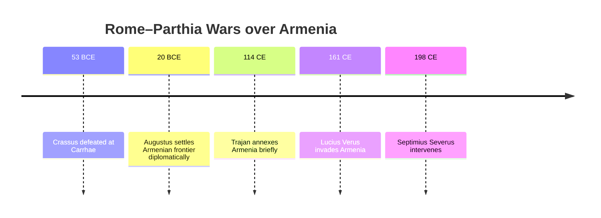
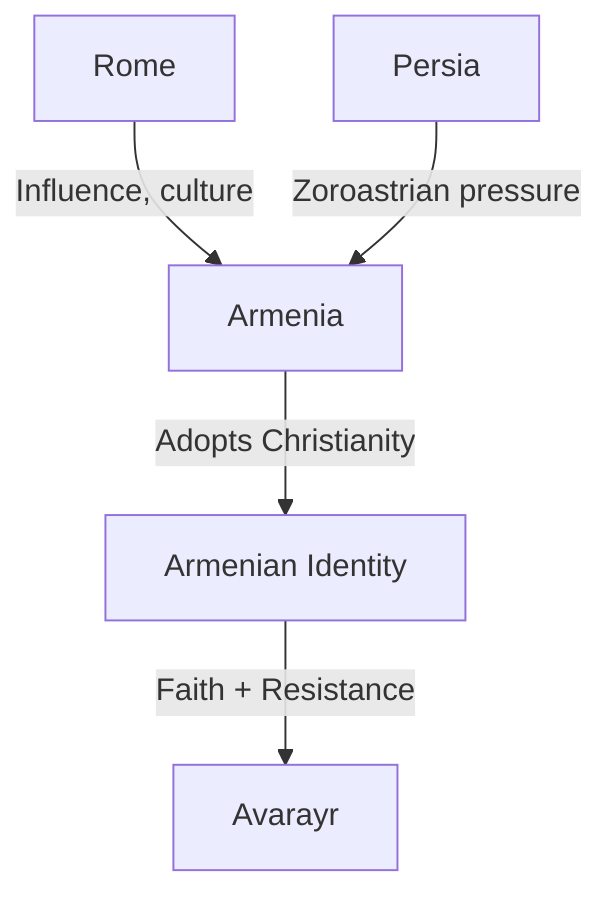

# Armenia Before Avarayr: 500 Years of Struggle That Forged Identity

The **Battle of Avarayr (451 CE)** is often remembered as the moment Armenians secured the right to remain Christian despite Persian pressure. But Avarayr was not an isolated event — it was the culmination of **centuries of warfare, shifting alliances, and cultural transformation**.

The **five centuries prior** to Avarayr — from the fall of the Artaxiad dynasty (1st century BCE) to Armenia’s adoption of Christianity (301 CE) — created the foundations of Armenian identity: a people caught between empires, yet determined to preserve a distinct self.

------

## 1. Armenia Between Rome and Parthia (1st Century BCE – 1st Century CE)

After the decline of Alexander’s successors, Armenia fell into the orbit of two giants: **Rome** and **Parthia**.

- **Tigranes the Great (95–55 BCE):** Expanded Armenia into a regional empire stretching from the Caspian to the Mediterranean.
- **Pompey vs. Tigranes (66 BCE):** Rome defeated Tigranes, forcing Armenia into Roman client status.
- Armenia then became the **frontier buffer** between Rome in the west and Parthia in the east.

**Identity impact:** Armenians learned to survive by balancing loyalties, never fully absorbed by either empire. This fostered a sense of *pragmatic independence*.

------

## 2. The Roman–Parthian Tug-of-War (1st – 3rd Century CE)

For the next 200 years, Rome and Parthia fought over Armenia.

- **Battle of Carrhae (53 BCE):** Roman defeat by Parthians set the tone for long rivalry.
- **Lucius Verus’ campaign (161–166 CE):** Rome briefly installed its own kings.
- **Septimius Severus and Caracalla (2nd–3rd c.):** Romans intervened repeatedly.

**Identity impact:** Armenia became a **militarized borderland**. Armenians grew skilled in diplomacy, shifting allegiance to survive, but also internalized the idea of being a **prize worth fighting for**.

------

## 3. The Rise of the Sassanians (224 CE)

In 224, the **Sassanian dynasty** replaced the Parthians in Persia. Unlike the tolerant Parthians, the Sassanians were aggressive **Zoroastrian centralizers**.

- Armenia became the primary frontier between **Zoroastrian Persia** and **Christianizing Rome**.
- **Shapur I (240–270):** Campaigned heavily in Armenia.
- Sassanians began **forced deportations of Armenians** to weaken resistance.

**Identity impact:** Religion became a central battlefield. The Sassanians’ pressure would push Armenians closer to Christianity and Rome.

------

## 4. Armenia Adopts Christianity (301 CE)

A seismic event occurred when **King Tiridates III**, under the influence of **St. Gregory the Illuminator**, declared Armenia the **first official Christian nation** in 301 CE.

- This was **12 years before Constantine’s Edict of Milan (313)** legalized Christianity in the Roman Empire.
- Armenia’s conversion was both a **spiritual revolution** and a **political strategy**:
  - To resist assimilation into Zoroastrian Persia.
  - To align culturally with Rome/Byzantium.

**Identity impact:** Christianity became the *core of Armenian national identity*, a unifying force that defined them against both Persia and Rome.

------

## 5. The Road to Avarayr

By the mid-5th century, Persia tried to impose Zoroastrianism on Armenians once more. But now, Christianity had become inseparable from **being Armenian**.

- **Vardan Mamikonian’s revolt (451):** Armenians chose to fight and die rather than abandon their faith.
- **Battle of Avarayr:** A military defeat, but a moral and cultural victory — Persians eventually allowed Armenians to keep Christianity.

------

## ⚖️ Conclusion

The **500 years before Avarayr** forged Armenian identity through constant trial:

1. **As a buffer state,** Armenians learned survival through diplomacy.
2. **As a frontier,** they became militarized and resilient.
3. **As subjects of Persia,** they resisted forced assimilation.
4. **As the first Christian nation,** they anchored identity in faith.

By 451 CE, when called to defend Christianity at Avarayr, Armenians were not just fighting for religion — they were fighting for the **essence of who they had become as a people** through centuries of struggle.