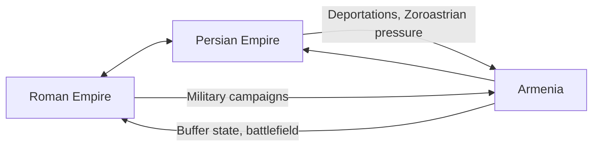
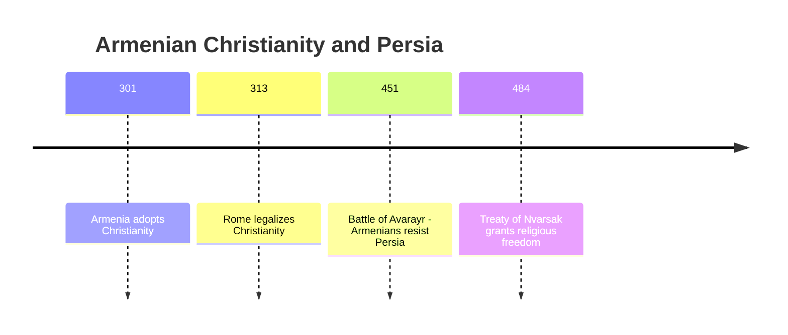
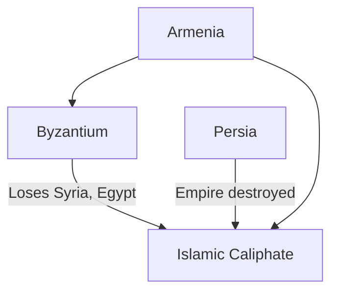
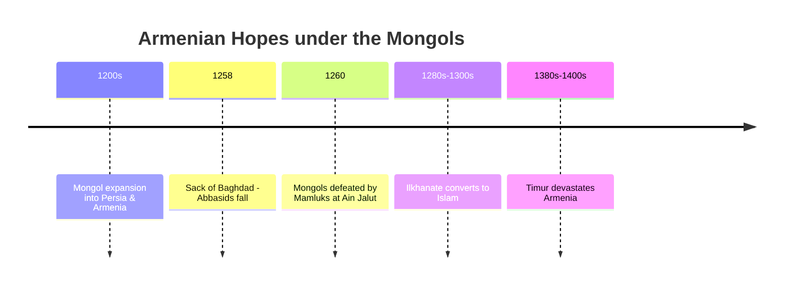
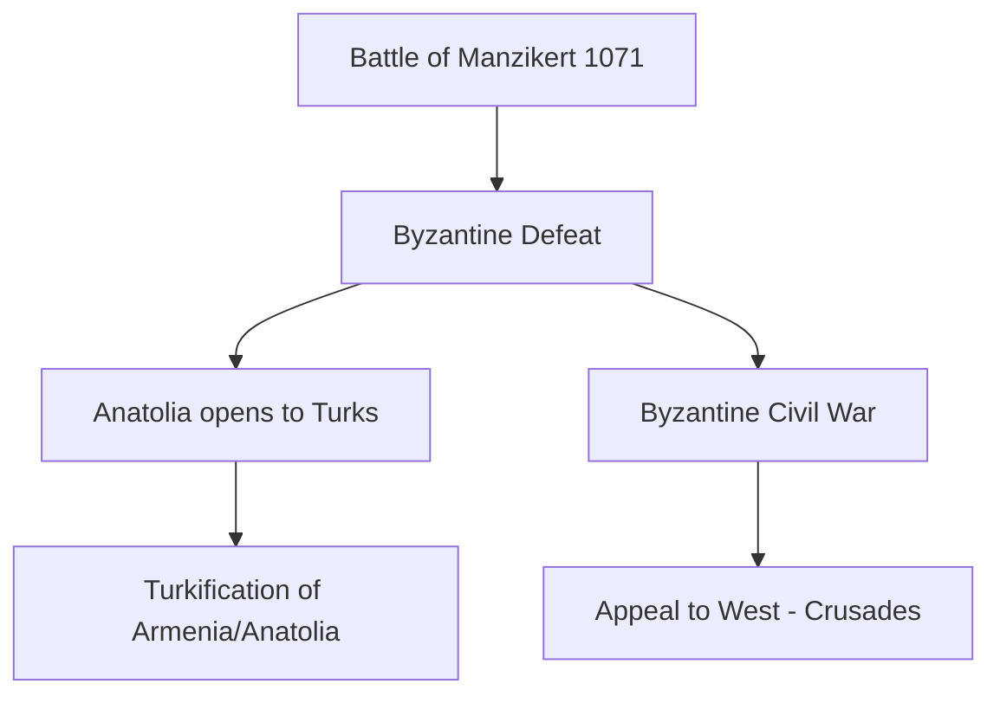

# Armenia Between Empires: From Rome to the Mongols

Armenia sits at one of history’s most turbulent crossroads — between **Rome and Persia**, between **Christianity and Zoroastrianism**, later between **Byzantium and Islam**, and eventually between **Mongol and Turkic powers**. Each wave of conquest reshaped Armenian life, faith, and identity.

This post traces that story from antiquity through the Middle Ages, showing how Armenia was repeatedly caught between empires and yet managed to hold onto its Christian identity.

------

## Rome and Persia: A Rivalry Over Armenia

Rome never truly conquered Persia. Instead, Rome and Persia (first the **Parthians**, then the **Sassanians**) fought a centuries-long tug-of-war. Armenia, located between them, often bore the brunt.

- **Rome’s attempts:**
  - Crassus defeated at **Carrhae** (53 BCE).
  - Emperor Trajan briefly took Mesopotamia but abandoned it.
  - Constant wars with both Parthians and Sassanians.
- **Persia’s push:**
  - Sassanian rulers deported Armenians and pressured them religiously.

**Outcome:** Armenia was never fully secure. But the competition gave Armenians space to assert their **own distinct identity**, especially through Christianity.

------

## Armenia: The First Christian Nation

In **301 CE**, King **Tiridates III** and **St. Gregory the Illuminator** made Armenia the **first officially Christian state**.

- This came *before* Constantine’s legalization of Christianity in Rome (313 CE).
- Armenia used Christianity to distinguish itself from Zoroastrian Persia.
- It also created cultural ties to Rome and Byzantium.

This was a defining moment of Armenian pride — one that still resonates today.

------

## The Battle of Avarayr (451 CE): Defending the Faith

When Persia tried to impose Zoroastrianism, Armenians resisted under **Vardan Mamikonian**.

- Armenians lost the **battle militarily**, but won **religious freedom** in the Treaty of Nvarsak (484).
- This enshrined Christianity as central to Armenian identity.
- Byzantium supported Armenia in spirit, but did not intervene directly.

------

## Islam and the End of the Rome–Persia Balance

By the early 7th century:

- Byzantium and Persia had exhausted each other in wars (602–628).
- The **Arab Muslim conquests (630s–650s)** swept away Persia and seized Byzantine lands.

For Armenia:

- Now directly ruled by the Caliphate.
- Christians became **dhimmi** (“protected people”) — taxed but allowed to practice their faith.
- Armenia was no longer a buffer between Rome and Persia; instead, it became a **frontier between Byzantium and Islam**.

**Shift:** Armenia’s struggle was no longer against Zoroastrian Persia, but against **Islamic overlordship**, while maintaining its Christian identity.

------

## The Mongols: Hope and Disillusion

In the 1200s, the **Mongol expansion** shattered the Islamic order.

- Mongols destroyed Baghdad (1258) and toppled many Muslim rulers.
- Armenians initially allied with Mongols, hoping for Christian favor (many Mongol elites had Christian wives or advisers).
- The **Armenian Kingdom of Cilicia** supported Mongol campaigns against Muslim powers.

But:

- Mongols were defeated by the **Mamluks** at Ain Jalut (1260).
- The **Ilkhanate in Persia converted to Islam**, turning against Christians.
- Later, **Timur (Tamerlane)** devastated Armenia with massacres and deportations.

**Result:** The Mongols briefly gave Armenians hope, but their conversion to Islam and later devastations left Armenia weakened, depopulated, and open to Turkic settlement.

------

## Why Turks Filled the Void

After Mongol devastation, **Turkic tribes** (Oghuz, Seljuks, later Ottomans) populated the depopulated lands.

Why Turks and not others?

- **Nomadic mobility:** Turks could quickly occupy emptied farmland with their herds.
- **Already present:** The **Seljuks** had won Manzikert (1071) decades earlier and were entrenched in Anatolia.
- **Mongol policy:** Mongols often resettled Turkic allies into depopulated areas.
- **Other groups weakened:**
  - Armenians were dispersed/depopulated.
  - Byzantines were in decline.
  - Persians were shattered by Mongols.
  - Kurds expanded somewhat but lacked numbers.

------

## The Battle of Manzikert (1071): The Doorway to Anatolia

The **Battle of Manzikert** was fought in Armenia between Byzantines and Seljuks.

- **Byzantines (Romanos IV)** vs. **Seljuks (Alp Arslan)**.
- Byzantine defeat → emperor captured.
- Civil wars weakened Byzantium further.
- Seljuks and their allies streamed into Anatolia.

**Consequences:**

1. **Turkification of Anatolia** — set the foundation for modern Turkey.
2. **Decline of Byzantium** — lost manpower and agriculture.
3. **Crusades Triggered** — Byzantines appealed to the West for help.
4. **Armenian Displacement** — many fled to Cilicia, founding the **Armenian Kingdom of Cilicia**.

------

## Ottoman Ascendancy and Armenian Loss

By the 14th–15th centuries:

- Turks (especially the Ottomans) consolidated Anatolia.
- Armenians were reduced to minorities in their own highlands.
- Centuries later, under Ottoman rule, this culminated in the **Armenian Genocide (1915–1917)**, which eradicated the last major Armenian presence in Anatolia.

------

## Final Reflection

Armenia’s history between empires is a story of survival against overwhelming odds:

- **Rome vs. Persia:** Armenia as a buffer.
- **Christian Armenia:** Identity forged in resistance.
- **Islam:** New overlords, tolerated but taxed.
- **Mongols:** Brief hope, followed by devastation.
- **Turks:** Permanent demographic change.
- **Manzikert:** The pivot from Byzantium’s world to Ottoman Turkey.

Armenia endured centuries of conquest, depopulation, and cultural erosion, yet held onto its Christian faith and national identity. It is a testament to resilience at history’s crossroads.

------

👉 Would you like me to **split this into a polished multi-part blog series** (e.g., *Rome vs Persia*, *Armenia’s Christianity*, *Islam & the Caliphate*, *Mongols & Turks*, *Manzikert & Beyond*) so each topic can be explored more deeply with diagrams and maps?