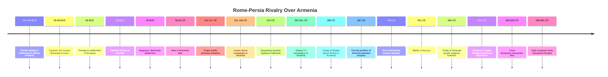
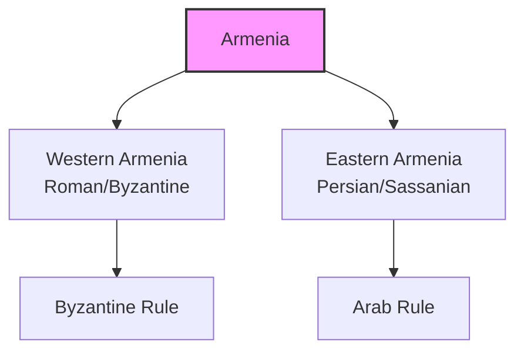

# Rome vs Persia: The Ancient Superpowers That Shaped Armenia

For over **700 years**, two superpowers dominated the ancient world: **Rome** in the west and **Persia** in the east. Their rivalry shaped the fate of countless peoples caught between them, but perhaps none more profoundly than **Armenia**.

This centuries-long struggle between empires transformed Armenia from a minor kingdom into a crucial battleground where global powers competed for dominance, resources, and prestige.

------

## Timeline: Seven Centuries of Conflict

------

## The Strategic Importance of Armenia

Armenia's location made it invaluable to both empires:

- **Mountain passes** controlling access between Anatolia and the Iranian plateau
- **Trade routes** connecting the Mediterranean to Central Asia and India
- **Natural resources** including metals, timber, and horses
- **Buffer zone** protecting each empire's core territories

**Geopolitical significance:** Armenia's position at the crossroads of empires made it impossible for either Rome or Persia to ignore. Control of Armenian territory was seen as essential for imperial security and prosperity.

------

## The Parthian Phase (60 BCE - 224 CE)

The first Persian adversary Rome faced was the **Parthian Empire**, ruled by the Arsacid dynasty.

- **Battle of Carrhae (53 BCE):** Parthians crushed Roman legions under Crassus
- **Mark Antony's campaign (36 BCE):** Failed invasion of Media Atropatene
- **Augustus' diplomatic settlement (20 BCE):** Armenia as Roman client state
- **Trajan's Parthian War (114-117 CE):** Brief Roman annexation of Armenia
- **Lucius Verus' campaign (161-166 CE):** Rome reasserts control over Armenia

**Armenian strategy:** The Artaxiad and early Arsacid dynasties of Armenia survived by balancing between the powers, sometimes accepting Roman kings, other times Persian ones.

------

## The Sassanian Challenge (224-651 CE)

In 224 CE, the **Sassanian dynasty** overthrew the Parthians, creating a more aggressive, centralized Persian Empire.

- **Ardashir I (224-242):** Immediately challenged Rome in Armenia
- **Shapur I (240-270):** Captured Roman Emperor Valerian, devastated Roman East
- **Narseh (293-302):** Defeated by Romans, forced to cede Armenian territories
- **Shapur II (309-379):** Waged decades of war against Rome
- **Khosrow I (531-579):** "Eternal Peace" with Byzantium quickly broken

**Armenian response:** Armenia adopted Christianity (301 CE), aligning culturally with Rome while resisting Persian religious pressure.

------

## Religious Dimensions of the Conflict

The Rome-Persia rivalry took on religious overtones:

- **Zoroastrian Persia** vs. **Christian Rome** (after 313 CE)
- Armenia became a religious frontier
- **Battle of Avarayr (451):** Armenians fought against Persian attempts to impose Zoroastrianism
- **Treaty of Nvarsak (484):** Persians granted Armenians religious freedom

**Religious identity:** The adoption of Christianity in 301 CE fundamentally shaped Armenian identity and aligned Armenia culturally with Rome/Byzantium, even when politically under Persian control.

------

## The Byzantine-Sassanian Wars

The final phase of the Rome-Persia conflict came as the **Byzantine Empire** (Eastern Rome) faced the Sassanians:

- **Anastasian War (502-506):** Fought over frontier fortresses
- **Iberian War (526-532):** Byzantine-Persian conflict in the Caucasus
- **Lazic War (541-562):** Struggle for control of the Black Sea coast
- **Maurice's Persian campaign (591):** Helped Khosrow II gain Persian throne
- **Byzantine-Sassanian War (602-628):** The final, devastating conflict

**The fatal exhaustion:** The final Byzantine-Sassanian War left both empires depleted, opening the door for the **Arab Muslim conquests** that would destroy Sassanian Persia and strip Byzantium of its eastern provinces.

------

## Armenia Divided

Throughout this conflict, Armenia was repeatedly divided:

- **387 CE:** First formal partition between Rome and Persia
- **591 CE:** Khosrow II ceded Persian Armenia to Byzantium
- **653 CE:** Final Byzantine-Arab partition after Persian collapse

**Divided identity:** The partition of Armenia between empires created enduring divisions that would shape Armenian development for centuries.

------

## Legacy of the Rome-Persia Conflict

The seven centuries of Rome-Persia conflict:

1. **Created the conditions** for Armenia's adoption of Christianity
2. **Militarized Armenian society** through constant warfare
3. **Dispersed Armenians** through deportations and migrations
4. **Weakened both empires**, enabling the Arab conquests
5. **Established patterns** of great power competition that would continue under later empires

Armenia emerged with a distinct Christian identity, forged in the crucible between empires, that would sustain its people through centuries of foreign domination.

------

## Conclusion: The Price of Being Between Empires

Armenia's experience between Rome and Persia reveals the harsh reality of geopolitics: small nations caught between great powers often pay the highest price. Yet Armenia's survival and cultural flourishing despite centuries of imperial competition demonstrates remarkable resilience.

The Rome-Persia rivalry may have ended with the Arab conquests in the 7th century, but the pattern it established—Armenia as contested ground between eastern and western powers—would continue for centuries to come.
