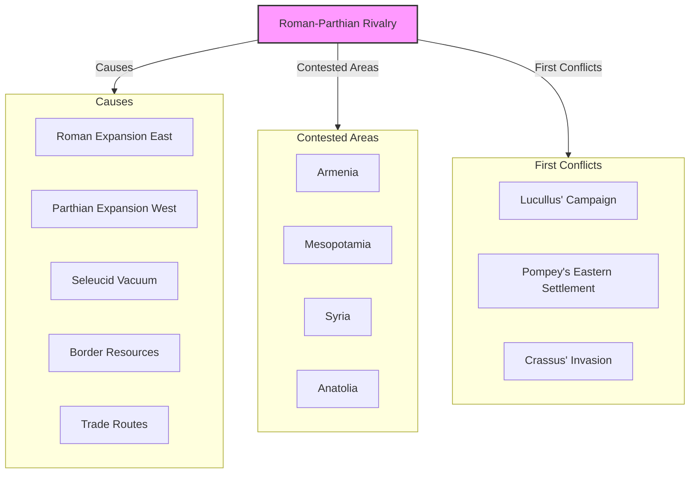
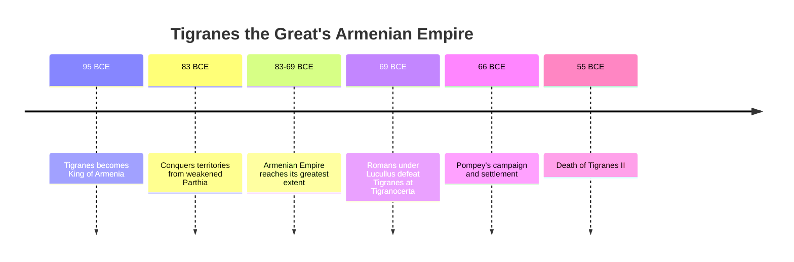
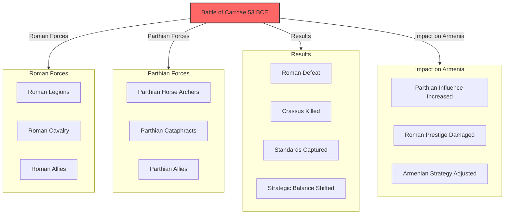
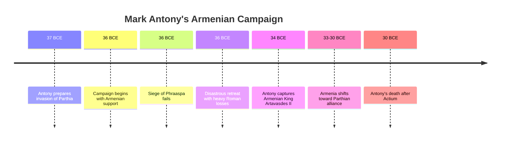
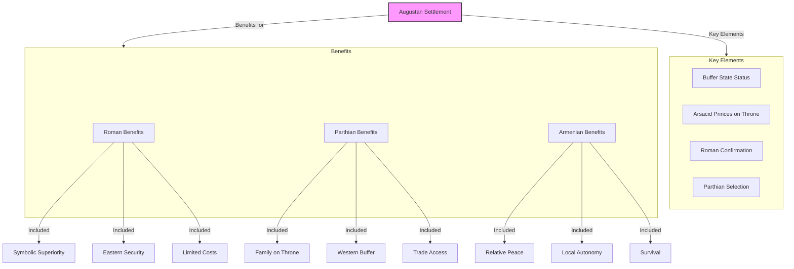
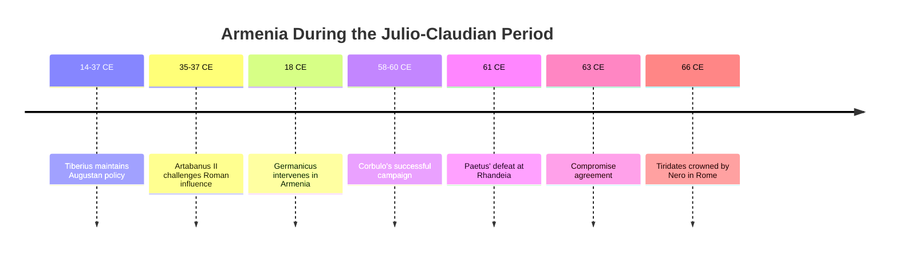
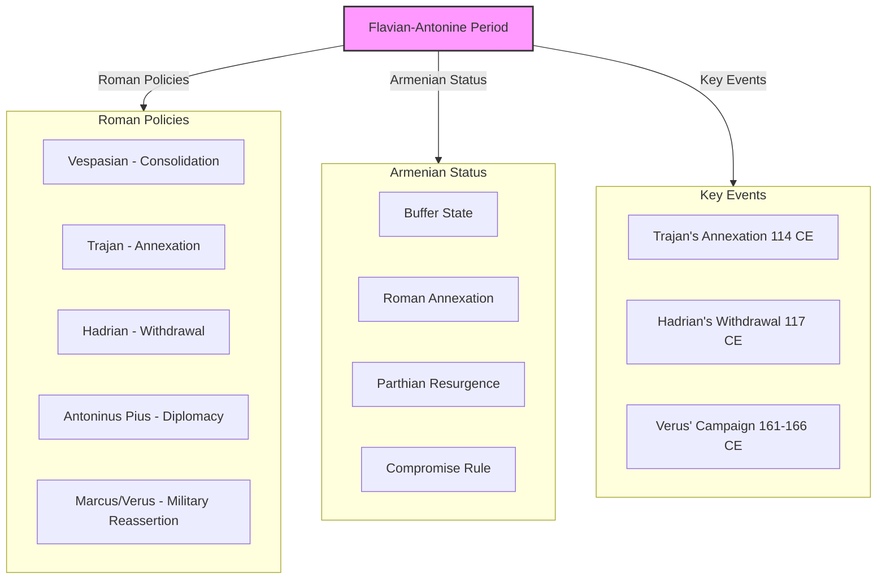
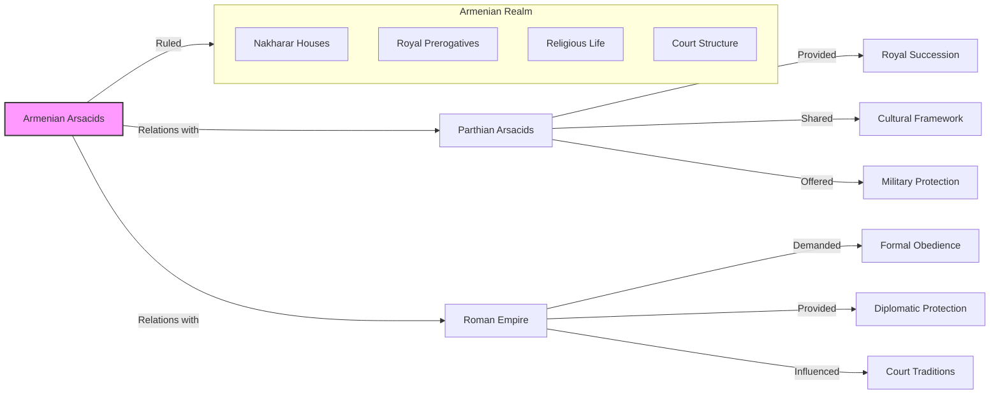
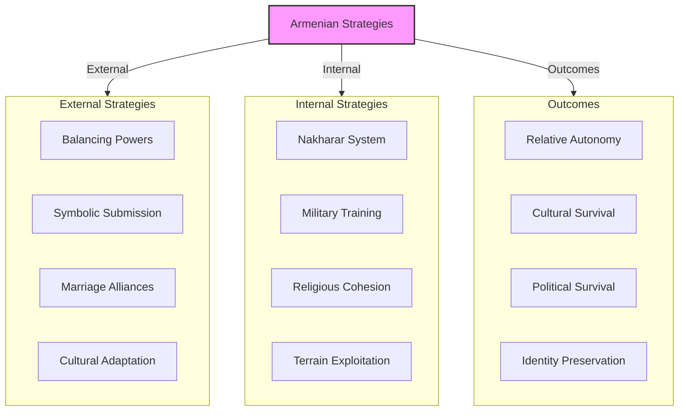
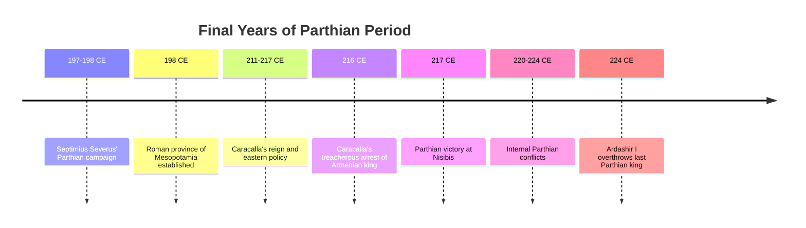

# The Parthian Phase: Armenia Between Rome and Arsacid Persia

The first major phase of the Rome-Persia rivalry over Armenia occurred during the **Parthian period** (60 BCE - 224 CE). For nearly three centuries, the **Roman Republic/Empire** and the **Parthian Empire** competed for influence over Armenia, establishing patterns of great power competition that would shape Armenian history for centuries to come.

This post examines how Armenia navigated between these superpowers, developing sophisticated strategies of survival that balanced competing imperial demands.

------

## The Emerging Roman-Parthian Rivalry

By the 1st century BCE, Rome and Parthia emerged as the dominant powers in the Near East:

- **Roman expansion eastward** following victories over Seleucid Syria and Mithridates of Pontus
- **Parthian expansion westward** after defeating Seleucid armies and consolidating control of Iran
- **Power vacuum** in Armenia and Mesopotamia as Seleucid power collapsed
- **First diplomatic contacts** between Rome and Parthia under Sulla (c. 96 BCE)
- **Growing tension** as both powers sought to expand their influence

**Frontier formation:** The initial Roman-Parthian frontier took shape along the upper Euphrates River, with Armenia becoming the primary contested territory between the empires.

------

## Tigranes the Great: Armenia's Brief Empire

Before becoming a battleground between Rome and Parthia, Armenia briefly emerged as a major power under **Tigranes II the Great** (r. 95-55 BCE):

- **Expanded Armenian territory** from the Caspian to the Mediterranean
- **Conquered parts of Syria, Cilicia, Cappadocia, and Mesopotamia**
- **Built new capital** at Tigranocerta with diverse population
- **Alliance with Mithridates VI of Pontus** against Rome
- **Conflict with both Rome and Parthia** at different times
- **Eventual defeat** by Roman forces under Lucullus and Pompey

**Brief golden age:** Tigranes' empire represented a brief window when Armenia exploited Roman and Parthian distraction to become a major power in its own right, before being reduced to a buffer state between the empires.

------

## The Battle of Carrhae: Parthia's Great Victory

The **Battle of Carrhae** (53 BCE) established Parthia as Rome's equal and set the stage for centuries of conflict:

- **Marcus Licinius Crassus** led Roman invasion of Mesopotamia
- **Surena**, Parthian general, commanded defense
- **Roman legions** defeated by Parthian horse archers and cataphracts
- **Crassus killed** along with most of his army
- **Roman standards captured** (a major humiliation)
- **Strategic balance** shifted in the East
- **Armenia caught** between emboldened Parthia and vengeful Rome

**Military significance:** Carrhae demonstrated the effectiveness of Parthian mobile warfare against Roman heavy infantry, establishing a military pattern that would persist throughout the Roman-Parthian rivalry.

------

## Mark Antony's Failed Campaign

**Mark Antony's** eastern campaign (36 BCE) represented another major Roman setback:

- **Ambitious invasion** targeting Media Atropatene (northwestern Iran)
- **Armenian king Artavasdes II** initially allied with Rome
- **Parthian counterattack** forced Roman retreat
- **Severe Roman losses** during difficult withdrawal
- **Antony blamed Armenian king** for the failure
- **Artavasdes captured** by Antony in 34 BCE
- **Armenian shift** toward Parthian alignment

**Strategic failure:** Antony's campaign demonstrated the difficulty of projecting Roman power deep into the Near East and further complicated Armenia's position between the empires.

------

## Augustus' Settlement and the Armenian Compromise

**Emperor Augustus** established a more pragmatic approach to Armenia:

- **Diplomatic solution** rather than costly military campaigns
- **Return of Roman standards** captured at Carrhae (20 BCE)
- **Armenia as buffer state** with kings acceptable to both powers
- **Arsacid princes** (related to Parthian royal family) often placed on Armenian throne
- **Roman confirmation** required for Armenian kings
- **Symbolic superiority** of Rome maintained
- **Practical limitations** of Roman power acknowledged

**Pragmatic compromise:** Augustus' settlement acknowledged the reality that neither Rome nor Parthia could permanently control Armenia, establishing a compromise that would serve as a template for future arrangements.

------

## The Julio-Claudian Period: Renewed Tensions

Under the Julio-Claudian emperors, Roman-Parthian competition over Armenia intensified:

- **Tiberius** maintained Augustan policy of diplomatic management
- **Artabanus II of Parthia** challenged Roman influence in Armenia
- **Germanicus** (Tiberius' nephew) intervened to restore Roman influence (18 CE)
- **Nero's Armenian War** (58-63 CE) under generals Corbulo and Paetus
- **Compromise solution** with Tiridates I (Parthian prince) becoming king but receiving his crown from Nero in Rome (66 CE)

**Symbolic politics:** The coronation of Tiridates by Nero in Rome exemplified how Armenia became a stage for symbolic displays of power, with practical arrangements often differing from public presentations.

------

## The Flavian and Antonine Periods: Fluctuating Control

From the Flavians through the early Antonines, control of Armenia continued to fluctuate:

- **Vespasian** focused on consolidating power, limited eastern involvement
- **Trajan's eastern ambition** led to direct annexation of Armenia (114 CE)
- **Parthian counteroffensive** after Trajan's death
- **Hadrian's withdrawal** from Trajan's conquests, return to buffer state policy
- **Antoninus Pius** maintained peace through diplomacy
- **Marcus Aurelius and Lucius Verus** faced renewed conflict
- **Roman campaign** under Lucius Verus (161-166 CE) reasserted influence

**Policy fluctuations:** Roman policy toward Armenia fluctuated based on emperor personality, with some preferring direct control (Trajan) and others favoring the buffer state arrangement (Hadrian).

------

## The Arsacid Dynasty of Armenia

During the Parthian period, Armenia was often ruled by a branch of the Parthian **Arsacid dynasty**:

- **Tiridates I** (63-75 CE) established Arsacid rule in Armenia
- **Family connections** to Parthian royal house
- **Cultural similarities** between Armenian and Parthian nobility
- **Religious practices** shared between Armenian and Iranian traditions
- **Feudal structure** with powerful nakharar noble houses
- **Balancing act** between Roman and Parthian influences

**Cultural orientation:** Despite formal submission to Rome at various points, the Armenian Arsacid dynasty maintained strong cultural and familial connections to Parthia, creating a complex dual identity.

------

## Armenian Strategies of Survival

Armenian rulers developed sophisticated strategies to navigate between the empires:

- **Playing powers against each other** to maintain maximum autonomy
- **Symbolic submission** while maintaining practical independence
- **Strategic marriage alliances** with both Roman and Parthian elites
- **Cultural adaptability** incorporating elements from both civilizations
- **Exploiting distance** from imperial centers
- **Leveraging difficult terrain** for defensive advantage
- **Maintaining internal cohesion** through nakharar system

**Diplomatic skill:** Armenian rulers developed remarkable diplomatic agility, often changing allegiances rapidly in response to shifts in the Roman-Parthian power balance.

------

## The Severan Period and Parthian Decline

The final decades of Parthian rule saw increased Roman advantage:

- **Septimius Severus'** campaigns against Parthia (197-198 CE)
- **Creation of province of Mesopotamia** pushing Roman frontier eastward
- **Caracalla's** treacherous arrest of Armenian king (216 CE)
- **Internal Parthian conflicts** weakening their position
- **Growing Sassanian threat** in southern Iran
- **Final years** of the Parthian Empire (220s CE)
- **Overthrow** of Parthian Arsacids by Sassanian dynasty (224 CE)

**End of an era:** The fall of the Parthian Arsacid dynasty in 224 CE marked the end of the first major phase of the Rome-Persia rivalry and the beginning of a more aggressive Persian policy under the Sassanians.

------

## Conclusion: The Parthian Legacy in Armenia

The Parthian period established enduring patterns in Armenian history:

1. **Buffer state status** between competing empires
2. **Arsacid dynasty** creating cultural connections to Iran
3. **Balancing strategies** that would serve later Armenian rulers
4. **Nakharar system** strengthened as a means of internal governance
5. **Cultural synthesis** incorporating Roman and Iranian elements
6. **Diplomatic sophistication** developed through necessity
7. **Survival skills** that would prove essential in later eras

The Armenian experience during the Parthian period demonstrates how a smaller nation could maintain significant autonomy despite being caught between superpowers. The strategies developed during this era—symbolic submission, cultural adaptability, and playing powers against each other—would serve Armenians well in later centuries under different imperial masters.

The end of Parthian rule and rise of the Sassanians would bring new challenges, as the more centralized and aggressive Sassanian Empire would prove less willing to accept the compromise arrangements that had characterized much of the Parthian period.
