# The Sassanian Challenge: Armenia Between Christianity and Zoroastrianism

In 224 CE, a momentous change occurred in Persia when the **Sassanian dynasty** overthrew the Parthian Arsacids. This dynastic change transformed the Rome-Persia rivalry and created new challenges for Armenia, as the more centralized and aggressive Sassanian Empire pursued a different approach to the contested borderlands.

This post examines how the rise of the Sassanians coincided with Armenia's adoption of Christianity, creating a religious dimension to the geopolitical struggle that would profoundly shape Armenian identity for centuries to come.

------

## The Sassanian Revolution

The Sassanian overthrow of the Parthian Arsacids represented more than a mere dynastic change:

- **Ardashir I** (r. 224-242) founded the dynasty after defeating last Parthian king
- **Persian nationalism** replacing Parthian feudalism
- **Zoroastrian religious revival** with close state-religion ties
- **Centralized administration** replacing Parthian decentralization
- **Territorial ambitions** targeting former Achaemenid Persian territories
- **Aggressive stance** toward Rome from the beginning
- **Ideological challenge** to the status quo

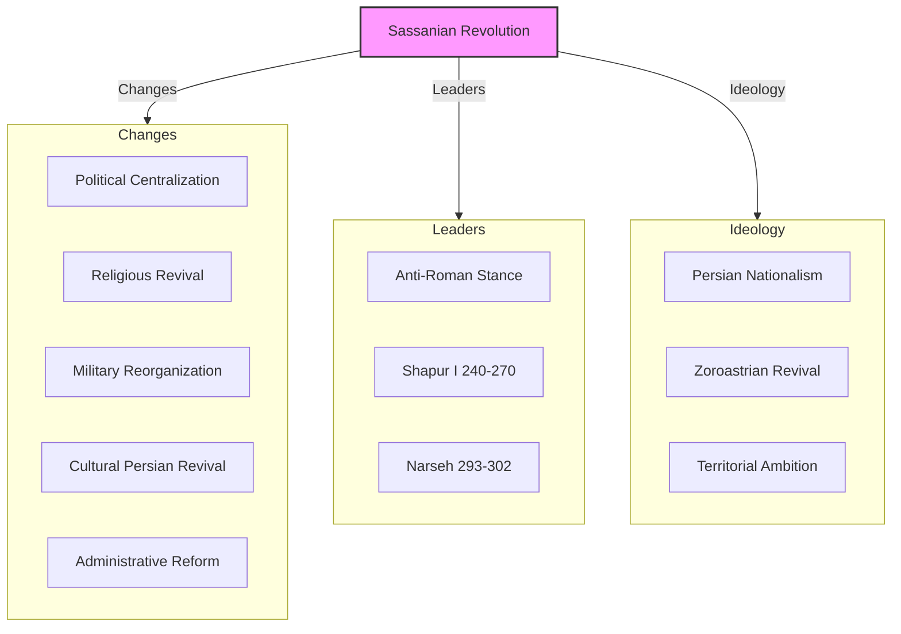

**Ideological shift:** Unlike the pragmatic Parthians, the Sassanians brought an ideological dimension to their rule, claiming to restore the ancient Persian Empire and revive "pure" Zoroastrianism.

------

## Early Sassanian-Roman Conflicts

The Sassanians immediately challenged Roman positions in Mesopotamia and Armenia:

- **Ardashir's campaigns** in Mesopotamia and Armenia (230s CE)
- **Emperor Alexander Severus'** counteroffensive (232-233 CE)
- **Shapur I** (r. 240-270) continued aggressive policy
- **Capture of Emperor Valerian** at Edessa (260 CE) - major Roman humiliation
- **Shapur's raids** deep into Roman Syria, Cappadocia, and Cilicia
- **Odenathus of Palmyra** temporarily checked Persian advance
- **Emperor Aurelian** (270-275) restored Roman position
- **Emperor Carus'** campaign to Ctesiphon (283 CE)

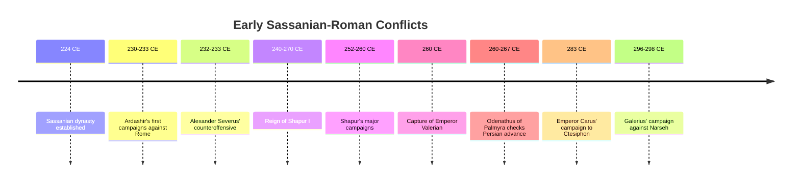

**Sassanian aggression:** Unlike the Parthians who often fought defensively, the Sassanians took the offensive against Rome, seeking to reclaim territories they considered rightfully Persian.

------

## Armenia's Precarious Position

Armenia faced a particularly difficult situation with the Sassanian rise:

- **End of Parthian-Armenian dynastic connections** with Arsacid overthrow
- **Armenian Arsacid dynasty** continued after Persian Arsacids fell
- **Sassanian hostility** toward independent Armenian kingdom
- **Roman protection** increasingly important
- **Tiridates II** (217-252) aligned with Rome
- **Shapur I's invasion** of Armenia (252 CE)
- **Sassanian control** established over much of Armenia
- **Armenian resistance** continued in some regions

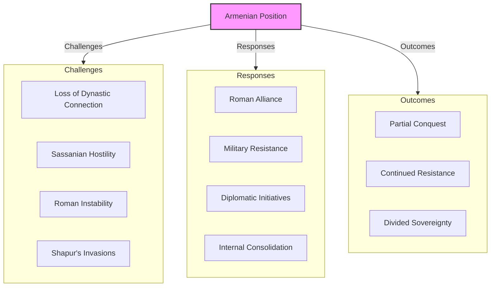

**Dynastic disconnect:** The overthrow of the Parthian Arsacids removed the familial connection between Persian and Armenian ruling houses, making Armenia's position more precarious.

------

## Armenia's Adoption of Christianity

Against this backdrop of Sassanian aggression and religious revival, Armenia made a momentous decision:

- **Tiridates III** (r. ca. 287-330) initially persecuted Christians
- **Gregory the Illuminator** converted Tiridates after imprisonment
- **Traditional date of 301 CE** for official adoption of Christianity
- **First state** to adopt Christianity as official religion
- **Predated Constantine's** Edict of Milan (313 CE)
- **Religious break** with Zoroastrian Persia
- **Cultural alignment** with Christian Rome
- **National identity** increasingly tied to Christianity

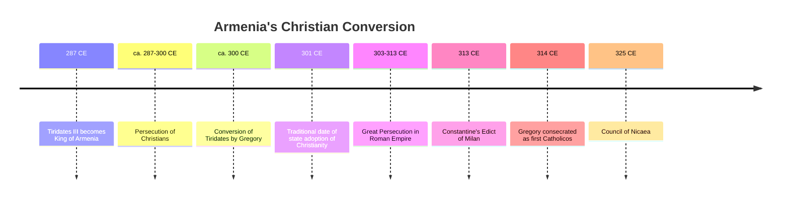

**Strategic and spiritual decision:** Armenia's adoption of Christianity represented both a genuine spiritual conversion and a strategic geopolitical choice, aligning Armenia culturally with Rome against Zoroastrian Persia.

------

## The Christianization of Armenia

The conversion of the Armenian state set in motion a profound transformation:

- **Destruction of pagan temples** and confiscation of their lands
- **Construction of churches** often on pagan sacred sites
- **Establishment of episcopal sees** throughout Armenia
- **Translation of Bible** into Armenian (early 5th century)
- **Development of Armenian alphabet** by Mesrop Mashtots (c. 405 CE)
- **Monastic foundations** becoming centers of learning
- **Resistance from some nakharar houses** with pagan traditions
- **Gradual conversion** of rural population

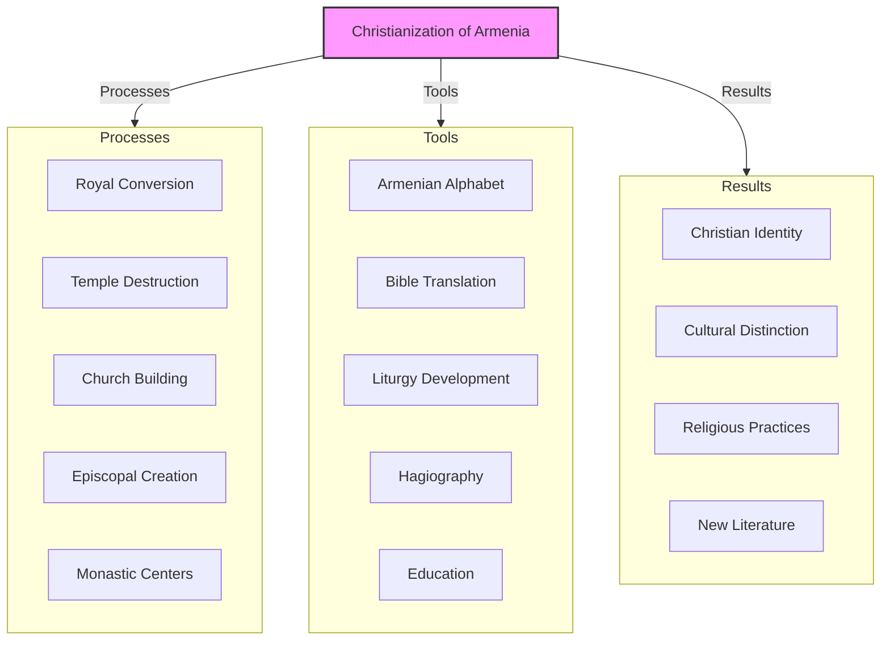

**Cultural revolution:** The Christianization of Armenia represented a profound cultural revolution that transformed Armenian identity and created new forms of cultural expression.

------

## Constantine and the Christian Alliance

The conversion of Emperor **Constantine** created new possibilities for Roman-Armenian relations:

- **Edict of Milan (313 CE)** legalized Christianity in Roman Empire
- **Christian solidarity** between Rome and Armenia
- **Treaty of 298 CE** had already established Roman protection
- **Constantine's letter** to Shapur II demanding protection of Persian Christians
- **Growing religious dimension** to geopolitical rivalry
- **Armenian alignment** with Christian Rome strengthened
- **Sassanian suspicion** of Armenian Christians as Roman sympathizers

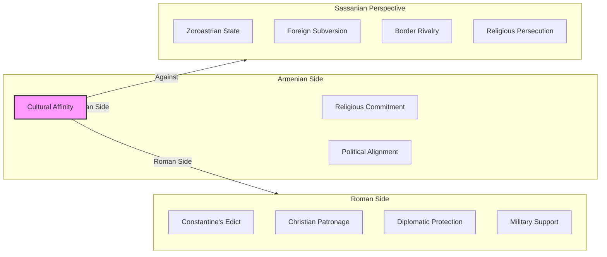

**Religious diplomacy:** Christianity became a tool of Roman diplomacy, with Constantine positioning himself as protector of Christians everywhere, including those in Sassanian territory.

------

## Shapur II and Religious Persecution

Under **Shapur II** (r. 309-379), Sassanian policy toward Christians hardened:

- **Long reign** spanning much of the 4th century
- **Wars with Rome** under Constantine and his successors
- **Persecution of Christians** in Persian territories
- **Christians viewed** as potential Roman allies
- **Armenian Christians** under particular suspicion
- **Attempts to impose** Zoroastrianism in Armenia
- **Nakharar divisions** exploited by Sassanians
- **Some Armenian nobles** converting to Zoroastrianism

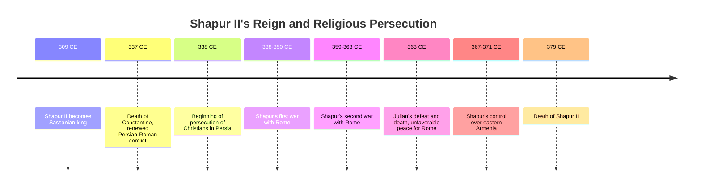

**Religious oppression:** Under Shapur II, religious identity became increasingly politicized, with Christians in Sassanian territories facing persecution as potential agents of Rome.

------

## The Partition of Armenia (387 CE)

The growing exhaustion of both empires led to a formal division of Armenia:

- **Emperor Theodosius I** and **Shapur III** agreed to partition
- **Western Armenia** (about 1/5) under Roman rule
- **Eastern Armenia** (about 4/5) under Sassanian control
- **End of unified** Armenian kingdom
- **Arsacid dynasty** continued in Persian Armenia until 428 CE
- **Different religious policies** in the two zones
- **Beginning of divergent** development paths

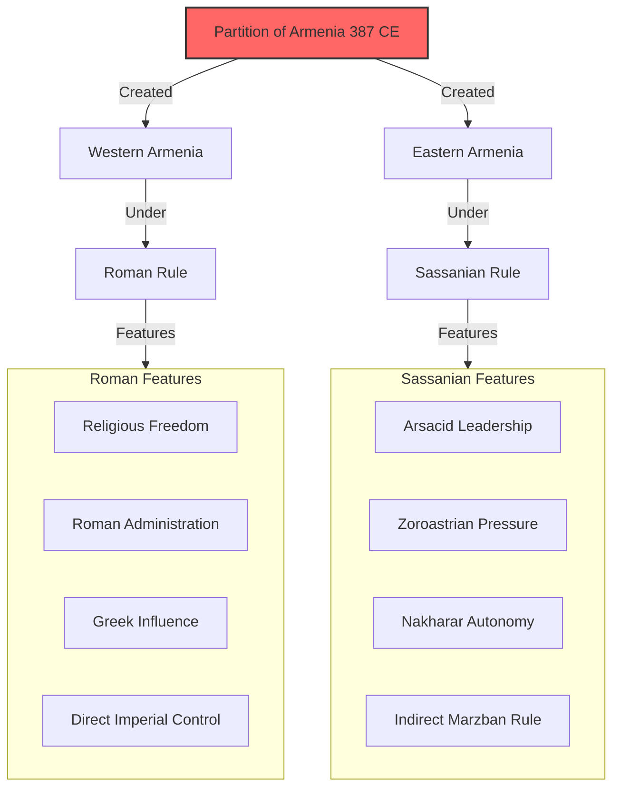

**Formal division:** The partition of 387 CE formalized the division of Armenia between the empires, creating a pattern that would persist in various forms for centuries.

------

## The Battle of Avarayr: Religious Resistance

The religious tensions culminated in the **Battle of Avarayr** (451 CE):

- **Yazdegerd II** (r. 438-457) pursued aggressive Zoroastrianization
- **Armenian resistance** led by Vardan Mamikonian
- **Religious freedom** as primary demand
- **Battle of Avarayr** (May 26, 451) - Armenian defeat but moral victory
- **Continued guerrilla resistance** under Vahan Mamikonian
- **Treaty of Nvarsak (484)** granted religious freedom
- **Armenian Church** maintained independence
- **National identity** increasingly tied to Christian faith

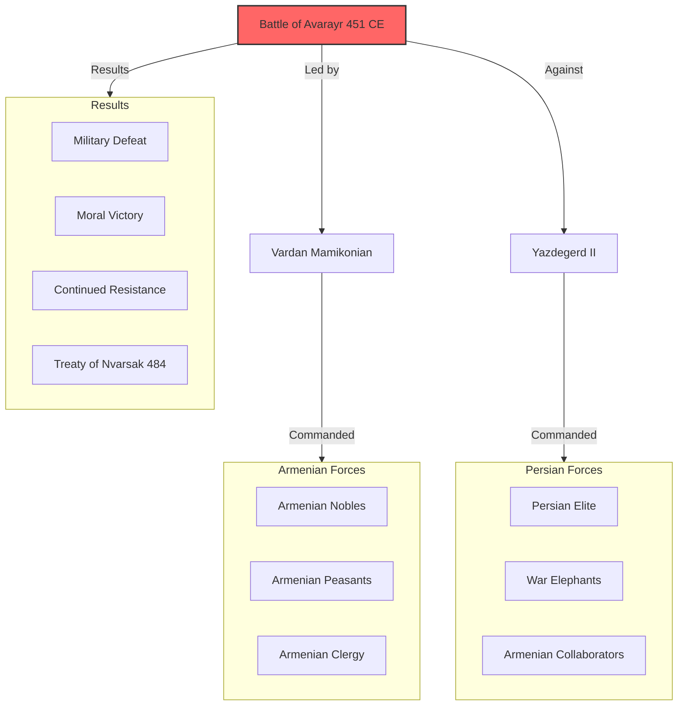

**Religious identity:** The Battle of Avarayr represents a pivotal moment when Armenian Christianity became inseparable from national identity, with religious freedom seen as essential to Armenian survival.

------

## Armenian Church Development

During this period, the Armenian Church developed its distinctive identity:

- **Rejection of Council of Chalcedon** (451 CE)
- **Monophysite christology** emphasizing Christ's divine nature
- **Autocephalous status** independent of Constantinople or Antioch
- **Catholicos** as supreme head of Armenian Church
- **Distinctive liturgy** and church architecture
- **Armenian script** enabling native theological literature
- **Monastic centers** of learning and manuscript production
- **Church as preserver** of national identity under foreign rule

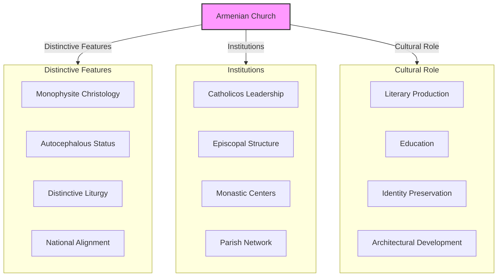

**Theological independence:** The Armenian Church's rejection of Chalcedon created theological separation from both Byzantine and Persian Christianity, reinforcing Armenian cultural distinctiveness.

------

## Religious Architecture as Cultural Expression

Church building became a powerful expression of Armenian identity:

- **Distinctive Armenian style** developing from 4th-7th centuries
- **Central-plan churches** with conical or cylindrical domes
- **Stone construction** using local volcanic tuff
- **Sculptural decoration** with distinctive Armenian motifs
- **Ecclesiastical complexes** with educational functions
- **Regional variations** across Armenian territories
- **Symbolic resistance** to Zoroastrian and Muslim powers

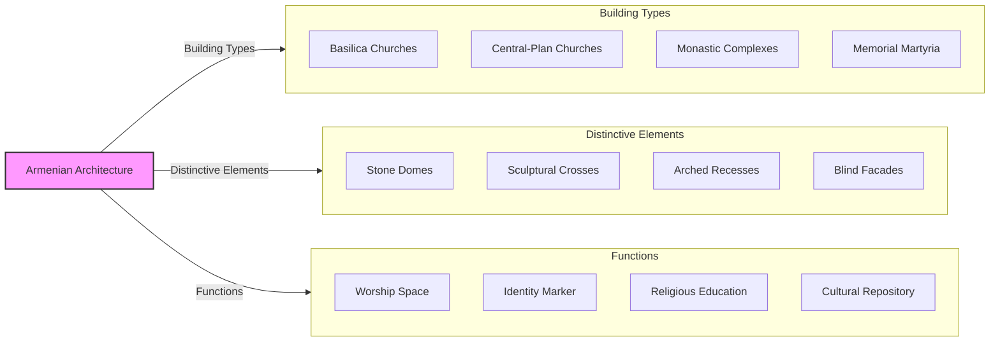

**Architectural identity:** Armenian church architecture represented not just religious faith but national identity, with distinctive forms that set Armenian Christianity apart visually from both Byzantine and Persian traditions.

------

## Conclusion: Faith as Identity

The Sassanian period transformed Armenia through the fusion of religion and national identity:

1. **Christianity** became inseparable from Armenian identity
2. **Religious difference** created cultural boundary with Zoroastrian Persia
3. **Church institutions** preserved Armenian culture under foreign rule
4. **Armenian alphabet** enabled native literary tradition
5. **Distinctive theology** separated Armenians from Byzantine Christianity
6. **Religious architecture** expressed national identity visually
7. **Martyrdom tradition** from Avarayr inspired later resistance

The challenges posed by the Sassanian Empire and its Zoroastrian state religion paradoxically strengthened Armenian identity by forcing a clear choice between assimilation and maintaining distinctive religious and cultural traditions. The Armenian choice for Christianity over Zoroastrianism would shape all subsequent Armenian history, creating an identity that could survive even the loss of political independence.

This religious dimension of Armenian identity would prove crucial in later centuries, as Armenia faced new conquerors with different religions—first the Arab Muslims, then the Seljuk Turks, and eventually the Ottoman Empire. The pattern established during the Sassanian period—preserving national identity through religious institutions when political independence was lost—would become the template for Armenian survival through centuries of foreign rule.
