# Military Tactics and the Byzantine-Sassanian Wars: Armenia as Battlefield

The Rome-Persia conflict represented one of history's longest-running military rivalries, spanning over seven centuries and featuring dramatic shifts in tactics, technology, and strategy. For Armenia, caught directly between these superpowers, the conflict brought both destruction and opportunity as armies marched back and forth across its territory.

This post examines the distinctive military systems that clashed in Armenia, the evolution of warfare during the Byzantine-Sassanian period, and how Armenians developed their own military traditions in response to constant warfare.

------

## Contrasting Military Systems

Rome and Persia developed distinctly different military approaches:

### Roman Military System:
- **Heavy infantry legions** as core fighting force
- **Disciplined formations** with standardized equipment
- **Engineering expertise** for sieges and fortifications
- **Road networks** enabling rapid deployment
- **Naval power** in the Mediterranean
- **Adaptability** incorporating foreign techniques
- **Later Byzantine evolution** toward more cavalry and mobile forces

### Persian Military System:
- **Heavy cavalry (cataphracts)** as elite striking force
- **Horse archers** providing mobile firepower
- **Elephant units** for psychological impact and breaking formations
- **Feudal levies** from noble houses
- **Defensive fortifications** protecting borders
- **Mountain warfare** expertise
- **Sassanian innovations** in armor and tactics

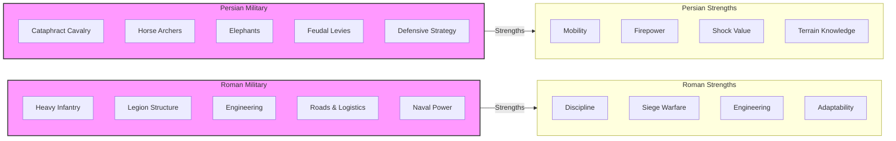

**Tactical asymmetry:** The contrasting military systems created an asymmetric conflict where each side had distinct advantages and disadvantages, leading to complex battlefield dynamics.

------

## Armenian Military Traditions

Armenians developed their own military system incorporating elements from both empires:

- **Nakharar cavalry** as elite heavy horsemen
- **Mountain infantry** adapted to local terrain
- **Fortress network** protecting strategic points
- **Guerrilla tactics** against superior forces
- **Military service** to both Rome and Persia at different times
- **Sparapet** (commander-in-chief) as traditional military leader
- **Martial traditions** celebrated in literature and art

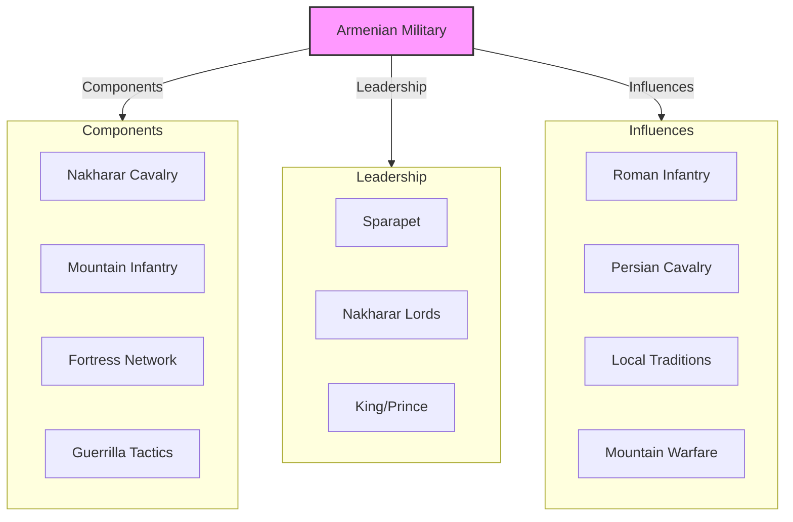

**Hybrid warfare:** Armenian military traditions represented a hybrid approach combining elements from both Roman and Persian systems, adapted to local conditions and resources.

------

## Key Battlegrounds in Armenia

Several regions of Armenia became frequent battlegrounds:

- **Arzanene** (Aghdznik) - southwestern region near upper Tigris
- **Sophene** (Tsopk) - strategic region controlling Euphrates crossings
- **Artaxata** (Artashat) - ancient Armenian capital
- **Dvin** - later capital and administrative center
- **Lake Van region** - contested between empires
- **Theodosiopolis** (Erzurum) - major Roman/Byzantine fortress
- **Nisibis** (Nusaybin) - crucial frontier fortress changing hands multiple times

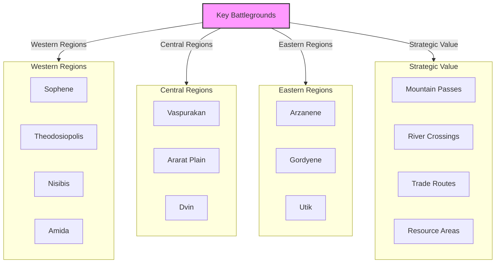

**Recurring battlefields:** Certain regions of Armenia saw repeated military campaigns due to their strategic importance, creating cycles of destruction and rebuilding over centuries.

------

## The Evolution of Byzantine Warfare

The Eastern Roman (Byzantine) Empire evolved its military approach over time:

- **4th-5th centuries:** Transition from classic legions to more mobile forces
- **Comitatenses** (field armies) and **Limitanei** (frontier troops)
- **Increased cavalry** proportion in Byzantine armies
- **Cataphract revival** under Emperor Maurice
- **Defensive strategy** emphasizing frontier fortifications
- **Diplomatic alternatives** to direct conflict when possible
- **Religious dimension** with Christianity vs. Zoroastrianism
- **Armenian troops** serving as elite units in Byzantine armies

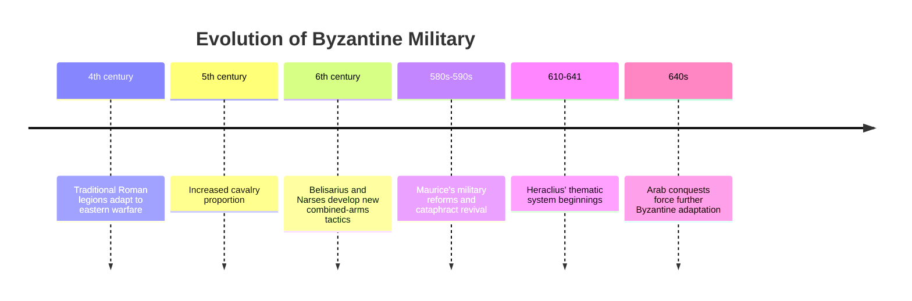

**Military adaptation:** Byzantine military evolution represented a gradual adaptation to eastern warfare conditions, incorporating elements from Persian and other eastern military systems.

------

## Sassanian Military Developments

The Sassanian military also evolved significantly:

- **Savaran** heavy cavalry as elite core of army
- **Increased professionalization** compared to Parthian forces
- **Royal guard** units of "Immortals" reviving Achaemenid tradition
- **War elephants** used for psychological effect and breaking formations
- **Siege technology** improvements learning from Roman examples
- **Defensive works** including the famous "Sassanian Limes"
- **Conscription system** more systematic than Parthian feudal levies
- **Armenian nobles** sometimes serving in Sassanian forces

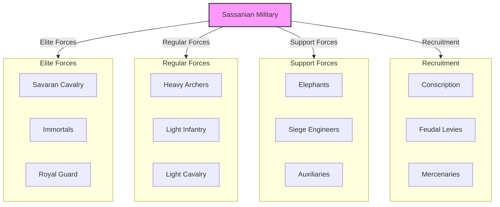

**Military centralization:** Sassanian military organization represented a more centralized and professional approach compared to the Parthian system, making them more formidable opponents for Rome/Byzantium.

------

## The Major Byzantine-Sassanian Wars

The final phase of Rome-Persia conflict saw several major wars:

### Anastasian War (502-506):
- **Triggered by** Byzantine refusal to pay for joint Caspian Gates defense
- **Kavad I** invaded Byzantine territory
- **Amida siege** lasting 80 days before falling to Persians
- **Byzantine counteroffensive** recovered some territory
- **Peace treaty** restored status quo with Byzantine payments

### Iberian War (526-532):
- **Started over** control of Kingdom of Iberia (Georgia)
- **Justinian I** vs. Kavad I and later Khosrow I
- **Dara fortification** by Byzantines changing frontier dynamics
- **Battle of Dara (530)** - major Byzantine victory
- **Battle of Callinicum (531)** - Sassanian tactical victory
- **"Eternal Peace"** treaty with large Byzantine payment

### Lazic War (541-562):
- **Fought over** control of Lazica (western Georgia)
- **Khosrow I** broke "Eternal Peace" by invading
- **Control of Black Sea** access at stake
- **Byzantine reconquest** after initial Persian gains
- **Fifty-year peace treaty** ending the conflict

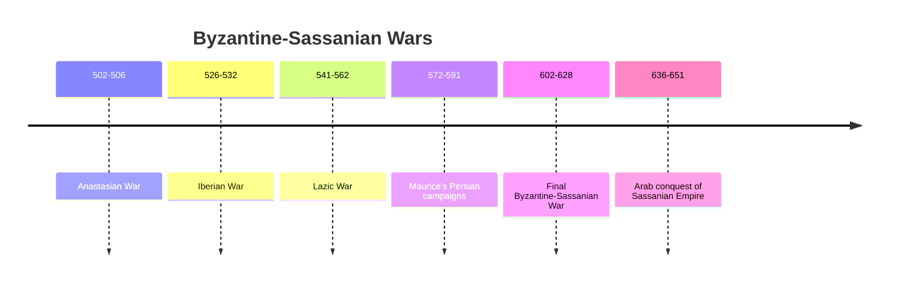

**Escalating conflicts:** Each successive Byzantine-Sassanian war tended to be larger and more destructive than the previous one, culminating in the catastrophic final war of 602-628.

------

## Maurice's Persian Campaign and Settlement

Emperor **Maurice's** campaigns (572-591) represented a significant Byzantine success:

- **Civil war** in Persia between Hormizd IV and Bahram Chobin
- **Khosrow II** fled to Byzantine territory seeking help
- **Maurice supported** Khosrow against the usurper
- **Byzantine forces** restored Khosrow to Persian throne
- **Grateful Khosrow** ceded Persian Armenia and parts of Mesopotamia
- **Strategic shift** in frontier favorable to Byzantium
- **Armenian reaction** mixed to Byzantine rule

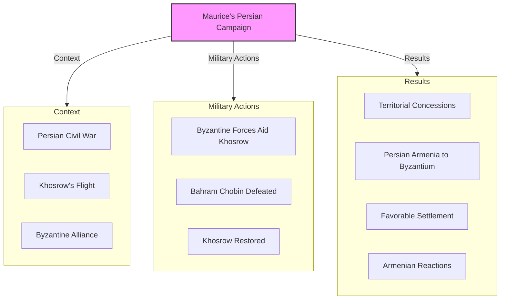

**Diplomatic coup:** Maurice's intervention in the Persian civil war represented a major diplomatic and strategic success, temporarily shifting the balance of power in Byzantium's favor.

------

## The Final Byzantine-Sassanian War (602-628)

The last and most devastating Rome-Persia conflict began with Maurice's overthrow:

- **Emperor Maurice** murdered by usurper Phocas (602)
- **Khosrow II** used this as pretext to attack, claiming to avenge his benefactor
- **Initial Persian success** with capture of major Byzantine cities
- **Jerusalem fell** (614) with Holy Cross captured
- **Egypt conquered** by Persians (619) cutting Byzantine grain supply
- **Persian armies reached Constantinople** (626)
- **Emperor Heraclius'** counteroffensive into Persian heartland
- **Persian collapse** and overthrow of Khosrow II
- **Peace treaty** restored pre-war boundaries

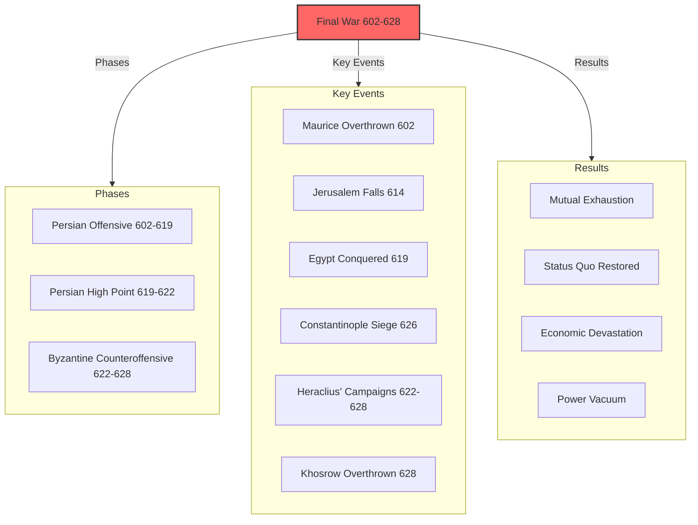

**Pyrrhic victory:** Heraclius' eventual victory came at enormous cost, leaving both empires fatally weakened on the eve of the Arab Muslim expansion.

------

## The Impact of Warfare on Armenia

The Byzantine-Sassanian wars had profound impacts on Armenia:

- **Repeated devastation** of agricultural lands and cities
- **Population displacement** from war zones
- **Economic disruption** of trade routes and production
- **Fortress construction** changing landscape
- **Military service** drawing Armenian manpower to both sides
- **Religious pressures** varying with changing rulers
- **Political fragmentation** as different regions aligned with different powers
- **Cultural resilience** despite military destruction

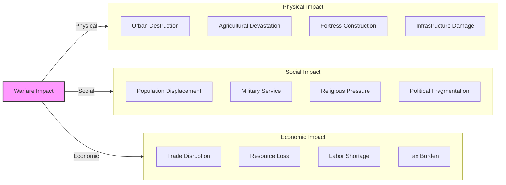

**Resilience amid destruction:** Despite centuries of warfare across their homeland, Armenians demonstrated remarkable resilience, rebuilding after conflicts and maintaining cultural continuity.

------

## Military Technology and Innovation

The Rome-Persia conflict drove military innovation:

- **Heavy cavalry armor** developments by both sides
- **Stirrup adoption** improving mounted combat effectiveness
- **Composite bow refinements** for greater range and power
- **Siege engine improvements** for attacking fortifications
- **Defensive architecture** adaptations to counter new weapons
- **Greek fire** developed by Byzantines
- **Combined-arms tactics** evolving over centuries
- **Military engineering** advances in fortifications and logistics

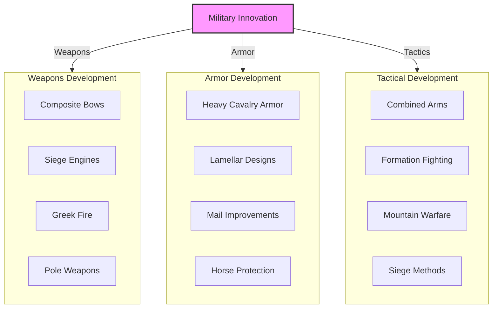

**Arms race:** The long rivalry between Rome/Byzantium and Persia created a centuries-long arms race, with each side adapting to the other's innovations.

------

## The Arab Conquest and End of the Conflict

The exhaustion of both empires opened the door for Arab conquest:

- **Arab Muslim expansion** beginning under Caliph Umar
- **Battle of Yarmouk (636)** - Byzantine defeat in Syria
- **Battle of al-Qadisiyyah (636)** - Sassanian defeat in Iraq
- **Battle of Nihawand (642)** - decisive defeat of Sassanian forces
- **Fall of Persian capital** Ctesiphon
- **Last Sassanian emperor** Yazdegerd III fled eastward
- **End of Sassanian Empire** by 651
- **Byzantine survival** but loss of Syria, Palestine, Egypt, and North Africa
- **Armenia conquered** by Arabs by 650s

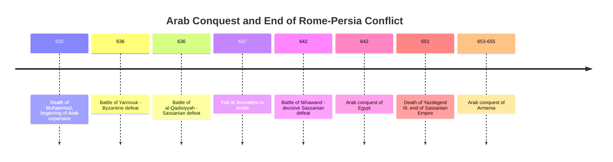

**New paradigm:** The Arab conquests ended the centuries-old Rome-Persia rivalry, replacing it with a new geopolitical reality that would shape the Middle East for centuries to come.

------

## Conclusion: The Military Legacy

The military aspects of the Rome-Persia conflict left several important legacies:

1. **Armenian martial traditions** shaped by centuries of warfare
2. **Fortress landscape** dotting the Armenian highlands
3. **Military expertise** that would serve later Armenian leaders
4. **Nakharar system** strengthened by military necessities
5. **Strategic thinking** influenced by position between empires
6. **Military terminology** incorporating Greek, Latin, and Persian elements
7. **Warrior saints** becoming important in Armenian Christianity

The Byzantine-Sassanian wars represent one of history's most evenly matched and long-running military rivalries. For Armenia, caught directly between these superpowers, warfare became a constant reality that shaped society, culture, and identity.

The military exhaustion of both empires after their final conflict created the conditions for the Arab Muslim conquests, which would transform the region and create a new geopolitical reality. Armenia, having survived centuries of Rome-Persia conflict, would now face new challenges under Arab rule—but with the resilience and adaptive strategies developed through its long experience as a battlefield between empires.
