# Armenia Divided: The Legacy of the Rome-Persia Conflict

Throughout the centuries-long rivalry between Rome and Persia, Armenia repeatedly found itself divided between these competing powers. These divisions—sometimes informal spheres of influence, sometimes formal partitions—profoundly shaped Armenian history, creating patterns that would persist long after both Rome and Persia had faded from the scene.

This post examines how Armenia was divided between empires, how these divisions affected Armenian society and culture, and the lasting legacy of the Rome-Persia conflict on Armenian identity.

------

## The First Formal Partition (387 CE)

The first formal division of Armenia came in 387 CE:

- **Agreement between** Emperor Theodosius I and Shapur III
- **Western Armenia** (about 1/5) under direct Roman rule
- **Eastern Armenia** (about 4/5) under Sassanian control with vassal Arsacid kings
- **End of unified** Armenian kingdom
- **Different administrative systems** in each zone
- **Religious policies** varying between zones
- **Beginning of divergent** development paths

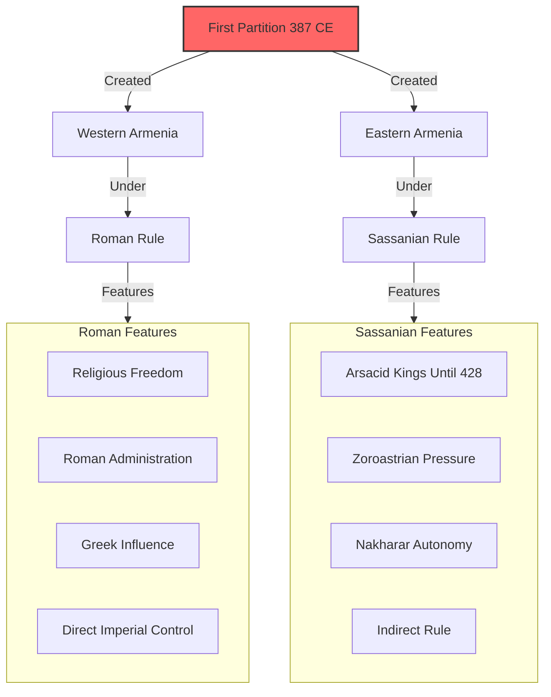

**Administrative differences:** The partition created different administrative realities in each zone, with Western Armenia incorporated more directly into Roman provincial structures while Eastern Armenia maintained greater local autonomy under Sassanian suzerainty.

------

## The End of the Armenian Arsacid Dynasty (428 CE)

The Sassanian zone saw a significant change in 428 CE:

- **Armenian nobles** petitioned Sassanian emperor to remove King Artaxias IV
- **End of Arsacid dynasty** that had ruled Armenia since 63 CE
- **Marzban system** of Persian governors established
- **Increased direct control** by Sassanian Empire
- **Nakharar nobles** maintaining local authority
- **Religious tensions** growing with Zoroastrian pressure
- **Setting the stage** for later religious conflicts

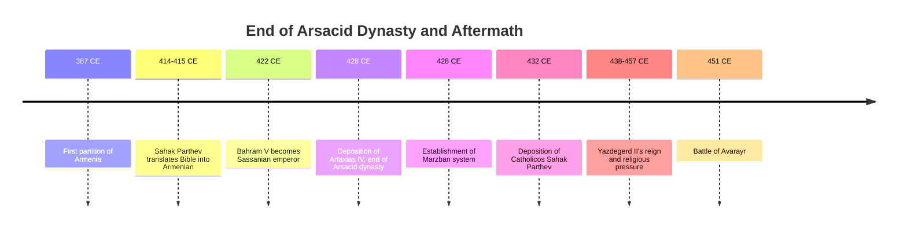

**Power shift:** The end of the Arsacid dynasty removed the buffer between Persian authorities and Armenian society, leading to more direct Persian control and increased religious pressure.

------

## Life in Divided Armenia

The partition created different realities for Armenians in each zone:

### Western (Roman/Byzantine) Armenia:
- **Direct provincial administration**
- **Greek cultural influence** stronger
- **Orthodox Christianity** pressure from Constantinople
- **Urban centers** more integrated with Roman world
- **Military service** in Byzantine armies common
- **Trade orientation** toward Mediterranean

### Eastern (Persian) Armenia:
- **Marzban administration** with local autonomy
- **Persian cultural influence** stronger
- **Armenian Church** more independent from Constantinople
- **Nakharar system** better preserved
- **Zoroastrian pressure** at various times
- **Trade orientation** toward Persian and Central Asian markets

```mermaid
flowchart LR
    DA[Divided Armenia] -->|Western Zone| WZ[Western Zone]
    DA -->|Eastern Zone| EZ[Eastern Zone]
    
    subgraph WZ[Western Zone Life]
        WA[Byzantine Administration]
        WR[Religious Pressure]
        WC[Greek Cultural Influence]
        WM[Military Service]
        WT[Mediterranean Trade]
    end
    
    subgraph EZ[Eastern Zone Life]
        EA[Marzban System]
        EN[Nakharar Autonomy]
        EP[Persian Influence]
        EZ[Zoroastrian Pressure]
        ET[Eastern Trade Routes]
    end
    
    DA -->|Common Elements| CE[Common Elements]
    
    subgraph CE[Common Elements]
        CL[Armenian Language]
        CC[Core Cultural Traditions]
        CF[Christian Faith]
        CS[Social Structures]
    end
    
    style DA fill:#f9f,stroke:#333,stroke-width:2px
```

**Cultural divergence:** Despite maintaining core elements of Armenian identity, the two zones began to develop distinct characteristics that would influence later regional variations in Armenian culture.

------

## The Marzban Period in Persian Armenia

After 428 CE, Persian Armenia was governed through the **Marzban system**:

- **Persian governor (marzban)** appointed by Sassanian emperor
- **Administrative center** at Dvin
- **Nakharar nobles** maintaining significant local authority
- **Tax collection** primary imperial concern
- **Military service** required from Armenian nobles
- **Religious policy** fluctuating with different emperors
- **Armenian Church** maintaining institutional continuity
- **Cultural autonomy** generally preserved

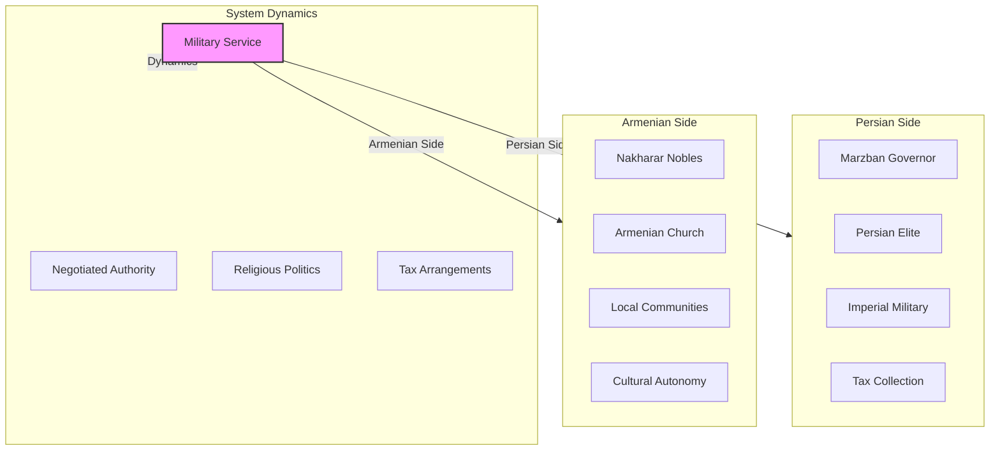

**Practical autonomy:** Despite the formal end of Armenian kingship, the Marzban system allowed significant practical autonomy, with Persian authorities primarily concerned with tax revenue and military support rather than direct administration.

------

## The Second Major Rearrangement (591 CE)

Emperor Maurice's support for Khosrow II led to a significant territorial shift:

- **Khosrow II** ceded most of Persian Armenia to Byzantium
- **Dramatic expansion** of Byzantine-controlled Armenian territory
- **New frontier** much further east than before
- **Byzantine administrative reforms** in newly acquired territories
- **Religious tensions** as Byzantine authorities pressured Armenian Church
- **Armenian resistance** to Chalcedonian orthodoxy
- **Short-lived arrangement** reversed during final Byzantine-Persian War

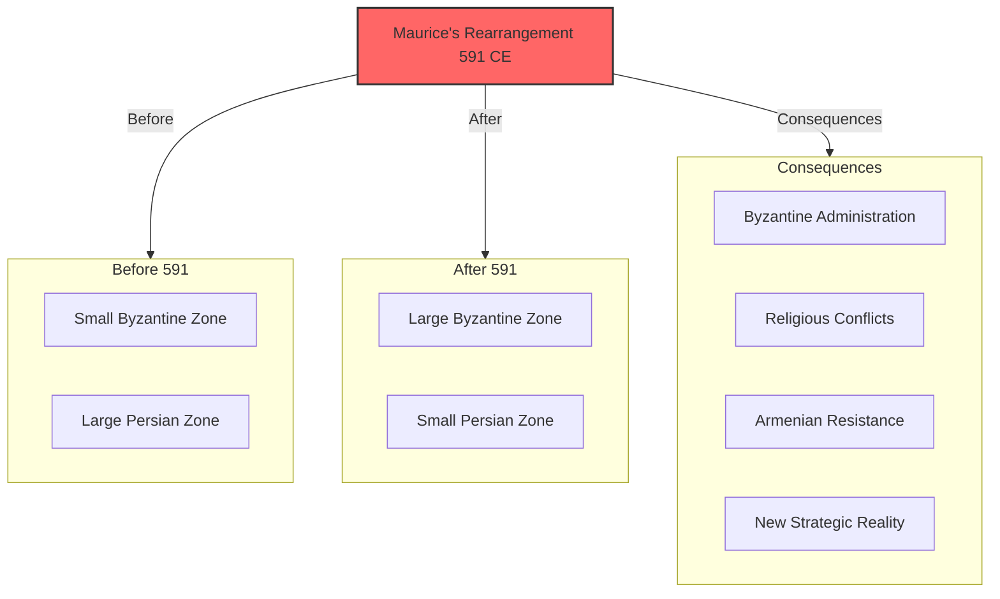

**Religious dimension:** The territorial shift brought more Armenians under Byzantine authority, intensifying religious tensions between the Armenian Church and Byzantine orthodoxy.

------

## Religious Divisions and Identity

The partition of Armenia interacted with religious differences:

- **Armenian Church** developed distinctive identity
- **Rejection of Council of Chalcedon** (451 CE) separated from Byzantine orthodoxy
- **Western zone** faced pressure to accept Chalcedonian doctrine
- **Eastern zone** faced Zoroastrian pressure at times
- **Religious identity** became marker of national identity
- **Church institutions** preserved cultural continuity across political divisions
- **Theological differences** with both Byzantine and Persian religious authorities

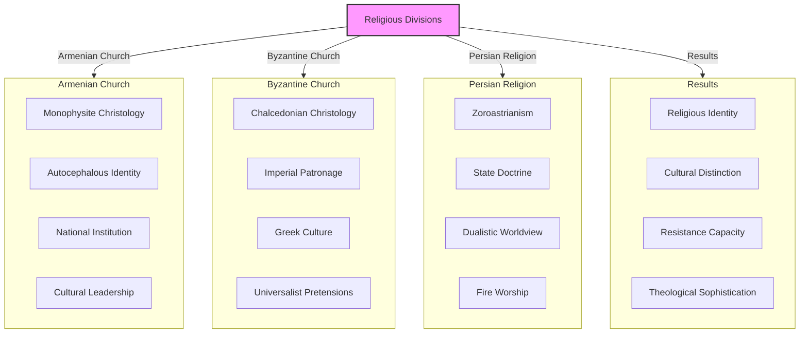

**Identity formation:** Religious differences became increasingly important markers of Armenian identity, with the Armenian Church's distinctive theology setting Armenians apart from both Byzantine and Persian religious traditions.

------

## Cultural Developments in Divided Armenia

Despite political division, Armenian culture flourished in distinctive ways:

- **Armenian alphabet** created by Mesrop Mashtots (c. 405 CE)
- **Bible translation** into Armenian (early 5th century)
- **Golden Age** of Armenian literature (5th century)
- **Historical works** by authors like Agathangelos and Moses of Khoren
- **Philosophical texts** translating and adapting Greek works
- **Architectural innovations** in church building
- **Musical traditions** developing in liturgical context
- **Artistic styles** blending Eastern and Western influences

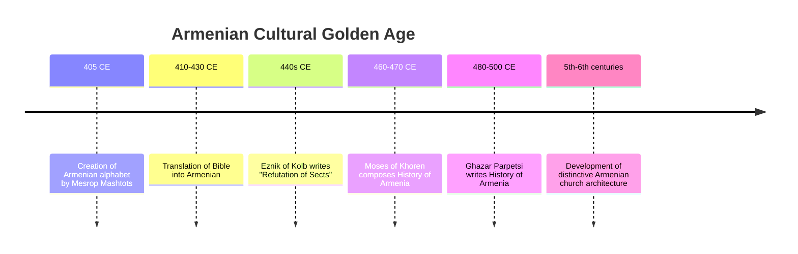

**Cultural unity despite division:** The creation of the Armenian alphabet and subsequent literary flowering helped maintain Armenian cultural unity despite political division, creating a shared written tradition that transcended imperial boundaries.

------

## The Final Byzantine-Persian Rearrangement

The devastating final Byzantine-Persian War (602-628) brought another shift:

- **Initial Persian conquest** of Byzantine Armenian territories
- **Heraclius' counteroffensive** eventually restoring Byzantine control
- **Exhaustion of both empires** from the prolonged conflict
- **Weakened frontier defenses** in Armenian regions
- **Administrative disruption** from repeated changes in control
- **Economic devastation** from warfare and requisitions
- **Setting the stage** for Arab conquest

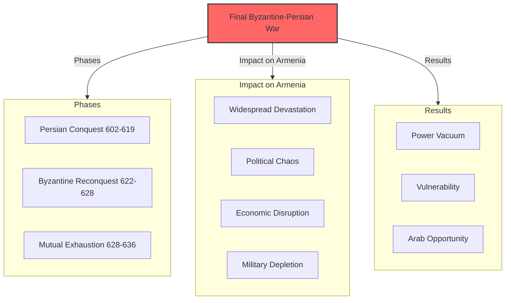

**Fatal exhaustion:** The final Byzantine-Persian War left both empires fatally weakened, creating the conditions for the Arab Muslim conquests that would transform the region.

------

## The Arab Conquest and New Division

The Arab conquests created a new division of Armenian territories:

- **Arab conquest** of former Persian territories (640s CE)
- **Byzantine retention** of western Armenian regions
- **Treaty of 653 CE** establishing new boundary
- **Armenia as frontier province (thughur)** between Caliphate and Byzantium
- **New administrative system** under Arab governors
- **Religious status** as dhimmis ("protected peoples")
- **New cultural influences** from Arab/Islamic civilization

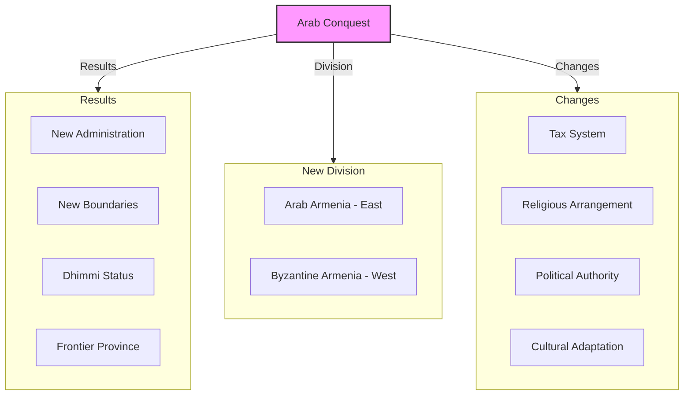

**New paradigm:** The Arab conquest ended the centuries-old Rome-Persia rivalry over Armenia, replacing it with a new geopolitical reality that would shape Armenian history for the next several centuries.

------

## Legacy of Division: Regional Variations in Armenian Culture

The centuries of division left lasting impacts on Armenian regional cultures:

- **Western Armenian** vs. **Eastern Armenian** dialectal differences
- **Architectural variations** between regions
- **Manuscript traditions** with distinctive regional styles
- **Musical variations** in different Armenian communities
- **Cultural influences** from different imperial traditions
- **Social structures** varying between regions
- **Religious practices** with regional distinctions

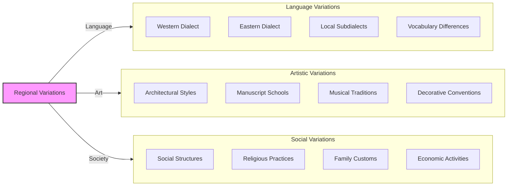

**Enduring differences:** The regional variations that began during the Rome-Persia conflict created enduring differences in Armenian culture that would persist into the modern era.

------

## Legacy of Division: Adaptive Strategies

Centuries of division taught Armenians valuable adaptive strategies:

- **Cultural preservation** under foreign rule
- **Religious institutions** as repositories of national identity
- **Diplomatic flexibility** in dealing with competing powers
- **Merchant networks** spanning imperial boundaries
- **Educational systems** maintaining language and traditions
- **Architectural expressions** of identity through church building
- **Literary traditions** preserving historical memory
- **Communal solidarity** in face of external pressures

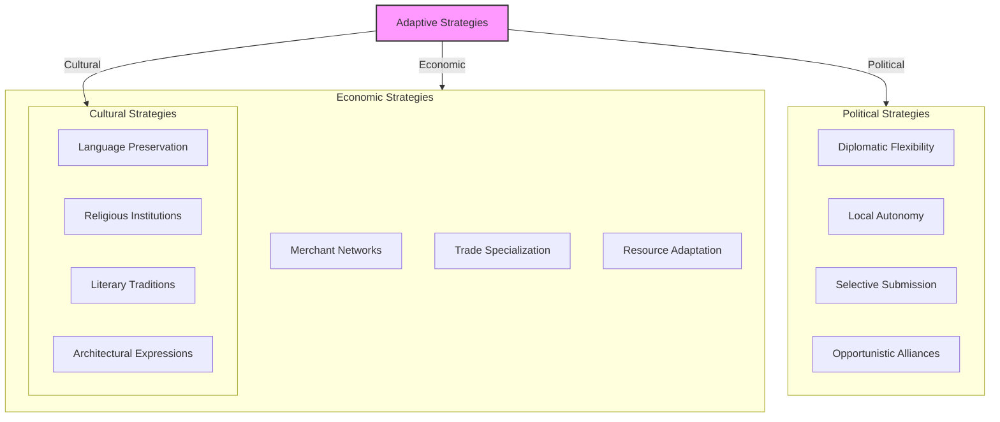

**Survival toolkit:** The strategies developed during centuries of division between Rome and Persia created a toolkit for cultural survival that would serve Armenians well during later periods of foreign domination.

------

## Legacy of Division: Patterns of Great Power Competition

The Rome-Persia rivalry established patterns that would repeat in later centuries:

- **Armenia as buffer state** between competing powers
- **Strategic importance** due to geographic position
- **Religious dimension** to geopolitical competition
- **External powers** exploiting internal divisions
- **Formal and informal partitions** of Armenian territories
- **Armenian elites** balancing between powers
- **Cultural identity** preserved despite political division

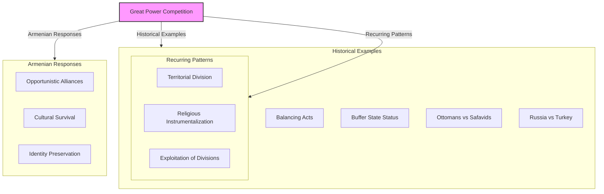

**Recurring theme:** The pattern of Armenia caught between competing powers would repeat throughout history, from Rome vs. Persia to Byzantium vs. Arabs, Ottomans vs. Safavids, and Russia vs. Turkey.

------

## Conclusion: The Enduring Impact of the Rome-Persia Conflict

The seven centuries of Rome-Persia conflict left profound and lasting impacts on Armenia:

1. **Political fragmentation** that would persist in various forms
2. **Regional cultural variations** that evolved into distinct traditions
3. **Religious identity** as core of national identity
4. **Adaptive strategies** for surviving under foreign rule
5. **Architectural heritage** reflecting influences from both East and West
6. **Literary traditions** preserving historical memory
7. **Diplomatic sophistication** born of necessity

Though the Rome-Persia rivalry ended with the Arab conquests in the 7th century, its legacy continued to shape Armenian history and identity for centuries to come. The experience of being divided between competing powers became a recurring theme in Armenian history, from the Byzantine-Arab frontier to the Ottoman-Safavid partition and eventually the division between Russian/Soviet and Ottoman/Turkish control.

Through all these divisions, Armenians maintained their distinctive identity, developing sophisticated strategies for cultural preservation under foreign rule. The resilience demonstrated during the Rome-Persia conflict would serve Armenian communities well through later centuries of foreign domination, displacement, and diaspora existence.

In this sense, the Rome-Persia rivalry did not just shape Armenia's ancient history—it helped forge the adaptive, resilient Armenian identity that has survived into the modern era despite centuries of existential challenges.
