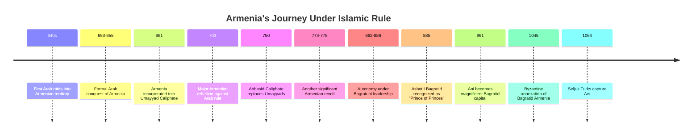
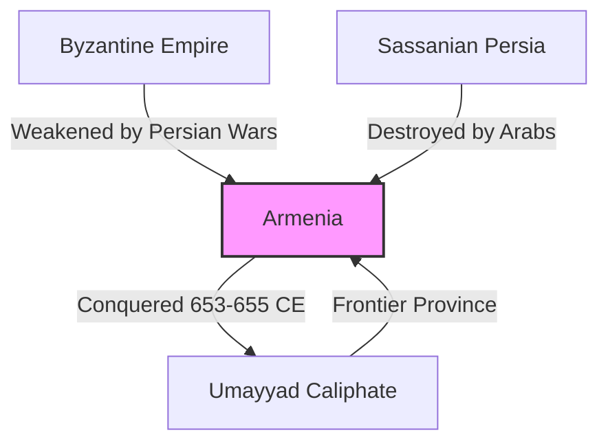
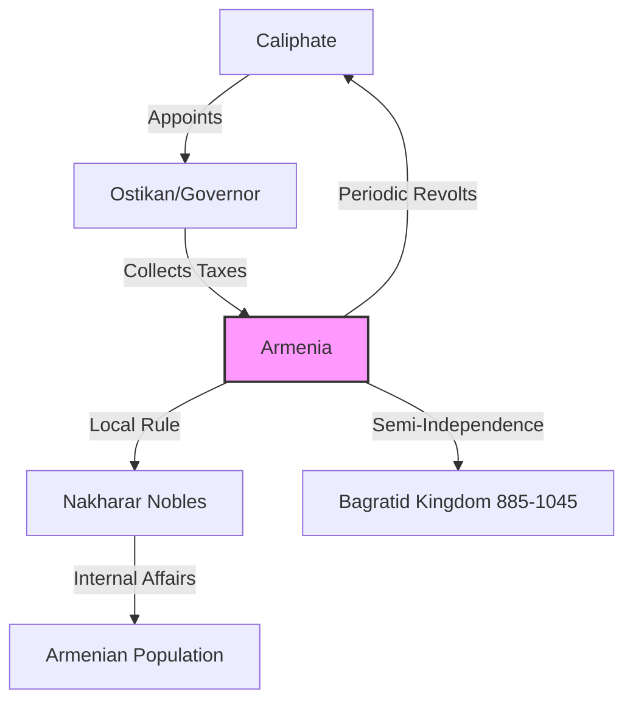
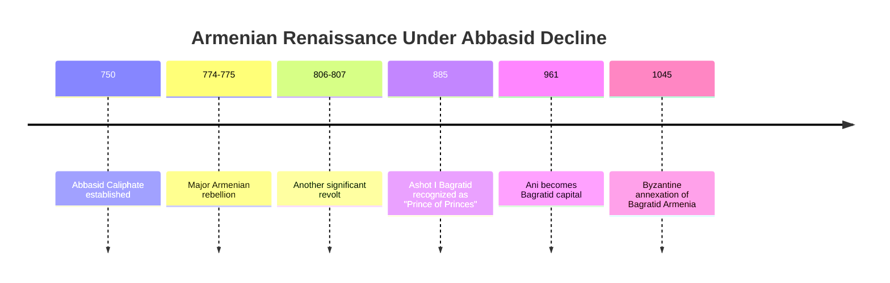
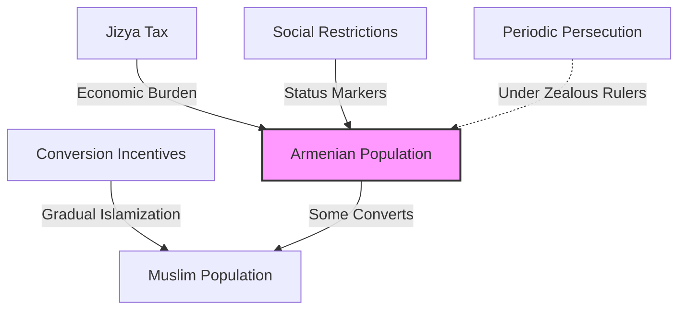
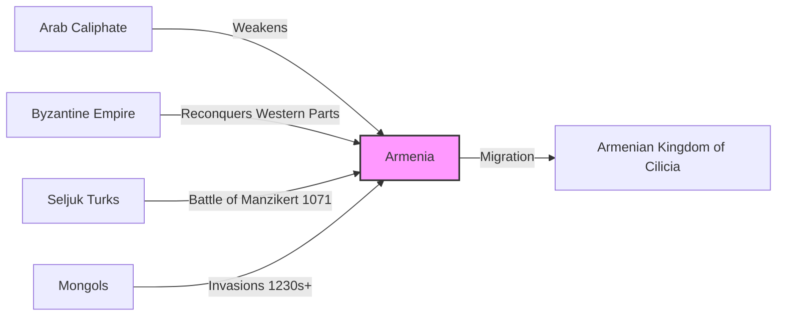

# Armenia Under Islamic Rule: From Conquest to Coexistence

The **Arab conquests** of the 7th century CE fundamentally transformed the Middle East. For Armenia, caught between the weakened Byzantine Empire and the collapsing Sassanian Persia, the arrival of Islam marked the beginning of a new era that would last for centuries.

This period brought both challenges and unexpected opportunities for Armenians as they navigated life under Islamic rule and their status as **People of the Book** (Ahl al-Kitab).

------

## Timeline: Armenia Under Islamic Rule

------

## The Arab Conquest of Armenia

The Arab expansion reached Armenia shortly after the fall of Sassanian Persia:

- **640s CE:** First Arab raids into Armenian territory
- **653-655 CE:** Formal conquest and treaty arrangements
- **661 CE:** Armenia incorporated into the **Umayyad Caliphate**
- **Armenia became a frontier province** (thughur) between the Caliphate and Byzantium

**End of the Rome-Persia Balance:** For the first time in centuries, Armenia was no longer caught between two roughly equal powers. The Caliphate became the dominant force, while Byzantium was pushed back to Anatolia.

------

## The Dhimmi Status: People of the Book

As Christians, Armenians received the status of **dhimmis** ("protected peoples") under Islamic law:

- **Religious recognition:** Christianity acknowledged as a valid, if incomplete, revelation
- **Protected status:** Right to practice their faith and maintain churches
- **Legal autonomy:** Armenian communities largely governed by their own religious leaders
- **Jizya tax:** Special poll tax on non-Muslims in exchange for protection and exemption from military service

**Benefits of "People of the Book" status:**

1. **Religious continuity:** Unlike under Zoroastrian Persia, no forced conversion attempts
2. **Cultural preservation:** Armenian Church maintained schools, literature, and identity
3. **Legal recognition:** Formal protected status under Islamic law
4. **Military exemption:** Armenians not required to fight in Muslim armies
5. **Commercial opportunities:** Access to vast trade networks of the Caliphate

------

## Political Arrangements and Autonomy

Armenian political structures evolved under Islamic rule:

- **Ostikanate of Armenia:** Province governed by an Arab governor (ostikan)
- **Nakharar system preserved:** Armenian noble houses maintained local authority
- **Tributary status:** Armenia paid taxes but retained internal autonomy
- **Periodic rebellions:** Major Armenian revolts in 703, 774-775, and 850-855
- **Bagratid revival:** Semi-independent Armenian kingdom emerged (885-1045)

**Autonomy through distance:** Armenia's mountainous terrain and distance from Damascus/Baghdad allowed for significant practical autonomy, especially during periods of caliphal weakness.

------

## The Abbasid Period and Armenian Renaissance

The **Abbasid Caliphate** (750-1258) saw significant changes for Armenians:

- **Caliphal weakening** allowed greater Armenian autonomy
- **Rise of the Bagratid dynasty** (885-1045) as semi-independent rulers
- **Cultural flowering** in architecture, literature, and art
- **City of Ani** became a magnificent capital with 1,001 churches
- **Commercial prosperity** through trade routes

**Taking advantage of opportunity:** As the Abbasid Caliphate weakened, Armenians carved out increasing autonomy, eventually establishing semi-independent kingdoms.

------

## Challenges of Islamic Rule

Despite the benefits of dhimmi status, Armenians faced significant challenges:

- **Jizya tax burden** could be heavy, especially during times of fiscal crisis
- **Social restrictions:** Limitations on building new churches, riding horses, bearing arms
- **Occasional persecution** under zealous rulers like al-Mutawakkil (847-861)
- **Conversion pressure:** Economic and social incentives to convert to Islam
- **Periodic Arab settlement** in Armenian lands

**Resilient identity:** Despite these pressures, the majority of Armenians maintained their Christian faith and distinct identity throughout the Islamic period.

------

## The End of Arab Rule and New Conquerors

Arab rule eventually gave way to new powers:

- **Byzantine reconquest** of parts of Armenia (1000s)
- **Seljuk Turk invasions** (after 1064)
- **Battle of Manzikert (1071)** opened Armenia to Turkish settlement
- **Crusader interactions** with Armenian Cilicia
- **Mongol invasions** (1230s onwards)

**From one empire to many:** The end of unified Caliphate rule meant Armenia faced multiple competing powers once again.

------

## Legacy of the Islamic Period

The centuries of Islamic rule left lasting impacts on Armenian society:

1. **Religious identity strengthened** through contrast with the dominant Islamic culture
2. **Church leadership empowered** as representatives to Muslim authorities
3. **Commercial skills developed** that would serve Armenian communities for centuries
4. **Diaspora communities established** throughout the Middle East
5. **Cultural adaptability demonstrated** while maintaining core identity
6. **Architectural influences absorbed** into Armenian church design

------

## Conclusion: The Paradox of Islamic Rule

For Armenians, Islamic rule presented a paradox:

On one hand, it meant **subordinate status, taxation, and occasional persecution**. On the other, it provided **religious tolerance, commercial opportunities, and cultural autonomy** often exceeding what was available under Byzantine rule.

The "People of the Book" status, while discriminatory by modern standards, created a framework for **coexistence and cultural preservation** that allowed Armenian identity to survive and even flourish during centuries of Islamic dominance.

This resilience would serve Armenians well as they faced new waves of conquerors in the centuries to come.
