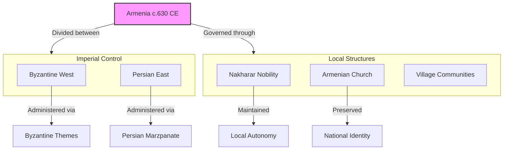
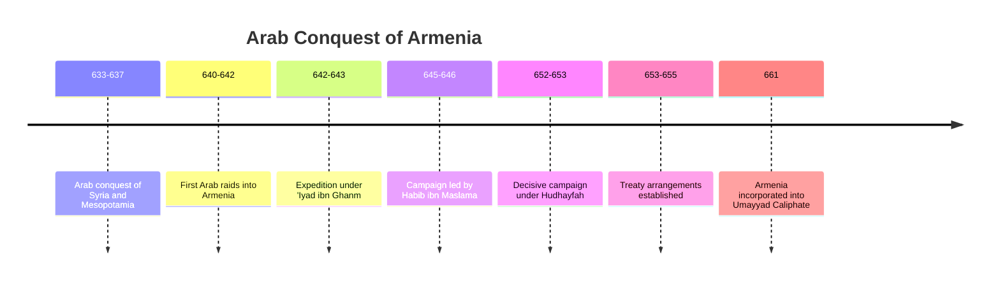
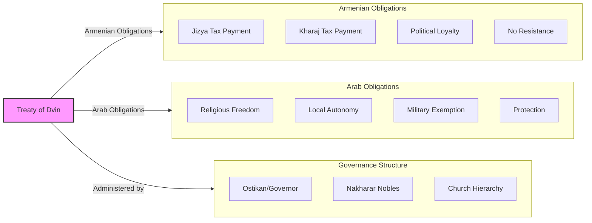
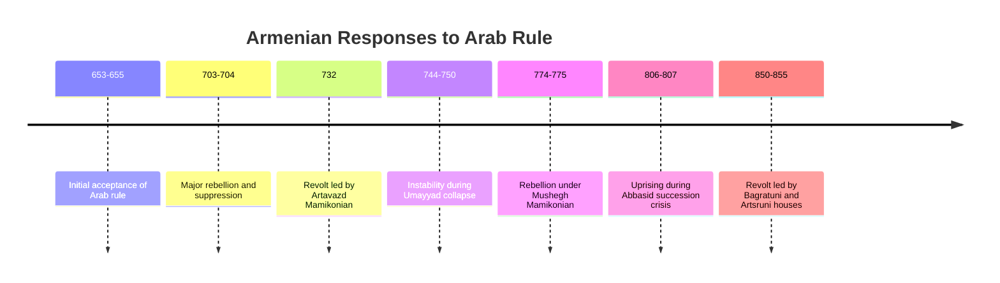
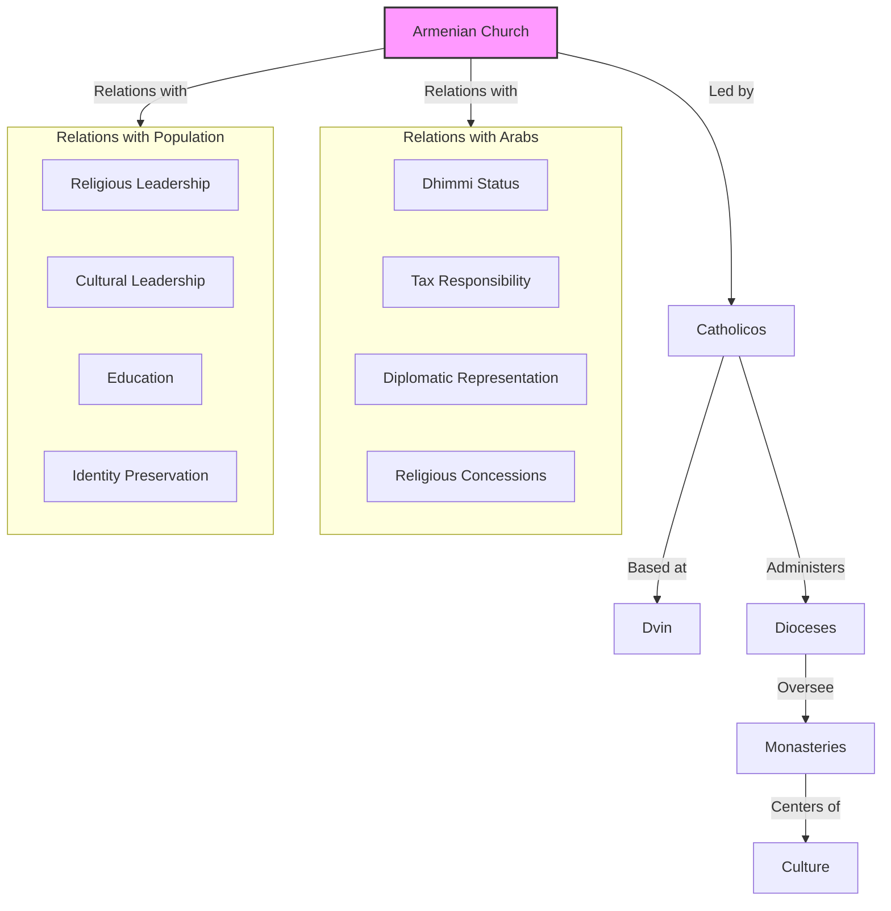
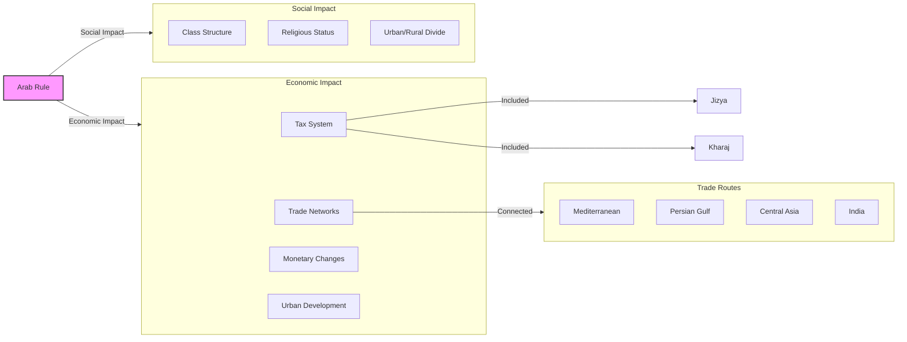

# The Arab Conquest of Armenia: A New Imperial Master

The **Arab conquest of Armenia** in the mid-7th century CE marked a pivotal turning point in Armenian history. After centuries of being caught between the Byzantine and Persian empires, Armenians suddenly faced a new imperial power with a different religion, culture, and system of governance.

This post examines how the Arab conquest unfolded, how Armenians initially responded, and how the first century of Islamic rule reshaped Armenian society and politics.

------

## Armenia on the Eve of Arab Conquest

By the 630s CE, Armenia was in a precarious position:

- **Exhausted by Byzantine-Persian wars** that had ravaged the region for decades
- **Divided between Byzantine and Persian zones** following the 591 treaty
- **Marzpanate system** under Persian control in the east
- **Byzantine administration** in the west
- **Armenian nakharar nobility** maintaining local power under imperial oversight
- **Armenian Church** serving as focus of national identity

**The Persian collapse:** The Sassanian Empire's defeat by Arab forces (633-651) removed one of Armenia's traditional overlords and created a power vacuum that the Arabs would soon fill.

------

## The Arab Advance into the Caucasus

The Arab conquest of Armenia occurred in several phases:

- **640-642:** First Arab raids into southern Armenia and Azerbaijan
- **642-643:** Major expedition under 'Iyad ibn Ghanm
- **645-646:** Campaign led by Habib ibn Maslama
- **652-653:** Decisive campaign under Hudhayfah ibn al-Yaman
- **653-655:** Treaty arrangements establishing Arab rule

**Military factors:** Several factors contributed to Arab success:
1. **Byzantine-Persian exhaustion** after decades of warfare
2. **Armenian disunity** and lack of centralized resistance
3. **Arab military mobility** and tactical innovations
4. **Religious zeal** of the Arab forces
5. **Pragmatic treaty terms** offered to local populations

------

## The Treaty of Dvin: Terms of Surrender

The formal incorporation of Armenia into the Caliphate came through the **Treaty of Dvin** (c.653-655):

- **Jizya payment** (poll tax on non-Muslims) in exchange for protection
- **Kharaj payment** (land tax) on agricultural production
- **Religious freedom** guaranteed for Christians
- **Local autonomy** under Arab oversight
- **Military service** not required of Armenian Christians
- **Protection from external enemies** promised by Arabs

**Armenian acceptance:** Armenian leaders largely accepted these terms as preferable to continued warfare, especially given the relatively tolerant religious policy compared to Byzantine pressure for Chalcedonian orthodoxy.

------

## The Establishment of Arab Rule

The Arabs established a new administrative system in Armenia:

- **Ostikanate of Arminiya** created as an administrative province
- **Arab governor (ostikan)** appointed from Damascus/Baghdad
- **Capital at Dvin** (sometimes Partav/Barda'a)
- **Armenia grouped with Azerbaijan and parts of Georgia** in administration
- **Tax collection** through local Armenian nobles
- **Garrison towns** established at strategic locations
- **Arab settlement** limited primarily to administrative centers

**Limited direct rule:** The Arabs established a relatively light administrative footprint, relying heavily on local elites to maintain order and collect taxes, rather than imposing direct rule at the local level.

------

## Armenian Resistance and Accommodation

Armenian responses to Arab rule varied over time:

- **Initial acceptance** of Arab overlordship as preferable to Byzantine religious pressure
- **Rebellion of 703-704** led by various nakharars
- **Suppression** by Muhammad ibn Marwan with severe punishments
- **Alternating periods** of cooperation and resistance
- **Strategic alliances** between some nakharars and Arab authorities
- **Church diplomacy** to protect Armenian religious institutions

**Shifting strategies:** Armenian elites developed sophisticated strategies of selective resistance and accommodation, playing off Byzantine and Arab powers against each other when possible.

------

## The Armenian Church Under Early Arab Rule

The Armenian Church navigated the new political reality:

- **Religious autonomy** preserved under dhimmi status
- **Catholicos** (Armenian Church leader) became de facto representative to Arab authorities
- **Church councils** continued to meet and make religious decisions
- **Monastery construction** continued, though with some restrictions
- **Theological development** free from Byzantine pressure for conformity
- **Educational role** enhanced as preserver of Armenian identity

**Religious freedom paradox:** Under Arab rule, the Armenian Church often enjoyed greater freedom to practice its distinctive Monophysite Christianity than it had under Byzantine rule, where it faced pressure to conform to Chalcedonian orthodoxy.

------

## Economic and Social Changes

Arab rule brought significant economic changes:

- **Integration into Caliphate trade networks** spanning from Spain to India
- **New taxation systems** based on Islamic principles
- **Currency reforms** with introduction of Arab coinage
- **Agricultural changes** with some new crops and techniques
- **Urban development** in administrative centers
- **Commercial opportunities** for Armenian merchants
- **Craft specialization** in Armenian communities

**Commercial adaptation:** Armenian merchants adapted quickly to the new economic realities, taking advantage of the vast trade networks of the Caliphate and developing specialized commercial skills.

------

## The Transition to Abbasid Rule

The **Abbasid Revolution** (747-750) brought significant changes to Armenia:

- **Umayyad collapse** created temporary power vacuum
- **Armenian opportunism** during the transition period
- **New administrative approaches** under early Abbasids
- **More systematic taxation** and census-taking
- **Increased cultural exchange** with the Islamic world
- **Gradual shift** of Caliphate attention away from Armenia
- **Seeds of autonomy** that would later flourish under the Bagratids

**Changing dynamics:** The Abbasid period saw a gradual transformation in Arab-Armenian relations, with direct control slowly giving way to more autonomous local rule as the Caliphate's attention shifted elsewhere.

------

## Conclusion: The Impact of the Arab Conquest

The Arab conquest of Armenia had profound and lasting consequences:

1. **End of Byzantine-Persian competition** over Armenian territory
2. **Integration into the Islamic world** economically and culturally
3. **Preservation of Armenian Christianity** under dhimmi status
4. **Development of new political strategies** by Armenian elites
5. **Enhanced role for the Armenian Church** as community leader
6. **New economic opportunities** through Caliphate trade networks
7. **Foundation for later autonomy** under the Bagratid dynasty

The Arab conquest represented not just a change in overlords but a fundamental reorientation of Armenia's position in the medieval world—from a contested frontier between Byzantine and Persian empires to a province within the vast Islamic Caliphate.

This new reality would shape Armenian society, politics, and culture for centuries to come, establishing patterns of minority existence that would prove crucial to Armenian survival through later periods of foreign domination.
