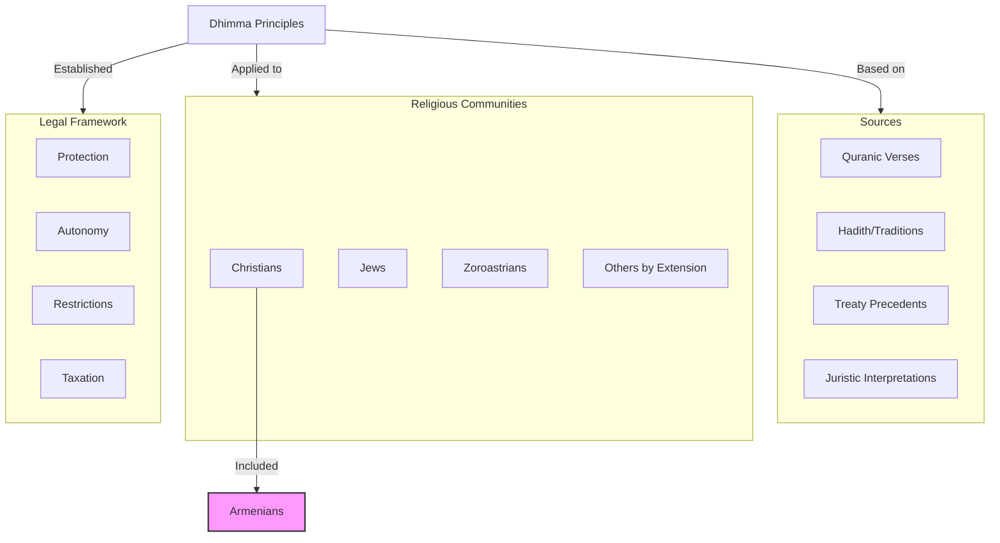
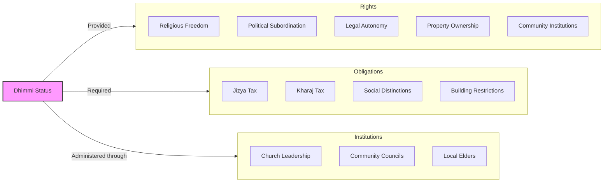
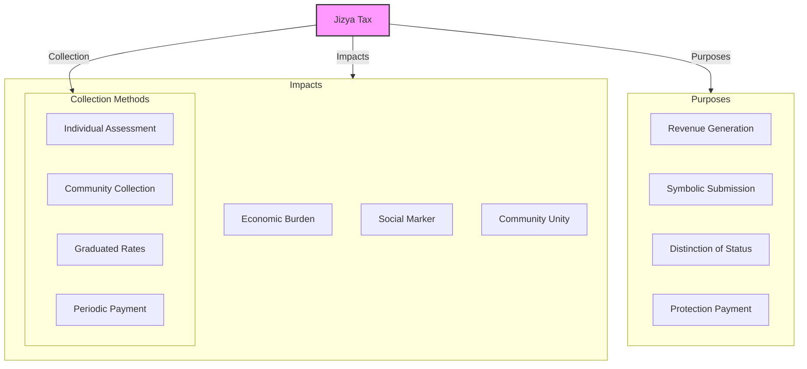
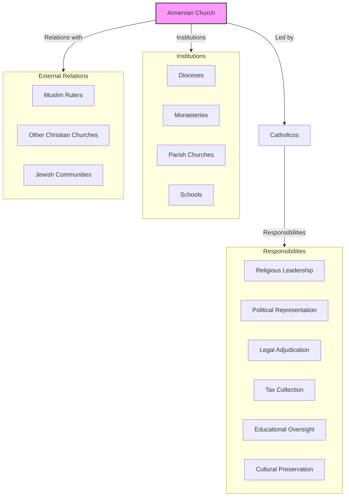
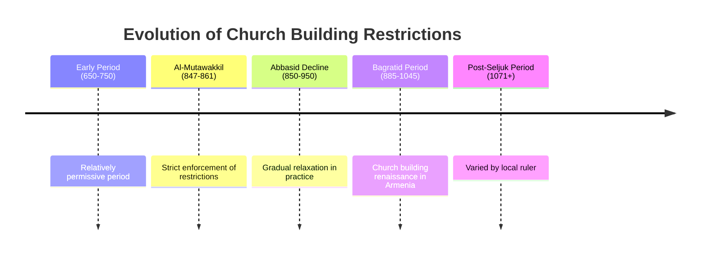
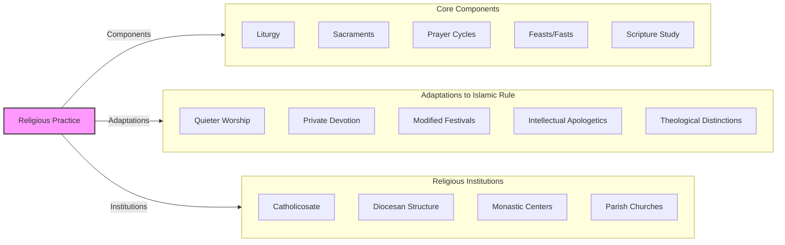
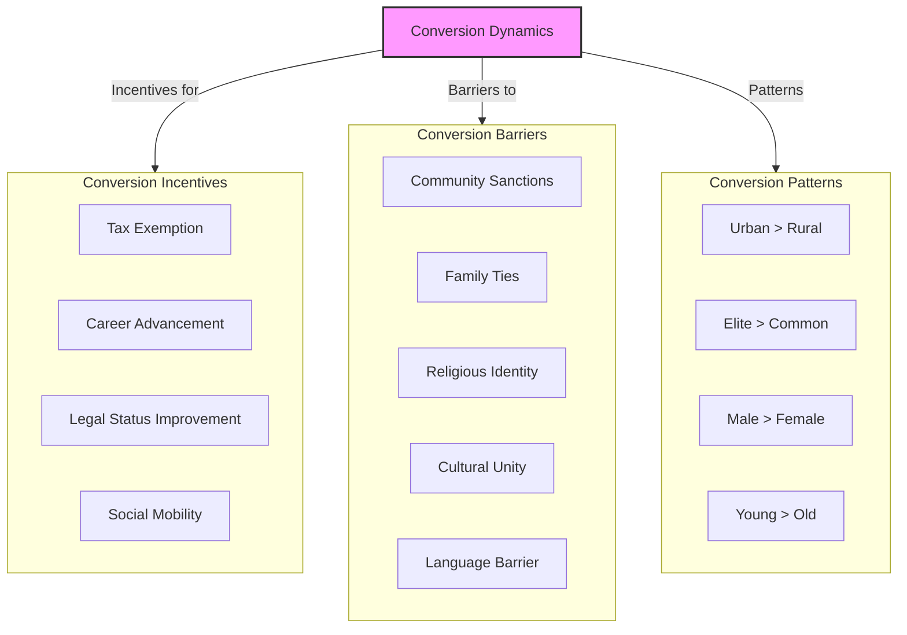

# Dhimmi Status and Religious Life: Armenians as "People of the Book"

One of the most significant aspects of Armenian life under Islamic rule was their status as **dhimmis** ("protected peoples"). This legal framework, based on the Quran and early Islamic jurisprudence, created a distinct position for Christians, Jews, and other "People of the Book" within Muslim society.

For Armenians, dhimmi status represented both **restrictions** and **opportunities**—a complex arrangement that would shape their religious, social, and cultural life for centuries.

------

## The Concept of Dhimma in Islamic Law

The **dhimma** ("covenant of protection") developed during the early Islamic conquests:

- **Quranic basis:** Recognition of earlier revelations to Jews and Christians
- **Treaty precedents:** Early agreements between Muhammad and non-Muslim communities
- **Umar's Pact:** Attributed to Caliph Umar, established basic framework
- **Gradual development:** System evolved over time through practice and legal interpretation
- **Religious distinction:** Clear separation between Muslims and non-Muslims
- **Practical governance:** Allowed Islamic rule over diverse religious populations



**Theological basis:** Islam recognized Christianity and Judaism as valid but incomplete revelations, with their adherents entitled to protection if they accepted Muslim rule and certain restrictions.

------

## Rights and Obligations Under Dhimmi Status

The dhimmi arrangement created a specific set of rights and obligations for Armenians:

### Rights of Armenian Christians:

- **Religious freedom:** Right to practice Christianity without forced conversion
- **Personal security:** Protection of life and property
- **Legal autonomy:** Internal community matters governed by Armenian law and courts
- **Property ownership:** Right to own land and businesses
- **Community institutions:** Churches, monasteries, and schools permitted
- **Commercial activities:** Participation in trade and crafts

### Obligations of Armenian Christians:

- **Jizya tax:** Special poll tax on adult males
- **Kharaj tax:** Land tax regardless of owner's religion
- **Social distinctions:** Visible markers of non-Muslim status
- **Behavioral restrictions:** Various limitations on public behavior
- **Building restrictions:** Limitations on new churches and repairs
- **Political subordination:** Acceptance of Muslim rule



**Practical implementation:** The application of these principles varied considerably over time and place, with some periods seeing strict enforcement and others much more relaxed implementation.

------

## The Jizya Tax: Burden and Meaning

The **jizya** tax was central to dhimmi status:

- **Religious basis:** Justified in Quran 9:29 as submission symbol
- **Practical function:** Revenue source for the Islamic state
- **Exemptions:** Women, children, elderly, disabled, monks, the poor
- **Collection methods:** Varied from respectful to humiliating depending on ruler
- **Tax rates:** Typically graduated based on wealth (rich, middle class, poor)
- **Collective responsibility:** Often collected from community as whole sum



**Economic significance:** The jizya could be a significant burden, particularly during times of fiscal crisis when rates might be increased or exemptions reduced. This economic pressure sometimes led to conversion to Islam, though most Armenians maintained their Christian faith despite the financial incentive to convert.

------

## The Armenian Church as Community Leader

Under Islamic rule, the **Armenian Church** took on expanded roles:

- **Religious leadership** remained primary function
- **Political representation** to Islamic authorities
- **Legal adjudication** of internal community matters
- **Tax collection** responsibility in many periods
- **Educational oversight** through church schools
- **Cultural preservation** through liturgy and manuscripts
- **Social services** for community members



**Enhanced authority:** The dhimmi system actually enhanced the authority of the Armenian Church hierarchy, as Islamic authorities preferred to deal with a single representative body rather than individual Christians. This strengthened the Church's position within Armenian society.

------

## Religious Buildings and Restrictions

Islamic law placed certain restrictions on Christian religious buildings:

- **No new churches** in cities founded by Muslims
- **Repair restrictions** on existing churches
- **Height limitations** (not taller than mosques)
- **Modest exteriors** required
- **Bell and cross restrictions** in public spaces
- **Location limitations** in some periods



**Practical workarounds:**
- Building in pre-Islamic settlements
- Rebuilding on foundations of older churches
- Obtaining special permissions through influence or payment
- Focusing on interior decoration rather than exterior grandeur
- Building in remote areas away from Muslim populations

------

## Religious Practice and Adaptation

Armenian Christianity adapted to the realities of Islamic rule:

- **Liturgical continuity:** Core worship practices maintained
- **Theological development:** Continued refinement of Armenian doctrine
- **Monastic strength:** Monasteries became even more important centers
- **Manuscript production:** Focus on preserving texts and traditions
- **Festival adaptations:** More subdued public celebrations
- **Private devotion:** Increased emphasis on household religious practice
- **Apologetic literature:** Some works defending Christianity to Muslims



**Distinctive identity:** The pressure of living under Islamic rule actually strengthened Armenian religious identity in some ways, as maintaining Christianity became a central marker of Armenian distinctiveness.

------

## Conversion Dynamics

Despite economic and social incentives, most Armenians resisted conversion to Islam:

- **Economic incentives:** Tax exemption and career advancement for converts
- **Social incentives:** Higher status and full legal rights
- **Conversion patterns:** Higher among urban elites than rural populations
- **Geographic factors:** Remote areas saw less conversion pressure
- **Periodic pressures:** Some periods saw more aggressive conversion efforts
- **Community penalties:** Social ostracism for converts from Christianity



**Resilient faith:** The Armenian Christian identity proved remarkably resilient despite centuries of rule by Islamic powers, with the vast majority of Armenians maintaining their ancestral faith.

------

## Interreligious Relations and Dialogue

Armenian-Muslim relations varied considerably:

- **Intellectual exchanges:** Some theological and philosophical dialogue
- **Practical coexistence:** Day-to-day interactions in markets and neighborhoods
- **Cultural borrowing:** Selective adaptation of Islamic artistic elements
- **Language influence:** Arabic and Persian terms entering Armenian vocabulary
- **Scientific exchange:** Medical and astronomical knowledge sharing
- **Literary awareness:** Some familiarity with each other's literary traditions

```mermaid
flowchart LR
    IR[Interreligious Relations] -->|Types of| IN[Interactions]
    
    subgraph IN[Interactions]
        CO[Commercial]
        IN[Intellectual]
        PO[Political]
        CU[Cultural]
        SO[Social]
    end
    
    IR -->|Contexts| CT[Contexts]
    
    subgraph CT[Contexts]
        UR[Urban Centers]
        RU[Rural Areas]
        CO[Courts/Administrative Centers]
        MA[Marketplaces]
        BO[Borderlands]
    end
    
    IR -->|Outcomes| OU[Outcomes]
    
    subgraph OU[Outcomes]
        CB[Cultural Borrowing]
        LI[Linguistic Influence]
        TE[Theological Exchange]
        SC[Scientific Collaboration]
        AR[Artistic Resonances]
    end
    
    style IR fill:#f9f,stroke:#333,stroke-width:2px
```

**Complex relationships:** While the legal framework created clear hierarchies, actual relationships between Armenians and Muslims were often more complex and nuanced than the formal dhimmi system might suggest.

------

## Comparison with Other Christian Communities

The Armenian experience differed from other Christian communities under Islam:

- **Stronger communal identity** than many Melkite (Byzantine) Christians
- **More unified leadership** through Catholicosate than fragmented Nestorians
- **Geographic concentration** unlike more dispersed Jacobites
- **Less integration** with Islamic culture than Coptic Egyptians
- **Greater distance** from centers of Islamic power than Syrian Christians
- **More political autonomy** in Armenian highlands than urban Christians elsewhere

```mermaid
flowchart TD
    CC[Christian Communities] -->|Under Islamic Rule| CO[Comparisons]
    
    subgraph CO[Comparisons]
        AR[Armenians]
        ME[Melkites/Byzantines]
        NE[Nestorians/Church of East]
        JA[Jacobites/Syrian Orthodox]
        CO[Copts]
    end
    
    AR -->|Characteristics| CH[Armenian Characteristics]
    
    subgraph CH[Armenian Characteristics]
        UI[Unified Identity]
        GC[Geographic Concentration]
        CL[Centralized Leadership]
        DI[Distinct Language]
        PA[Political Autonomy]
    end
    
    style AR fill:#f9f,stroke:#333,stroke-width:2px
```

**Distinctive factors:** Geographic concentration in the Armenian highlands, linguistic uniqueness, and strong church leadership all contributed to the distinctive Armenian experience under Islamic rule.

------

## Conclusion: The Paradox of Dhimmi Status

For Armenians, dhimmi status represented a profound paradox:

On one hand, it meant **subordinate status, taxation, and restrictions**. On the other, it provided **religious tolerance, legal recognition, and cultural autonomy** that often exceeded what was available under Byzantine rule.

The "People of the Book" status, while discriminatory by modern standards, created a framework for **coexistence and cultural preservation** that allowed Armenian Christianity to survive and even flourish during centuries of Islamic dominance.

This experience helped shape a distinctive Armenian approach to minority existence—maintaining core religious and cultural identity while selectively adapting to the dominant culture. These strategies would prove vital during later periods of foreign rule, from the Mongols to the Ottomans and beyond.

The dhimmi experience thus represents not just a historical curiosity but a formative period that helped shape Armenian identity and survival strategies that continue to resonate in Armenian communities worldwide today.
