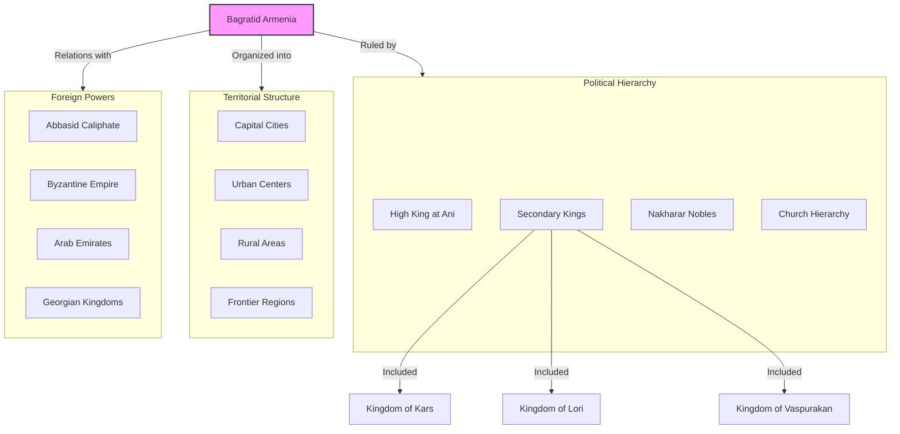
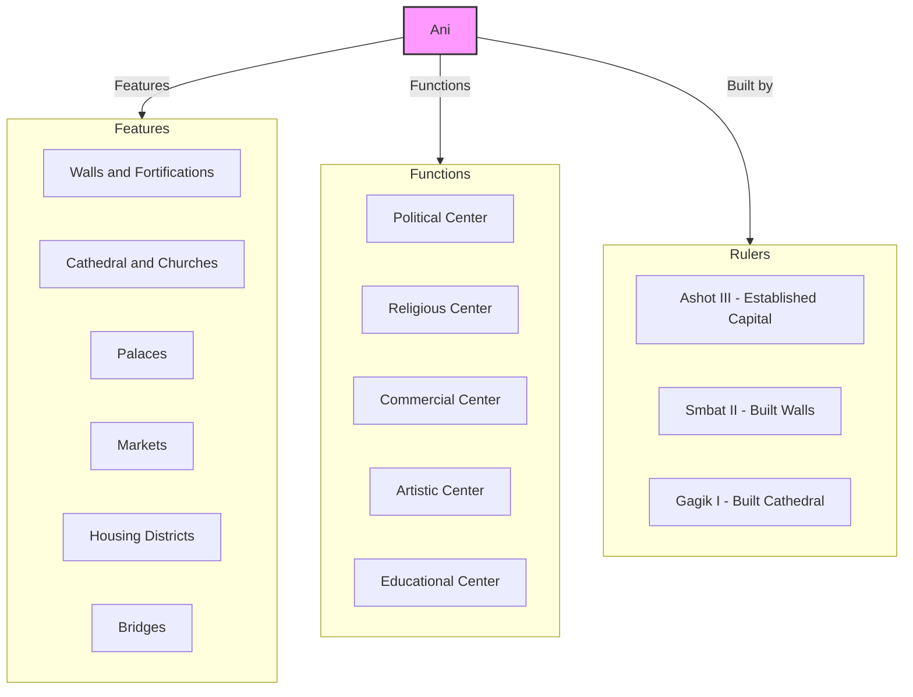
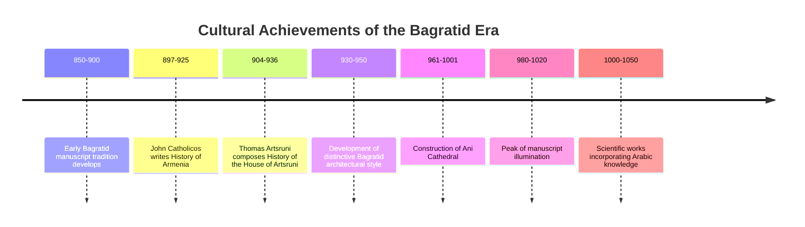
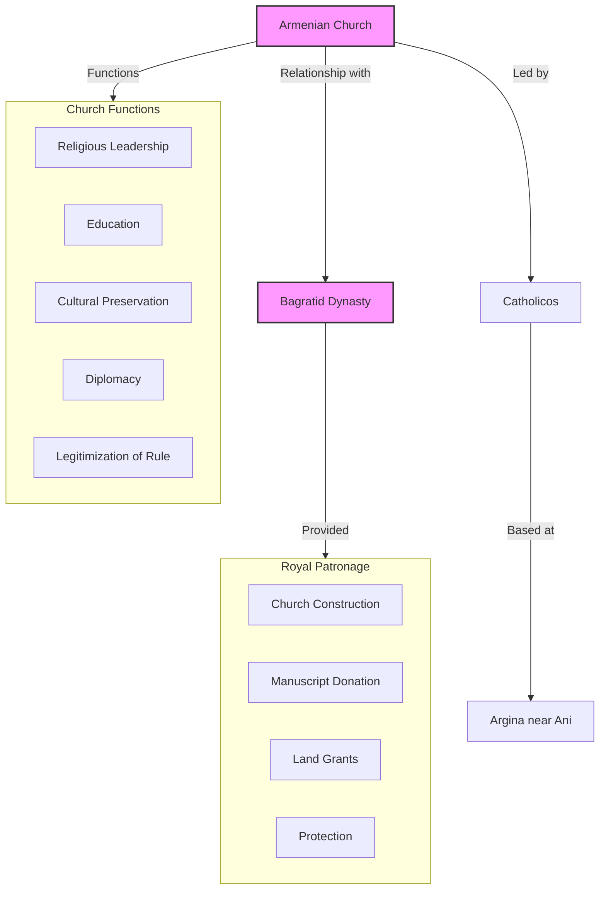
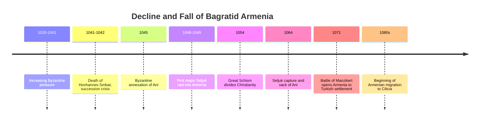
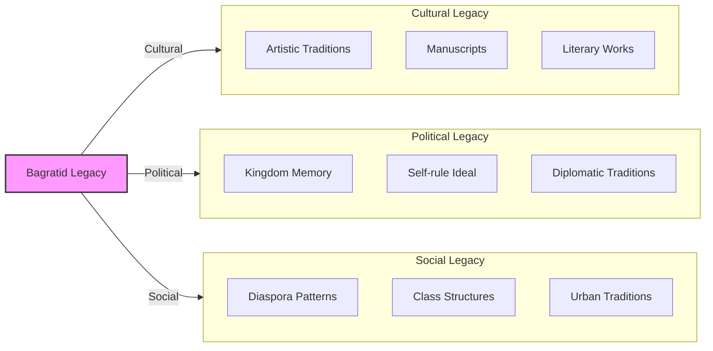

# The Bagratid Renaissance: Armenian Revival Under Abbasid Decline

As the **Abbasid Caliphate** began its slow decline in the 9th century, a remarkable renaissance occurred in Armenia. The **Bagratid dynasty** (Bagratuni in Armenian) emerged as semi-independent rulers, ushering in a period of political autonomy, economic prosperity, and cultural flowering that represented one of the high points of medieval Armenian civilization.

This post examines how the weakening of central Abbasid authority created space for Armenian self-rule, and how the Bagratids took advantage of this opportunity to create a flourishing Armenian kingdom centered on the magnificent capital city of **Ani**.

------

## The Rise of the Bagratids

The Bagratid family's ascent to power was gradual:

- **Traditional nakharar house** with lands in Sper and Tayk regions
- **Loyal service** to Arab rulers in early period
- **Strategic marriages** with other noble houses
- **Gradual accumulation** of lands and influence
- **Ashot Msaker** ("the Meat-Eater," d. 826) laid foundations for family power
- **Bagarat I** (826-851) expanded family holdings
- **Ashot I** (862-890) achieved formal recognition as "Prince of Princes"

**Dual recognition:** The key moment came in 885-887 when Ashot I received royal recognition from **both** the Abbasid Caliph and the Byzantine Emperor—a diplomatic masterstroke that legitimized Bagratid rule from both major powers.

------

## Factors Enabling Armenian Autonomy

Several factors created the opportunity for Bagratid autonomy:

- **Abbasid internal problems** including succession disputes and revolts
- **Weakening central control** over distant provinces
- **Rise of local dynasties** throughout the Caliphate
- **Byzantine resurgence** creating competition for Armenian loyalty
- **Geographic isolation** of Armenian highlands
- **Armenian unity** under Bagratid leadership
- **Economic resources** of Armenia becoming more valuable to trade

**Timing and opportunity:** The Bagratids skillfully exploited the growing power vacuum, positioning themselves as useful intermediaries to both Abbasid and Byzantine authorities while gradually expanding their actual independence.

------

## The Structure of Bagratid Armenia

The Bagratid kingdom developed a complex political structure:

- **High King** (Shahanshah) as supreme ruler
- **Secondary kingdoms** under Bagratid relatives (Kars, Lori, Vaspurakan)
- **Nakharar nobles** maintaining traditional rights
- **Church hierarchy** closely allied with monarchy
- **Urban centers** with growing merchant classes
- **Rural areas** under aristocratic control
- **Frontier regions** with military organization

**Federated structure:** The Bagratid political system was not a centralized monarchy but rather a hierarchical federation of related kingdoms and principalities, with the High King at Ani exercising varying degrees of authority over the secondary rulers.

------

## Ani: The City of 1,001 Churches

The Bagratid capital of **Ani** became one of the medieval world's most impressive cities:

- **Established as capital** by King Ashot III in 961
- **Strategic location** on trade routes and defensible site
- **Massive walls** constructed by King Smbat II
- **Cathedral of Ani** built 989-1001 by Trdat the Architect
- **Population growth** to possibly 100,000 at its height
- **Religious buildings** earning it the title "City of 1,001 Churches"
- **Commercial center** with international merchants
- **Architectural innovations** including pointed arches and advanced domes

**Architectural achievement:** The Cathedral of Ani, designed by the architect Trdat (who later helped repair the dome of Hagia Sophia in Constantinople), represented the pinnacle of Armenian architecture and influenced Gothic architecture in Europe.

------

## Economic Prosperity Under the Bagratids

The Bagratid period saw remarkable economic development:

- **Agricultural expansion** with irrigation improvements
- **Trade route control** between Byzantium, Caliphate, and Central Asia
- **Urban growth** in Ani, Dvin, Kars, and other centers
- **Craft specialization** with high-quality Armenian products
- **Monetary economy** with circulation of multiple currencies
- **Tax revenues** supporting royal court and military
- **Construction boom** in religious and secular buildings

**Strategic position:** Armenia's location at the crossroads of major trade routes allowed the Bagratids to profit from commerce between the Islamic world, Byzantium, and Central Asia, creating wealth that funded their cultural and architectural achievements.

------

## Cultural and Artistic Renaissance

The Bagratid era witnessed a remarkable cultural flowering:

- **Architectural innovations** in church and secular building
- **Manuscript production** with distinctive miniature painting style
- **Literary works** including histories by Thomas Artsruni and John Catholicos
- **Educational revival** in monastic schools
- **Musical development** in Armenian liturgical tradition
- **Philosophical works** engaging with Greek and Arabic thought
- **Scientific knowledge** incorporating elements from multiple traditions

**Distinctive style:** Bagratid-era art and architecture developed a distinctive style that blended Armenian traditions with elements from Byzantine and Islamic worlds, creating a unique cultural synthesis.

------

## The Armenian Church Under Bagratid Rule

The Armenian Church enjoyed a special relationship with the Bagratid dynasty:

- **Royal patronage** of church construction and monasteries
- **Catholicos residence** at Argina near Ani
- **Theological continuity** with Armenian Apostolic traditions
- **Educational role** through monastic schools
- **Manuscript production** in monastic scriptoria
- **Political support** for Bagratid legitimacy
- **Diplomatic functions** in relations with other Christian powers

**Mutual support:** The relationship between church and monarchy was mutually beneficial—the church provided legitimacy and administrative support to the Bagratids, while the dynasty provided protection and patronage to the church.

------

## Relations with Neighboring Powers

The Bagratids maintained a delicate balance between major powers:

- **Abbasid Caliphate:** Formal submission while maximizing practical autonomy
- **Byzantine Empire:** Alliance against Arabs while resisting religious pressure
- **Arab Emirates:** Complex relationships with neighboring Muslim rulers
- **Georgian Kingdoms:** Generally friendly relations and cultural exchange
- **Artsruni Kingdom of Vaspurakan:** Sometimes allies, sometimes rivals
- **Other Armenian principalities:** Varying degrees of control and alliance

**Diplomatic skill:** The longevity of Bagratid rule depended on skillful diplomacy that played major powers against each other while avoiding direct confrontation with any of them.

------

## The Decline and Fall of Bagratid Armenia

Despite its achievements, the Bagratid kingdom eventually succumbed to external pressures:

- **Internal divisions** among Armenian noble houses
- **Byzantine expansionism** under emperors Basil II and Constantine IX
- **Seljuk Turkish raids** beginning in the 1040s
- **Byzantine annexation** of Ani in 1045
- **Battle of Manzikert** (1071) opening Armenia to Turkish conquest
- **Seljuk capture** of Ani in 1064
- **Population displacement** to Cilicia and other regions

**Tragic timing:** The Byzantine annexation of Ani in 1045, motivated by fear of Seljuk advances, ironically weakened the frontier defenses that might have resisted Turkish invasion. Just 26 years later, the Byzantine defeat at Manzikert opened all of Armenia to Turkish conquest.

------

## Legacy of the Bagratid Period

Though relatively brief, the Bagratid era left a lasting legacy:

1. **Architectural achievements** that still stand today (though mostly in ruins)
2. **Literary and artistic works** preserved in manuscripts worldwide
3. **Political precedent** of Armenian self-rule that inspired later movements
4. **Cultural confidence** that sustained Armenian identity through later hardships
5. **Diaspora patterns** established as Armenians fled to new regions
6. **Intellectual traditions** that influenced later Armenian thought
7. **Historical memory** as a golden age of Armenian achievement

**Cultural memory:** The memory of Bagratid Armenia, especially the splendor of Ani, became a powerful symbol of Armenian cultural achievement that helped sustain national identity through centuries of foreign rule.

------

## Conclusion: The Significance of the Bagratid Renaissance

The Bagratid period represents a remarkable example of how a people can take advantage of imperial decline to reassert their autonomy and culture. As the Abbasid Caliphate weakened, the Bagratids skillfully carved out space for Armenian self-rule, creating a kingdom that, while never fully independent, achieved significant autonomy and cultural distinction.

The architectural, artistic, and literary achievements of this period stand as testimony to the creativity and resilience of Armenian civilization. The Cathedral of Ani and other monuments, even in their ruined state, continue to inspire awe and admiration.

Perhaps most importantly, the Bagratid renaissance demonstrated that Armenian identity could not only survive but flourish even after centuries of foreign rule. This lesson would prove vital in later centuries, as Armenians faced new waves of conquest and displacement.

The tragic end of the Bagratid kingdom—betrayed by Byzantium and then overrun by Seljuk Turks—foreshadowed later Armenian history, where achievement and catastrophe often followed in close succession. Yet the cultural confidence established during this golden age would help sustain Armenian identity through the even greater challenges that lay ahead.
