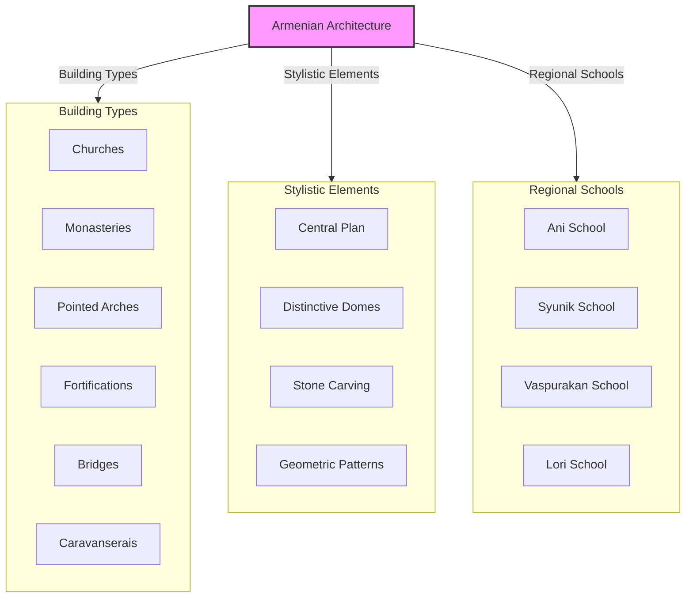
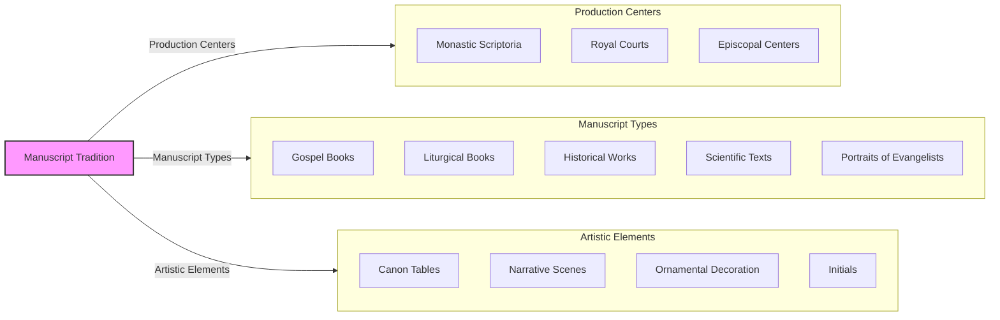
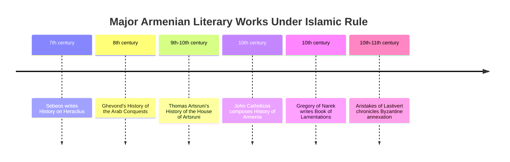
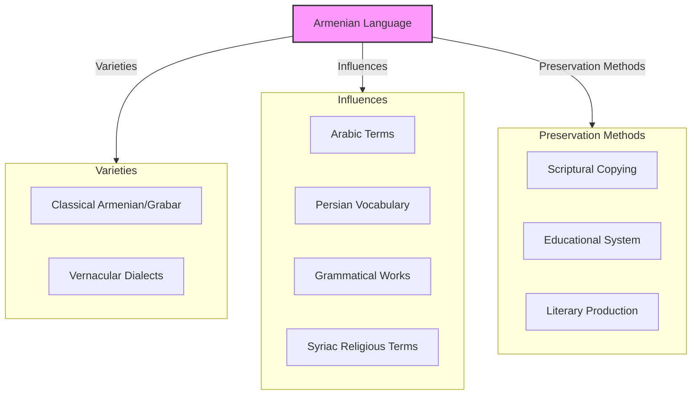
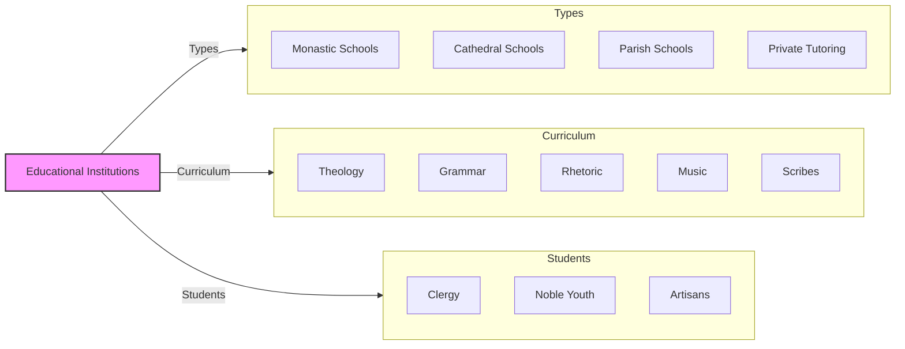
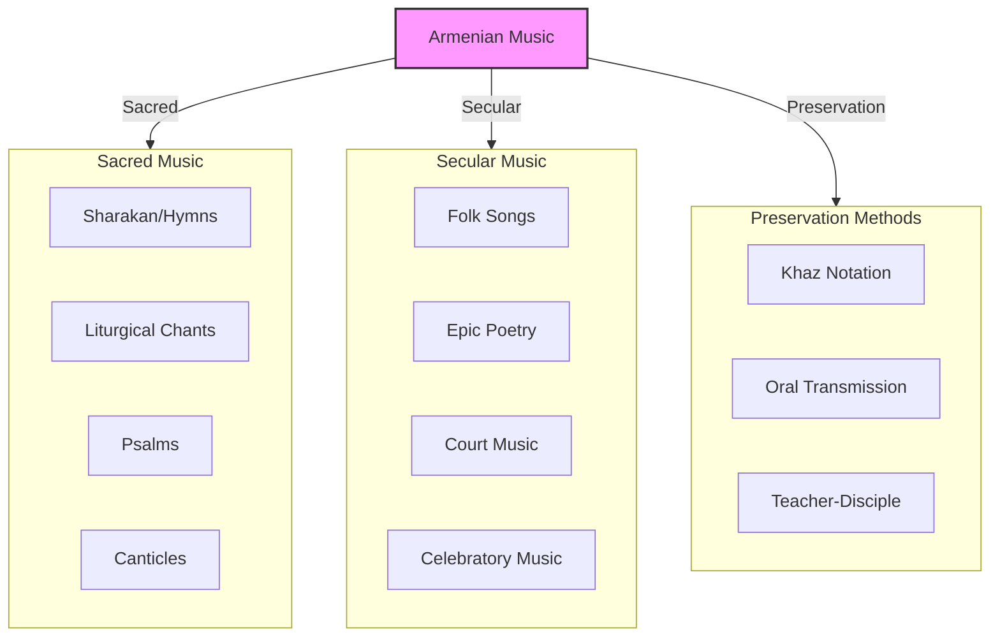
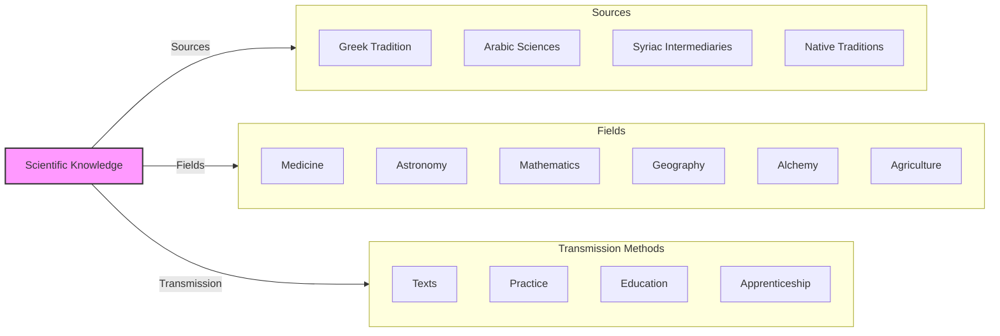
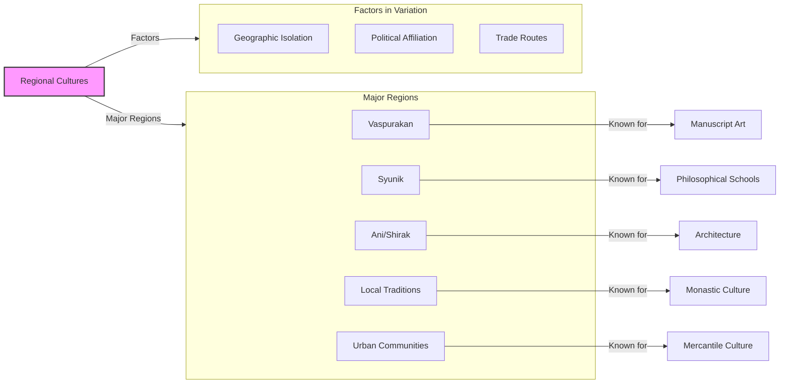
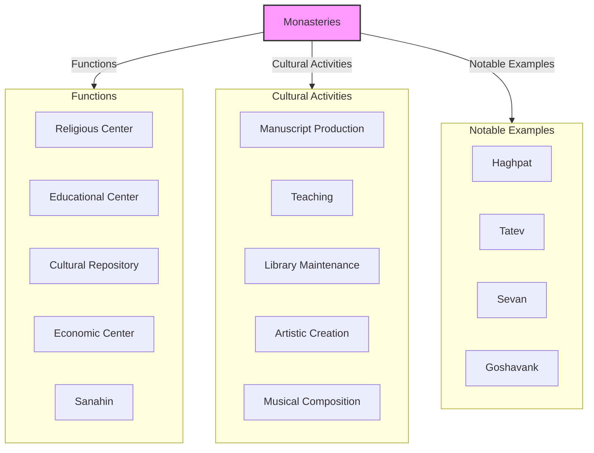

# Armenian Cultural Developments Under Islamic Rule

The centuries of Islamic rule over Armenia (7th-11th centuries) witnessed remarkable cultural developments despite—and sometimes because of—the challenges of living under foreign domination. Armenian culture demonstrated extraordinary resilience and creativity during this period, adapting to new realities while preserving core traditions.

This post explores how Armenian architecture, literature, art, and learning evolved during the Islamic period, creating distinctive forms that would influence Armenian culture for centuries to come.

------

## Architecture: Innovation Within Tradition

Armenian architecture flourished during the Islamic period:

- **Church building** continued despite some restrictions
- **Distinctive Armenian style** refined with central-plan churches
- **Pointed arches** developed before their appearance in European Gothic
- **Decorative sculpture** integrated into architectural elements
- **Secular buildings** including palaces and fortifications
- **Regional schools** with distinctive characteristics
- **Technical innovations** in dome and vault construction



**Key monuments:**
- **Cathedral of Ani** (989-1001) - Trdat the Architect's masterpiece
- **Church of St. Gregory** (Gagkashen) at Ani (c. 1001-1010)
- **Monastery of Haghpat** (10th-13th centuries)
- **Monastery of Sanahin** (10th century)
- **Church of the Holy Cross** on Akhtamar Island (915-921)
- **Marmashen Monastery** (988-1029)

------

## Manuscript Tradition and Illumination

The production of manuscripts became central to Armenian cultural preservation:

- **Scriptoria** (writing centers) established in monasteries
- **Distinctive Armenian script** developed by Mesrop Mashtots preserved
- **Gospel books** as primary focus of manuscript production
- **Illumination styles** evolving with regional characteristics
- **Technical innovations** in pigments and gold leaf application
- **Influence exchange** with Byzantine and Syriac traditions
- **Secular texts** including histories and scientific works



**Stylistic evolution:**
- **Early Islamic period:** Continuation of late antique styles
- **8th-9th centuries:** Development of distinctly Armenian iconography
- **10th-11th centuries:** Flowering of regional schools of illumination
- **Bagratid period:** Height of manuscript art with rich colors and gold

------

## Literary Developments

Armenian literature flourished despite political challenges:

- **Historical writing** as major genre
- **Religious texts** including theological works and commentaries
- **Poetry** both religious and secular
- **Scientific translations** from Greek and Arabic
- **Legal codes** adapting to new political realities
- **Grammatical works** preserving Armenian language



**Major authors:**
- **Sebeos** (7th century) - Historian of the early Arab conquests
- **Ghevond** (8th century) - Chronicler of Armenian-Arab relations
- **Thomas Artsruni** (9th-10th century) - Historian of the Artsruni dynasty
- **John Catholicos** (10th century) - Comprehensive Armenian history
- **Gregory of Narek** (10th century) - Mystical poet and theologian
- **Aristakes of Lastivert** (11th century) - Chronicler of the Byzantine annexation

------

## Armenian Language Developments

The Armenian language evolved during the Islamic period:

- **Classical Armenian (Grabar)** preserved in religious and formal texts
- **Spoken dialects** developing in different regions
- **Arabic and Persian loanwords** entering vocabulary
- **New technical terminology** developing for sciences and arts
- **Grammatical works** standardizing language use
- **Translation activity** from Greek, Syriac, and Arabic



**Linguistic achievement:** The preservation of Armenian as a literary language during centuries of Islamic rule represents a remarkable cultural achievement, especially when many other Christian communities in the Middle East gradually adopted Arabic.

------

## Educational Institutions

Armenian education continued primarily through church institutions:

- **Monastic schools** as primary educational centers
- **Cathedral schools** in major cities
- **Curriculum** including theology, grammar, rhetoric, music
- **Scientific knowledge** incorporating Greek and Arabic learning
- **Teacher-disciple tradition** for specialized knowledge
- **Scribal training** for manuscript production



**Educational centers:**
- **Monastery of Sanahin** - Major educational center
- **Monastery of Haghpat** - Important scriptoria and school
- **Cathedral school of Ani** - Urban educational center
- **Tatev Monastery** - Center of philosophical studies

------

## Music and Liturgical Arts

Armenian sacred music developed distinctive forms:

- **Sharakan** (hymn) tradition codified
- **Khaz notation system** developed for musical preservation
- **Eight-mode system** (oktoechos) adapted to Armenian use
- **Liturgical chant** with distinctive Armenian characteristics
- **Musical instruments** used in secular contexts
- **Folk music** continuing alongside sacred traditions



**Musical achievement:** The development of the khaz notation system for preserving Armenian sacred music represented a significant innovation, though the exact interpretation of these medieval notations remains partially lost today.

------

## Scientific Knowledge and Exchange

Armenian scholars engaged with the scientific knowledge of their time:

- **Medical knowledge** combining Greek, Arabic, and local traditions
- **Astronomical works** including calendrical calculations
- **Mathematical texts** translated and adapted
- **Geographical knowledge** from multiple sources
- **Alchemical and natural philosophy** texts
- **Agricultural innovations** adapted to local conditions



**Knowledge exchange:** Armenian scholars served as important intermediaries between Greek/Byzantine knowledge and the Islamic scientific world, sometimes preserving texts lost in their original languages.

------

## Cultural Interaction with Islamic Civilization

Armenian culture selectively incorporated elements from Islamic civilization:

- **Architectural influences** in decorative patterns and techniques
- **Scientific knowledge** from Arabic sources
- **Commercial practices** adapted from Islamic models
- **Artistic motifs** selectively borrowed and transformed
- **Literary forms** occasionally influenced by Arabic or Persian models
- **Technological adaptations** in crafts and agriculture

```mermaid
flowchart TD
    CI[Cultural Interaction] -->|Domains| DO[Domains]
    
    subgraph DO[Domains of Interaction]
        AR[Architecture]
        AR[Art]
        SC[Science]
        CO[Commerce]
        CR[Crafts]
        LI[Literature]
    end
    
    CI -->|Process| PR[Process]
    
    subgraph PR[Process of Adaptation]
        SE[Selective Borrowing]
        TR[Transformation]
        IN[Integration]
        RE[Reinterpretation]
    end
    
    CI -->|Mediators| ME[Mediators]
    
    subgraph ME[Cultural Mediators]
        ME[Merchants]
        SC[Scholars]
        AR[Artisans]
        TR[Translators]
        CO[Courtiers]
    end
    
    style CI fill:#f9f,stroke:#333,stroke-width:2px
```

**Selective adaptation:** Armenian culture demonstrated remarkable ability to selectively incorporate useful elements from Islamic civilization while maintaining its distinctive Christian identity and traditions.

------

## Regional Variations in Armenian Culture

Armenian culture developed regional variations during the Islamic period:

- **Vaspurakan** - Distinctive manuscript illumination style
- **Syunik** - Important center of educational and philosophical activity
- **Ani and Shirak** - Architectural innovations and urban culture
- **Lori-Tashir** - Northern Armenian cultural developments
- **Armenian communities in Arab cities** - Adapted to urban Islamic context



**Cultural diversity:** The political fragmentation of Armenia under various Muslim and Christian rulers actually contributed to cultural diversity, with different regions developing distinctive artistic and intellectual traditions.

------

## The Role of Monasteries as Cultural Centers

Monasteries played a crucial role in Armenian cultural preservation:

- **Centers of manuscript production** with scriptoria
- **Educational institutions** training clergy and scholars
- **Architectural patrons** commissioning innovative buildings
- **Libraries** preserving ancient and contemporary texts
- **Artistic workshops** for illumination and other arts
- **Agricultural innovations** on monastery lands
- **Safe havens** during political turmoil



**Cultural resilience:** The monastery system proved remarkably resilient, allowing Armenian culture to survive periods of political turmoil and foreign domination by maintaining centers of learning and artistic production away from direct political control.

------

## Conclusion: Cultural Achievement Amid Political Challenge

The cultural developments of Armenians under Islamic rule represent a remarkable achievement of adaptation and preservation. Despite political subordination, foreign rule, and occasional persecution, Armenian culture not only survived but flourished, producing distinctive architecture, literature, art, and learning.

Several factors contributed to this cultural resilience:

1. **Church institutions** providing organizational framework for cultural activities
2. **Distinctive alphabet and language** creating barrier against assimilation
3. **Geographic isolation** of many Armenian regions
4. **Cultural confidence** from ancient traditions
5. **Selective adaptation** of useful elements from dominant cultures
6. **Periods of political autonomy** (especially Bagratid era) enabling cultural flowering

The cultural achievements of this period would prove vital to Armenian survival through later centuries of even greater challenges, providing models, memories, and methods that would sustain Armenian identity through the Seljuk, Mongol, and Ottoman periods.

Perhaps most importantly, this era demonstrated that political sovereignty was not necessary for cultural achievement—a lesson that would prove essential for a people who would spend much of their subsequent history under foreign rule or in diaspora.
