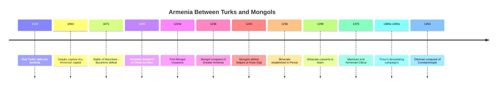
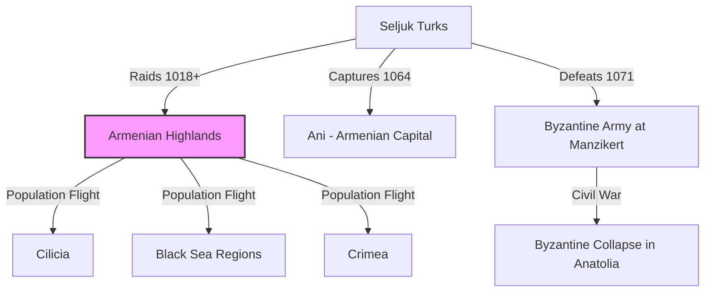
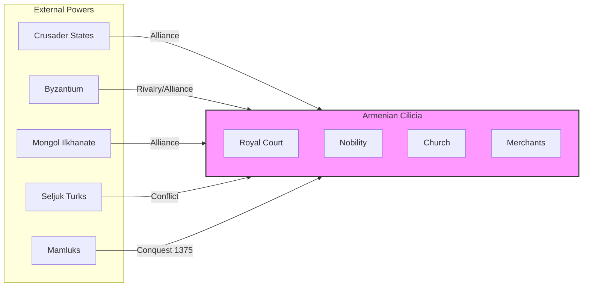
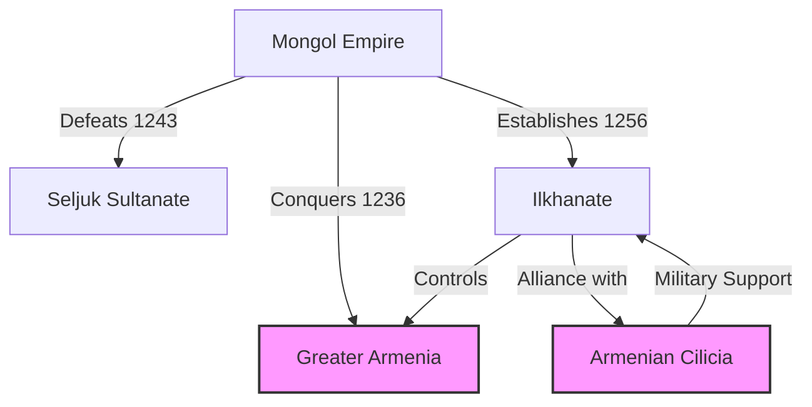
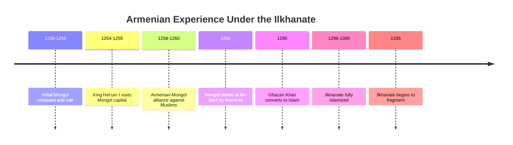
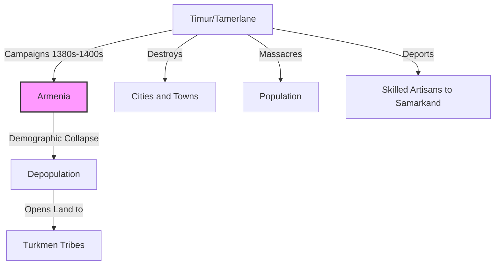
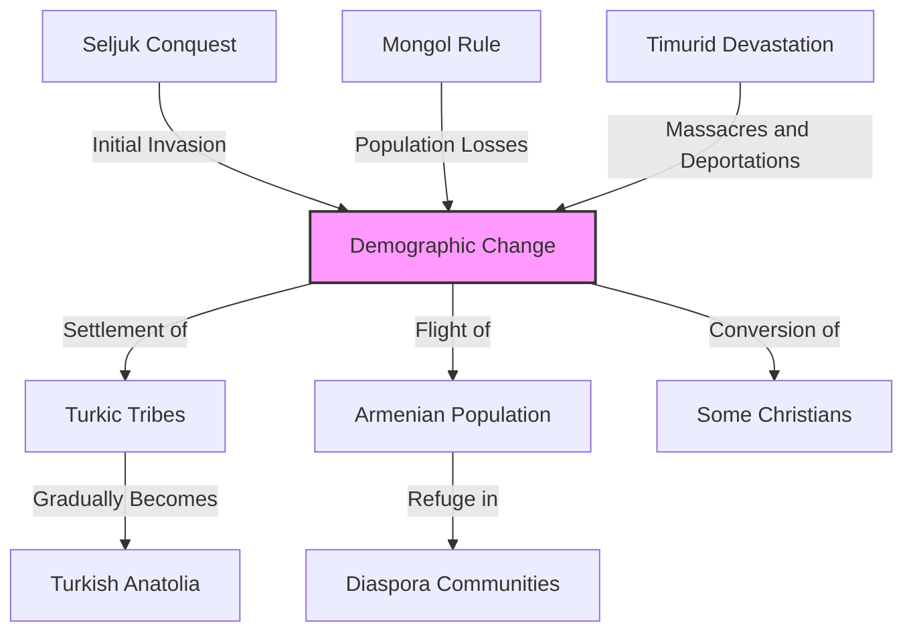
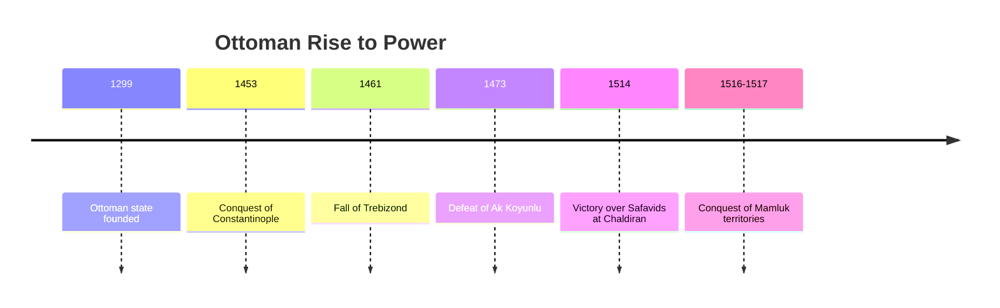

# Armenia Between Mongols and Turks: Survival Amid Devastation

The period from the 11th to the 15th centuries represents one of the most transformative and traumatic eras in Armenian history. Two waves of nomadic conquerors from Central Asia—first the **Seljuk Turks** and later the **Mongols**—fundamentally altered the demographic, political, and cultural landscape of historical Armenia.

This era would see Armenia's traditional heartland gradually lost, while a new Armenian kingdom emerged in Cilicia. It would witness both catastrophic destruction and brief periods of opportunity under new masters.

------

## Timeline: The Age of Nomadic Conquerors

------

## The Seljuk Turkish Arrival

The **Seljuk Turks**, a nomadic people from Central Asia who had converted to Islam, first appeared on Armenia's borders in the early 11th century:

- **1018:** First Turkic raids into Armenia
- **1048-1049:** Major battle at Kapetron between Byzantines and Seljuks
- **1064:** Seljuks under Alp Arslan capture and sack Ani, the Armenian capital
- **1071:** **Battle of Manzikert** - Sultan Alp Arslan defeats Byzantine Emperor Romanos IV Diogenes

**Consequences of Manzikert:**

1. **Byzantine defensive system collapsed** in eastern Anatolia
2. **Turkic tribes migrated** into the Armenian highlands
3. **Armenian population displaced** - many fled south to Cilicia
4. **Demographic transformation began** in historical Armenia
5. **Byzantine civil war** following the defeat prevented effective response

------

## The Armenian Kingdom of Cilicia

As their highland homeland fell to Turkic control, many Armenians established a new state in **Cilicia** (southeastern Anatolia/northern Syria):

- **1080:** Foundation of the Armenian state in Cilicia by **Ruben I**
- **1198:** **Levon II** crowned King of Armenian Cilicia
- **1199-1375:** Armenian Kingdom of Cilicia flourishes
- **Strategic alliance** with Crusader states and Mongols
- **Commercial prosperity** through Mediterranean trade
- **Cultural renaissance** in literature, art, and architecture

**Cilician Armenia represented:**
- A **political adaptation** to the loss of the highland homeland
- A **cultural continuation** of Armenian traditions in a new setting
- A **strategic pivot** toward the Mediterranean world
- A **commercial success story** through international trade

------

## The Mongol Whirlwind

In the early 13th century, an even more formidable nomadic power emerged from the east—the **Mongols** under Genghis Khan and his successors:

- **1220s:** First Mongol raids into Transcaucasia
- **1236:** Mongols conquer Greater Armenia
- **1243:** Mongols defeat Seljuks at Köse Dağ, becoming overlords of Anatolia
- **1256:** **Ilkhanate** established in Persia and the Caucasus
- **1258:** Mongols destroy Baghdad, ending the Abbasid Caliphate

**Armenian response to Mongols:**

1. **Pragmatic submission** in Greater Armenia
2. **Strategic alliance** from Armenian Cilicia
3. **Church diplomacy** through missions to the Mongol court
4. **Hope for religious sympathy** due to Mongol tolerance and Christian wives of khans

------

## The Ilkhanate Period: Opportunity and Disappointment

The **Ilkhanate**, the Mongol state established in Persia and the Caucasus, initially offered some opportunities for Armenians:

- **Religious tolerance** under early Mongol rule
- **Reduced Islamic pressure** after destruction of Baghdad
- **Commercial opportunities** in the vast Mongol trading network
- **Diplomatic openings** through the Armenian Kingdom of Cilicia
- **Hetʻum I of Cilicia** traveled to Karakorum to establish alliance with Möngke Khan

**The great disappointment:**

The Armenian hope for a powerful Christian ally against Islam was dashed when the Ilkhanate rulers converted to Islam under Ghazan Khan (1295). This ended the period of opportunity and began a new phase of Islamic pressure.

------

## Timur's Devastation

The collapse of the Ilkhanate was followed by the rise of an even more destructive conqueror—**Timur** (Tamerlane):

- **1380s-1400s:** Timur's campaigns devastate the Caucasus and Anatolia
- **1387:** Timur captures Isfahan, creates tower of 70,000 skulls
- **1394-1395:** Campaigns against Georgia and the Caucasus
- **1400:** Destruction of Sivas with reported massacre of 100,000
- **1402:** Defeat of Ottoman Sultan Bayezid I at Ankara

**Timur's devastation had lasting consequences:**

1. **Massive depopulation** of Armenian highlands
2. **Destruction of urban centers** and infrastructure
3. **Deportation of skilled craftsmen** to Central Asia
4. **Creation of power vacuum** filled by Turkmen tribes
5. **Acceleration of demographic change** in historical Armenia

------

## The Turkification of Armenia

The combined impact of Seljuk conquest, Mongol rule, and Timurid devastation fundamentally transformed the demographic character of historical Armenia:

- **Nomadic settlement:** Turkic pastoral nomads settled depopulated lands
- **Sedentary displacement:** Armenian farmers fled or were killed/deported
- **Religious pressure:** Christian populations faced increasing Islamization
- **Urban destruction:** Armenian urban centers never fully recovered
- **Political fragmentation:** Armenian political entities eliminated except in remote areas

**Factors enabling Turkification:**

1. **Nomadic mobility** allowed quick occupation of emptied lands
2. **Military superiority** of mounted nomadic warriors
3. **Religious backing** of Islamic states and institutions
4. **Repeated waves** of Turkic migration from Central Asia
5. **Lack of external support** for remaining Armenian populations

------

## The Rise of the Ottomans

As Timur's empire fragmented, a new Turkish power emerged—the **Ottoman Empire**:

- **1299:** Osman I establishes Ottoman state in western Anatolia
- **1453:** Mehmed II conquers Constantinople
- **1461:** Ottomans annex Empire of Trebizond, last Byzantine outpost
- **1473:** Ottomans defeat Ak Koyunlu Turkmens at Battle of Otlukbeli
- **1514:** Ottomans defeat Safavids at Chaldiran, securing eastern Anatolia
- **1516-1517:** Ottoman conquest of Mamluk territories including Syria and Egypt

**For Armenians, the Ottoman rise meant:**

1. **Incorporation into a new imperial system**
2. **Millet system** of religious community governance
3. **Some stability after centuries of warfare**
4. **Commercial opportunities** in the vast Ottoman domains
5. **Continued existence as a religious minority** without political sovereignty

------

## Armenian Survival Strategies

Through these centuries of Turkic and Mongol domination, Armenians developed survival strategies that would preserve their identity:

- **Religious institutions** as centers of cultural preservation
- **Manuscript production** to maintain literary traditions
- **Merchant networks** connecting dispersed communities
- **Mountain refuges** in remote areas like Sasun and Zeitun
- **Diaspora communities** from Crimea to India
- **Adaptability to new rulers** while maintaining core identity

------

## Legacy of the Turkic-Mongol Era

The period from the Seljuk invasion to the Ottoman consolidation left profound and lasting impacts:

1. **Demographic transformation** of historical Armenia
2. **Loss of political sovereignty** in the Armenian highlands
3. **Shift of Armenian cultural center** to diaspora communities
4. **Adaptation to minority status** under Islamic rule
5. **Development of merchant class** and commercial expertise
6. **Preservation of identity** through religious institutions
7. **Foundation for modern Armenian diaspora** communities worldwide

------

## Conclusion: Resilience Amid Catastrophe

The Turkic-Mongol period represents one of the most challenging chapters in Armenian history—a time when the physical homeland was largely lost, populations were decimated, and political independence vanished.

Yet through these catastrophes, Armenian identity demonstrated remarkable resilience. The church, language, and cultural traditions survived, adapting to new realities while preserving core elements of identity.

This resilience would be tested again in later centuries, most catastrophically during the Armenian Genocide of 1915-1917, but the survival strategies developed during the Turkic-Mongol era helped ensure that Armenian identity would endure despite the loss of the ancestral homeland.
