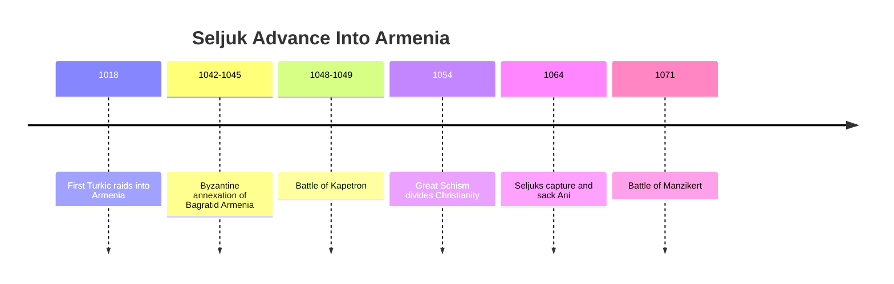
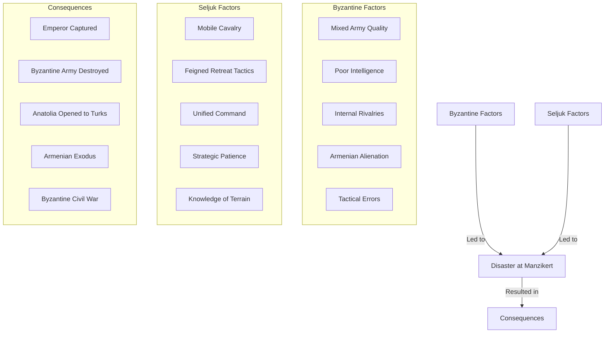
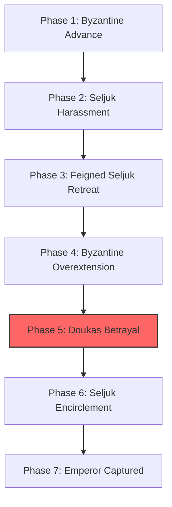
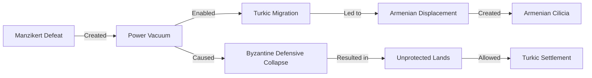
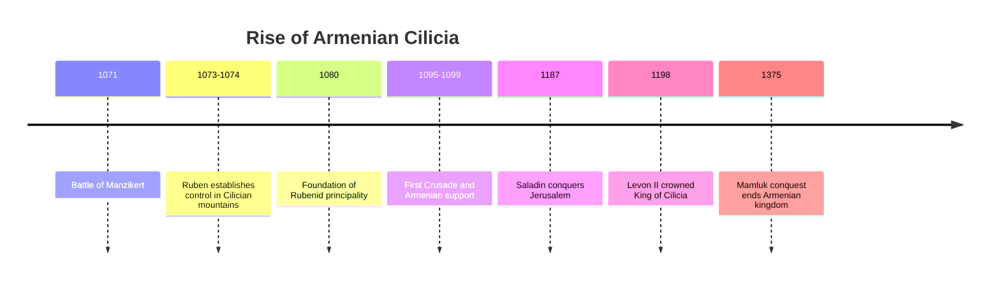
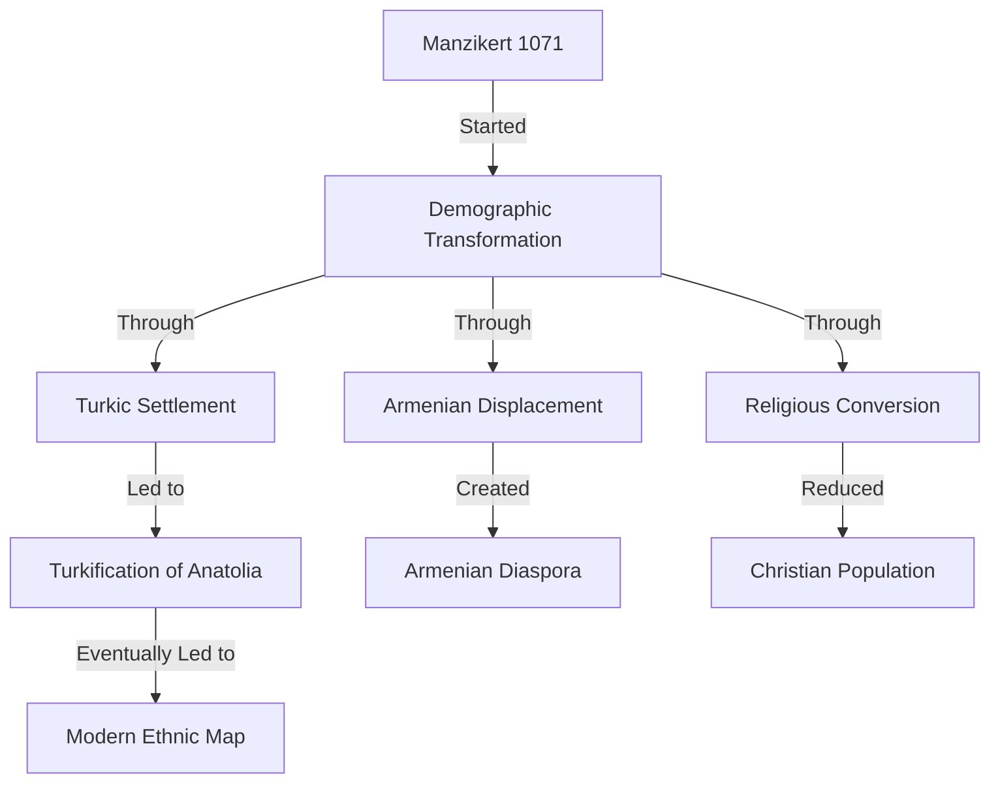

# The Seljuk Turks and the Battle of Manzikert: Armenia's Fate Transformed

The **Battle of Manzikert** in 1071 CE stands as one of history's most consequential military engagements—a single day that altered the course of Armenian, Byzantine, and Middle Eastern history. This pivotal battle opened Anatolia to Turkic settlement, accelerated the decline of Byzantium, and began the demographic transformation of historical Armenia.

This post examines the Seljuk Turkish arrival, the fateful battle, and its profound consequences for Armenian history.

------

## The Seljuk Turks: Origins and Rise

The Seljuks emerged from the Oghuz Turkic tribes of Central Asia:

- **Origins:** Nomadic pastoralists from the Central Asian steppes
- **Migration westward:** Driven by pressure from other nomadic groups
- **Conversion to Islam:** Adopted Sunni Islam in the 10th century
- **Military prowess:** Skilled horse archers and light cavalry
- **Tughril Beg:** First Seljuk Sultan (1037-1063), conquered Persia
- **Alp Arslan:** Second Sultan (1063-1072), expanded westward


**Seljuk state formation:**

1. **Great Seljuk Empire** centered in Persia
2. **Rum Seljuks** later established in Anatolia
3. **Hierarchical tribal structure** under sultanate
4. **Adoption of Persian administrative systems**
5. **Alliance with Abbasid Caliphate** against Shiite Fatimids and Byzantines

------

## First Encounters with Armenia

The Seljuks first appeared on Armenia's borders in the early 11th century:

- **1018:** First recorded Turkic raids into Armenia
- **1021-1022:** Seljuk bands serve as mercenaries in Byzantine-Georgian conflict
- **1042-1045:** Byzantines annex Bagratid Armenia, weakening local defenses
- **1048-1049:** Major battle at Kapetron between Byzantines and Seljuks
- **1054:** Great Schism divides Christianity, weakening Byzantine position
- **1064:** Seljuks under Alp Arslan capture Ani, the magnificent Armenian capital



**The fall of Ani in 1064 was particularly traumatic:**

- The "City of 1,001 Churches" was the jewel of Armenian civilization
- Its capture symbolized the end of the Armenian Bagratid kingdom
- Contemporary accounts describe massive destruction and looting
- Many inhabitants were killed or enslaved
- The city never fully recovered its former glory

------

## The Road to Manzikert

By 1071, tensions between the Seljuks and Byzantines had reached a breaking point:

- **Byzantine Emperor Romanos IV Diogenes** sought to reverse Seljuk gains
- **Alp Arslan** was focused on campaigns against Fatimid Egypt
- **Byzantine army** assembled was massive but of mixed quality
- **Armenian contingents** were present but alienated by Byzantine policies
- **Battle site** at Manzikert (modern Malazgirt) was in historic Armenia
- **August 26, 1071:** The armies met on the plain near Lake Van



**Byzantine weaknesses:**

1. **Mercenary-heavy army** with questionable loyalty
2. **Alienated Armenian troops** due to religious persecution
3. **Poor intelligence** about Seljuk movements and strength
4. **Internal rivalries** among Byzantine generals
5. **Tactical errors** by Emperor Romanos IV

------

## The Battle of Manzikert: A Decisive Defeat

The battle unfolded in several phases:

- **Initial Byzantine advance** with heavy cavalry and infantry
- **Seljuk harassment** with horse archers avoiding direct engagement
- **Feigned Seljuk retreat** drawing Byzantine forces forward
- **Byzantine flanks exposed** as army advanced
- **Seljuk encirclement** as sun began to set
- **Betrayal** by the Byzantine general Andronikos Doukas, who retreated with his units
- **Emperor captured** after fierce last stand



**The aftermath:**

- Alp Arslan treated Emperor Romanos IV with respect
- A peace treaty was negotiated with Byzantine concessions
- Romanos was released but faced civil war upon return
- He was overthrown, blinded, and died from his wounds
- The treaty became invalid as Byzantine factions fought for power

------

## Immediate Consequences for Armenia

The Byzantine defeat at Manzikert had immediate and catastrophic consequences for Armenia:

- **Byzantine defensive system collapsed** in eastern Anatolia
- **Power vacuum** created in former Armenian territories
- **Accelerated Turkic migration** into the Armenian highlands
- **Armenian nobility** lost Byzantine protection
- **Civilian population** faced raids, enslavement, and displacement
- **Churches and monasteries** looted and destroyed
- **Agricultural systems disrupted** by nomadic pastoralism



**Armenian exodus:**

Many Armenians fled southward toward Cilicia, where Byzantine control remained stronger and mountains provided natural defenses. This population movement would eventually lead to the establishment of the Armenian Kingdom of Cilicia.

------

## The Birth of Armenian Cilicia

As their highland homeland fell to Turkic control, many Armenians established a new state in **Cilicia** (southeastern Anatolia/northern Syria):

- **1073-1074:** Ruben, an Armenian noble, establishes control in Cilician mountains
- **1080:** Foundation of the Rubenid principality by **Ruben I**
- **1095-1099:** First Crusade passes through Armenian territories
- **1198:** **Levon II** crowned King of Armenian Cilicia
- **1199-1375:** Armenian Kingdom of Cilicia flourishes



**Cilician Armenia represented a remarkable adaptation:**

- A **new Armenian homeland** after the loss of the historic one
- A **Christian state** allied with Crusaders and European powers
- A **commercial center** connecting East and West
- A **cultural renaissance** preserving Armenian identity
- A **strategic pivot** from continental to Mediterranean orientation

------

## Long-Term Transformation of Historical Armenia

The most profound consequence of Manzikert was the gradual demographic transformation of historical Armenia:

- **Turkic settlement patterns:**
  - Nomadic pastoralists occupied highland pastures
  - Gradual settlement in valleys and plains
  - Displacement of sedentary Armenian farmers
  - Conversion of agricultural land to pasture
  - Establishment of Turkic political control

- **Armenian responses:**
  - Flight to Cilicia and other regions
  - Retreat to mountainous refuges
  - Adaptation to minority status
  - Preservation of identity through church
  - Development of diaspora communities



**The process was gradual but irreversible:**

- By the 13th century, Turks dominated most of the Armenian highlands
- By the 16th century, historical Armenia was firmly within Ottoman control
- By the 19th century, Armenians were minorities in most of their historic homeland
- By 1915, the Armenian Genocide would complete the demographic transformation

------

## Manzikert in Historical Memory

The Battle of Manzikert holds different significance in different historical traditions:

- **In Turkish history:** Celebrated as the opening of Anatolia to Turkish settlement
- **In Byzantine history:** Mourned as the beginning of the empire's terminal decline
- **In Armenian history:** Remembered as a catastrophe that began the loss of homeland
- **In Islamic history:** Seen as a triumph of Muslim forces over Christendom
- **In world history:** Recognized as one of history's most consequential battles

```mermaid
flowchart LR
    subgraph Turkish Perspective
        T1[National Origin Story]
        T2[Victory of Islam]
        T3[Beginning of Turkish Anatolia]
    end
    
    subgraph Byzantine Perspective
        B1[Catastrophic Defeat]
        B2[Beginning of Decline]
        B3[Betrayal and Civil War]
    end
    
    subgraph Armenian Perspective
        A1[Loss of Homeland]
        A2[Forced Migration]
        A3[Cultural Catastrophe]
    end
    
    M[Manzikert 1071] --> Turkish Perspective
    M --> Byzantine Perspective
    M --> Armenian Perspective
```

------

## Conclusion: The Hinge of History

The Battle of Manzikert in 1071 stands as a hinge point in Armenian history—the moment when the trajectory of an entire people was fundamentally altered. 

Before Manzikert, Armenians were a majority population in their highland homeland, with their own kingdoms and principalities, even if often under Byzantine or Islamic suzerainty.

After Manzikert, the gradual transformation began that would eventually turn Armenians into a minority in their own homeland, leading to the development of diaspora communities and eventually the Armenian Kingdom of Cilicia.

The battle did not immediately destroy Armenian presence in the highlands, but it opened the floodgates for the Turkic migration that would, over centuries, fundamentally transform the demographic, political, and cultural landscape of historical Armenia.

This transformation would set the stage for later tragedies, including the Armenian Genocide of 1915-1917, which would complete the process begun at Manzikert nearly 850 years earlier.
