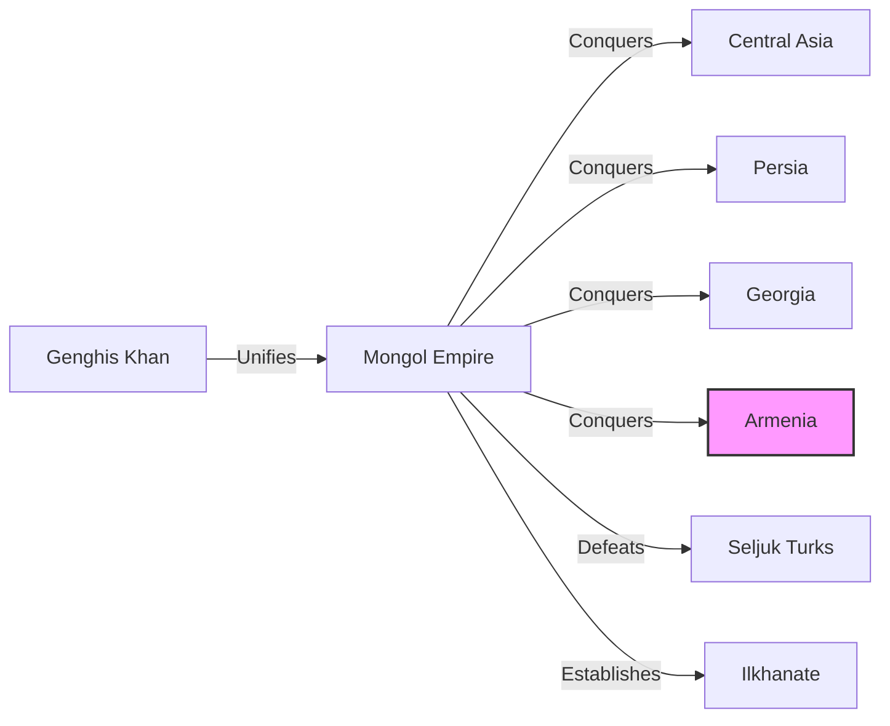
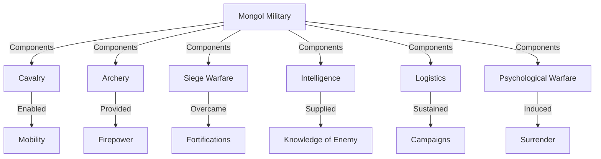
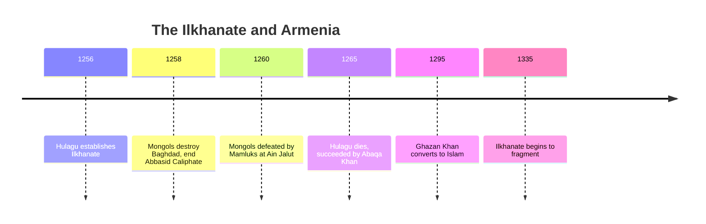
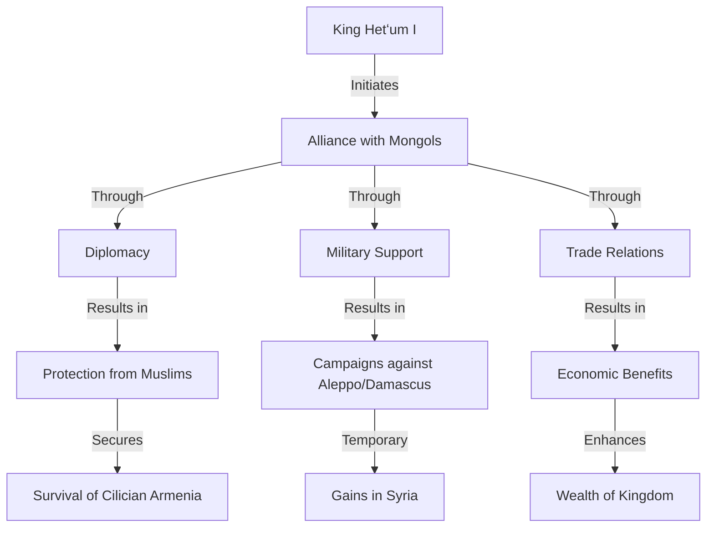
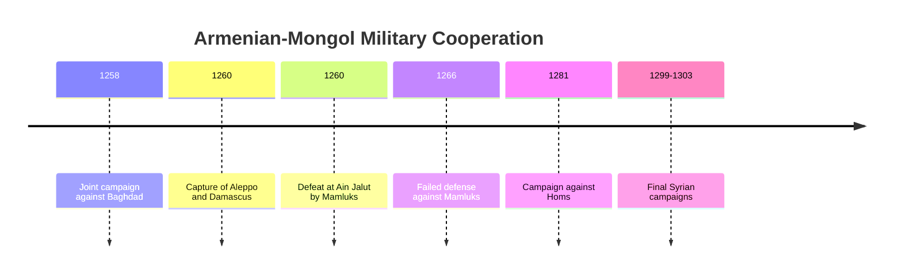
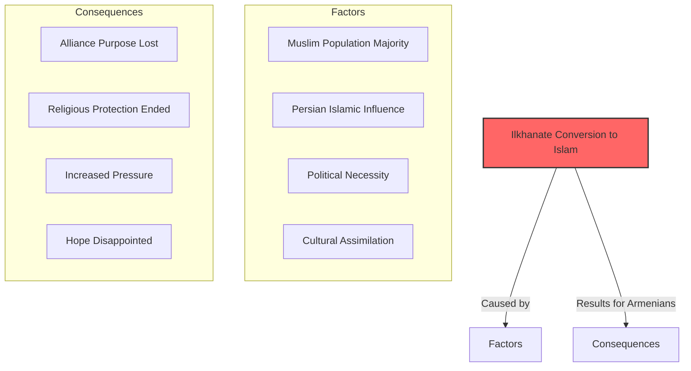
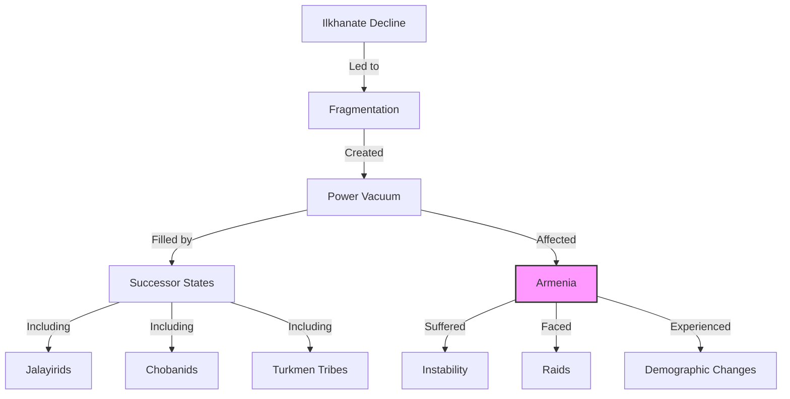

# The Mongol Conquest and the Armenian Alliance: A Strategic Gamble

When the **Mongol armies** swept into the Caucasus in the early 13th century, they represented an unprecedented military force that had already conquered much of Asia. For Armenians, caught between Muslim powers and the declining Byzantine Empire, the arrival of these formidable nomadic conquerors presented both grave danger and unexpected opportunity.

This post examines the complex relationship between Armenians and Mongols—a relationship that evolved from conquest and submission to strategic alliance and ultimately bitter disappointment.

------

## The Mongol Whirlwind Reaches Armenia

The Mongol expansion westward occurred with stunning speed:

- **1206:** Temujin proclaimed Genghis Khan, unifying Mongol tribes
- **1219-1224:** Conquest of Central Asia and Khwarezmian Empire
- **1220s:** First Mongol raids into Transcaucasia
- **1231:** Mongols defeat Georgian-Armenian forces
- **1236:** Systematic conquest of Greater Armenia begins
- **1243:** Mongols defeat Seljuk Turks at Köse Dağ
- **1256:** Ilkhanate established in Persia and the Caucasus



**The initial conquest was devastating:**

- Armenian cities like Ani and Kars suffered destruction
- Resistance was met with massacres
- Agricultural systems disrupted
- Population displacement and flight
- Heavy taxation imposed

------

## The Mongol Military Machine

The Mongols represented a revolutionary military force:

- **Cavalry mobility:** Able to cover vast distances rapidly
- **Horse archery:** Devastating firepower from mobile platforms
- **Psychological warfare:** Reputation for brutality to encourage surrender
- **Siege technology:** Adapted from Chinese engineers
- **Meritocratic leadership:** Officers selected for ability, not birth
- **Intelligence gathering:** Extensive spy networks and reconnaissance
- **Logistics:** Sophisticated supply systems for campaigns



**Armenian response to this overwhelming force:**

1. **Pragmatic submission** by most Armenian nobles
2. **Fortification** of mountain strongholds
3. **Payment of heavy tribute** to avoid destruction
4. **Ecclesiastical diplomacy** through the Armenian Church
5. **Adaptation to new overlords** as they had done for centuries

------

## The Ilkhanate and Armenia

In 1256, Hulagu Khan (grandson of Genghis Khan) established the **Ilkhanate** as a Mongol state ruling Persia, Iraq, the Caucasus, and parts of Anatolia:

- **Capital at Maragheh** (later Tabriz) in northwestern Iran
- **Nominally subordinate** to the Great Khan in Mongolia
- **Multicultural administration** drawing on Persian bureaucracy
- **Religious diversity** with Buddhists, Christians, Muslims in court
- **Armenian territories** incorporated as tributary regions



**Armenian position under the Ilkhanate:**

- **Direct Mongol administration** in much of Greater Armenia
- **Heavy taxation** through census-based system
- **Military service requirements** for Armenian nobles
- **Relative religious freedom** compared to previous Muslim rule
- **Maintenance of Armenian Church hierarchy** as administrative structure

------

## The Armenian Kingdom of Cilicia's Strategic Alliance

While Greater Armenia endured Mongol conquest, the **Armenian Kingdom of Cilicia** in the south made a bold strategic decision—to ally with the Mongols against their Muslim neighbors:

- **King Hetʻum I** (1226-1269) initiated pro-Mongol policy
- **1247:** First diplomatic contacts with Mongols
- **1254-1255:** Hetʻum's historic journey to Karakorum to meet Möngke Khan
- **1258-1260:** Armenian-Mongol military cooperation against Muslims
- **Motivations:** Protection against Seljuks and Mamluks, hope for Holy Land recovery



**Benefits of the alliance for Cilicia:**

1. **Protection** against Seljuk and Mamluk threats
2. **Territorial expansion** into parts of northern Syria
3. **Trade privileges** within the Mongol Empire
4. **Reduced taxation** compared to other Mongol subjects
5. **Christian prestige** as allies rather than subjects

------

## Religious Dimensions: The Christian Hope

The Mongol-Armenian relationship had significant religious dimensions:

- **Mongol religious tolerance:** Traditional Mongol shamanism was non-exclusive
- **Christian Mongols:** Many Mongol tribes (Keraites, Naimans) were Nestorian Christians
- **Christian wives:** Many Mongol khans had Christian wives (often Keraite princesses)
- **Anti-Muslim alliance:** Shared opposition to Islamic powers
- **Prester John legend:** European belief in a powerful Eastern Christian ally

```mermaid
flowchart LR
    subgraph Mongol Religious Factors
        T[Traditional Tolerance]
        NC[Nestorian Christians]
        CW[Christian Wives]
        AM[Anti-Muslim Policy]
    end
    
    subgraph Armenian Hopes
        CA[Christian Alliance]
        HL[Holy Land Recovery]
        IM[Islamic Defeat]
        RP[Religious Protection]
    end
    
    Mongol Religious Factors -->|Encouraged| Armenian Hopes
```

**Armenian and European hopes:**

- The Mongols might convert to Christianity
- A grand Christian-Mongol alliance could recapture Jerusalem
- Islamic powers could be permanently defeated
- Eastern and Western Christianity could be reunited

------

## Military Cooperation and Campaigns

The Armenian-Mongol alliance produced significant military cooperation:

- **1258:** Hetʻum I provides troops for Hulagu's campaign against Baghdad
- **1260:** Joint operations against Aleppo and Damascus
- **1260:** Mongol defeat at Ain Jalut by Mamluks while Armenian allies present
- **1266:** Failed attempt to prevent Mamluk capture of Cilician ports
- **1281:** Joint Armenian-Mongol-Georgian campaign against Mamluks
- **1299-1303:** Last major Mongol-Armenian campaigns in Syria



**Mixed results:**

- Initial victories against Muslim powers
- Failure to maintain gains after Ain Jalut
- Inability to prevent Mamluk pressure on Cilicia
- Declining Mongol interest in the Levant over time

------

## The Great Disappointment: Mongol Conversion to Islam

The Armenian strategic gamble ultimately failed when the Ilkhanate rulers converted to Islam:

- **1282:** Tegüder Ahmad becomes first Muslim Ilkhan
- **1295:** Ghazan Khan converts to Islam, making it state religion
- **1299-1304:** Brief revival of Armenian hopes during Ghazan's campaigns
- **1307-1335:** Öljaitü and Abu Sa'id solidify Islamic character of Ilkhanate



**Consequences for Armenians:**

1. **Strategic alliance lost** its religious foundation
2. **Islamic pressure returned** from their Mongol overlords
3. **Cilician Armenia increasingly isolated** against Mamluks
4. **Greater Armenia faced renewed religious pressure**
5. **Hope for Christian East-West alliance collapsed**

------

## The Decline of the Ilkhanate

The Ilkhanate began to fragment in the 14th century:

- **1335:** Death of Abu Sa'id, last effective Ilkhan
- **1336-1353:** Succession disputes and regional fragmentation
- **1353:** Effective end of unified Ilkhanate
- **Rise of successor states:** Jalayirids, Chobanids, Injuids
- **Power vacuum** in Armenia and eastern Anatolia



**For Armenians, the Ilkhanate's collapse meant:**

- Loss of the relative stability of unified Mongol rule
- Increased vulnerability to local Muslim powers
- Exposure to raids from various competing factions
- Acceleration of Armenian emigration from highland regions
- Further weakening of Armenian political structures

------

## Legacy of the Mongol-Armenian Relationship

The Mongol period left lasting impacts on Armenian history:

1. **Demographic shifts:** Population losses and migrations
2. **Political reconfiguration:** End of remaining Armenian principalities in Greater Armenia
3. **Strategic lesson:** Dangers of relying on distant powers
4. **Commercial networks:** Armenian merchants adapted to Mongol trade routes
5. **Cultural exchange:** Artistic and literary influences
6. **Diaspora expansion:** Armenian communities spread further

```mermaid
flowchart LR
    subgraph Mongol Period Legacy
        D[Demographic Changes]
        P[Political Reconfiguration]
        C[Commercial Adaptation]
        S[Strategic Lessons]
    end
    
    subgraph Armenian Future
        DI[Diaspora Identity]
        ME[Merchant Expertise]
        CS[Cultural Survival]
        PA[Political Adaptation]
    end
    
    Mongol Period Legacy -->|Influenced| Armenian Future
```

------

## Conclusion: A Calculated Risk That Failed

The Armenian alliance with the Mongols represents one of history's great strategic gambles—a calculated risk by a small Christian kingdom to survive in a hostile environment by allying with a seemingly unstoppable new power.

For a time, the gamble appeared to work, providing the Armenian Kingdom of Cilicia with protection and prestige. But ultimately, the conversion of the Mongols to Islam dashed Armenian hopes for a powerful Christian ally.

The Mongol period represents yet another chapter in Armenia's long history of adaptation and survival between empires—learning to navigate shifting geopolitical realities while preserving core elements of identity and faith.

The lessons learned during this period would serve Armenians well as they faced new waves of conquerors in the centuries to come, from Timur to the Ottomans and Safavids.
