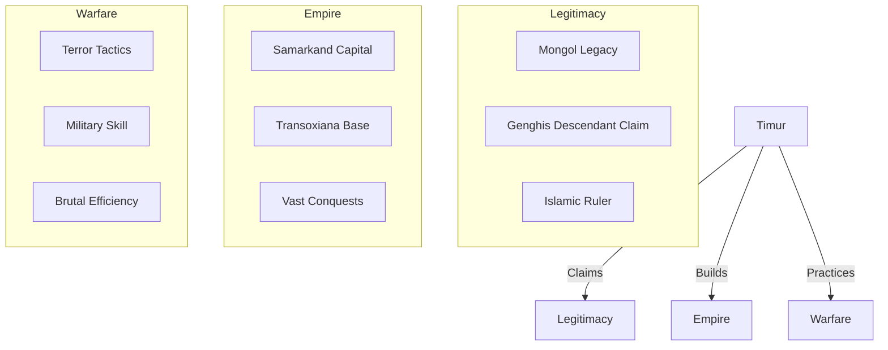
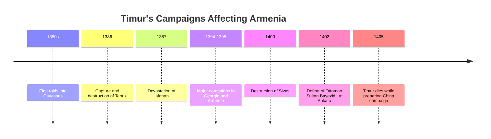
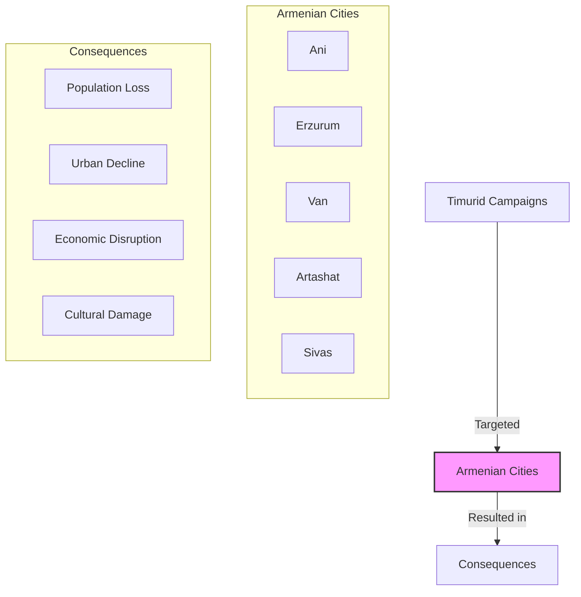
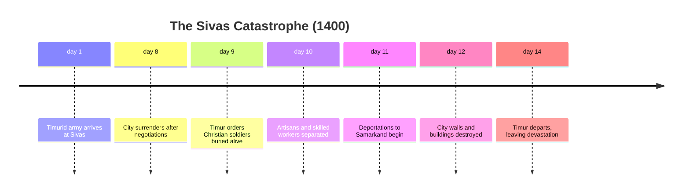
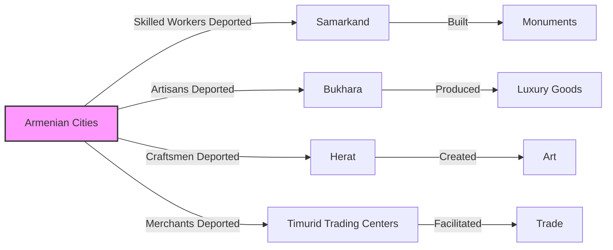
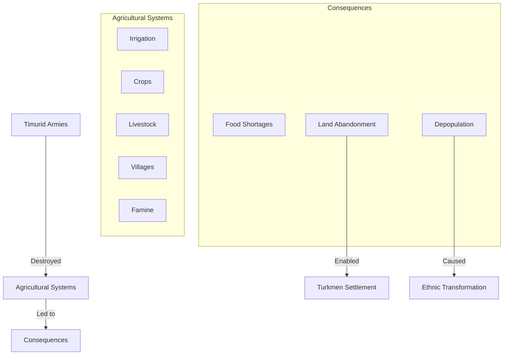
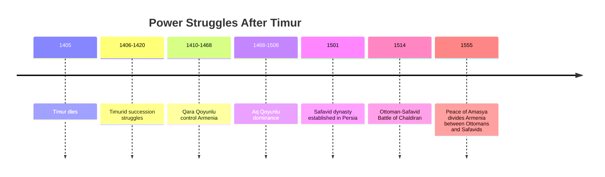
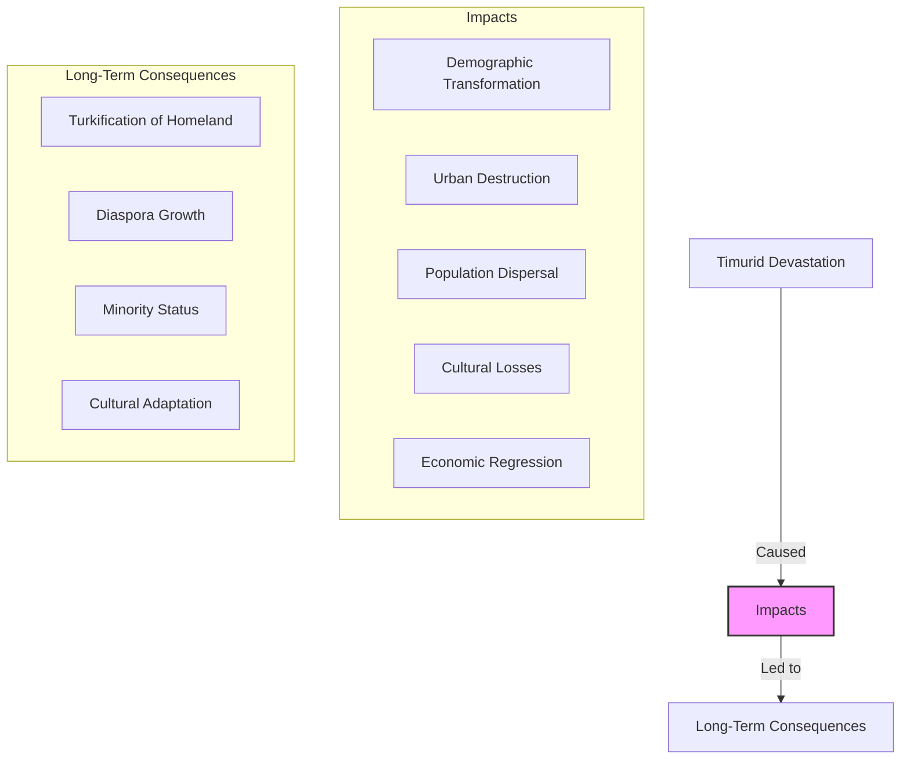

# Timur's Devastation of Armenia: The Catastrophe After the Mongols

Just as Armenia was beginning to recover from the Mongol period, a new catastrophe appeared from the east. **Timur** (also known as Tamerlane), a Turco-Mongol conqueror claiming descent from Genghis Khan, launched devastating campaigns across Asia that would leave an indelible mark on Armenian history.

Timur's invasions in the late 14th and early 15th centuries represent one of the most destructive episodes in Armenia's long history—a period of massacres, deportations, and widespread devastation that would accelerate the demographic transformation of historical Armenia.

------

## Timur: The "Iron Limper"

Timur emerged from Central Asia to build an empire that would briefly rival that of Genghis Khan:

- **Born c. 1336** in Transoxiana (modern Uzbekistan)
- **Name "Timur Lenk"** means "Timur the Lame" due to battle injuries
- **Rose to power** through tribal politics and military skill
- **Claimed legitimacy** as restorer of the Mongol Empire
- **Combined Turkic and Mongol traditions** with Islamic identity
- **Built capital at Samarkand** as a magnificent center of his empire



**Timur's empire-building:**

1. **Consolidated Central Asia** (1360s-1370s)
2. **Conquered Persia** (1380s)
3. **Invaded the Golden Horde** (1391-1395)
4. **Campaigns in India** (1398-1399)
5. **Western campaigns** against Mamluks and Ottomans (1400-1403)
6. **Planned China invasion** (died en route in 1405)

------

## Armenia on Timur's Path

Armenia lay directly in Timur's path during his western campaigns:

- **1380s:** First Timurid raids into the Caucasus
- **1386:** Capture and destruction of Tabriz
- **1387:** Devastation of Isfahan with reported 70,000 deaths
- **1394-1395:** Major campaigns against Georgia and Armenia
- **1400:** Destruction of Sivas with massacre of Christian population
- **1400-1403:** War with the Ottoman Empire, including Battle of Ankara



**Armenia's vulnerability:**

- Already weakened by previous Mongol rule
- Fragmented political structure after Ilkhanate collapse
- Caught between Timur and his enemies (Ottomans, Qara Qoyunlu)
- Christian population targeted specifically by Timur's Islamic zeal
- Mountainous terrain provided some refuge but limited agricultural options

------

## Timur's Military Machine

Timur's armies represented a formidable military force:

- **Combined Mongol tactics** with new innovations
- **Heavy cavalry core** with light cavalry scouts
- **Sophisticated siege techniques** learned from Persian engineers
- **Psychological warfare** through calculated brutality
- **Logistical excellence** enabling operations far from home base
- **Numerical advantage** through forced recruitment from conquered areas
- **Religious motivation** framing campaigns as jihad against Christians

```mermaid
flowchart LR
    subgraph Timur's Military
        HC[Heavy Cavalry]
        LC[Light Cavalry]
        ST[Siege Technology]
        PW[Psychological Warfare]
        LO[Logistics]
    end
    
    subgraph Armenian Defenses
        MF[Mountain Fortresses]
        WC[Walled Cities]
        LM[Local Militias]
        DT[Difficult Terrain]
    end
    
    Timur's Military -->|Overwhelmed| Armenian Defenses
    
    style Timur's Military fill:#f66,stroke:#333,stroke-width:2px
```

**Armenian defensive options:**

1. **Mountain fortresses** in remote locations
2. **Walled cities** like Ani, Kars, and Van
3. **Payment of tribute** to avoid destruction
4. **Flight to inaccessible regions** or neighboring countries
5. **Religious appeals** through church diplomacy

------

## The Devastation of Armenian Cities

Timur's campaigns brought unprecedented destruction to Armenian urban centers:

- **Systematic targeting** of major cities and trade centers
- **Ani** further damaged after previous Mongol and earthquake damage
- **Erzurum** captured and population massacred
- **Van** besieged and damaged
- **Artashat** and other commercial centers devastated
- **Sivas** (mixed Armenian-Turkish population) suffered horrific massacre



**Urban destruction patterns:**

1. **Initial siege** with sophisticated engineering
2. **Surrender demands** with promise of safety if accepted
3. **Massacre of defenders** if resistance offered
4. **Separation of population** by skill and value
5. **Deportation of artisans** to Samarkand and other Timurid cities
6. **Destruction of infrastructure** including irrigation systems

------

## The Sivas Massacre: A Case Study in Horror

The fate of Sivas in 1400 exemplifies Timur's brutality:

- **Major city** with significant Armenian population
- **Surrendered after siege** with promise of sparing soldiers' lives
- **Timur broke promise** and ordered mass execution
- **Christian soldiers buried alive** in violation of surrender terms
- **Artisans and valuable prisoners deported** to Samarkand
- **City infrastructure destroyed**
- **Contemporary accounts** describe up to 100,000 deaths



**The Sivas massacre shocked even by medieval standards:**

- Violation of surrender terms was considered dishonorable
- The method of execution (burial alive) was particularly horrific
- The scale of killing was extraordinary even for the time
- The explicit targeting of Christians added religious dimension
- News of the massacre spread terror throughout the region

------

## Deportations and the "Brain Drain"

One of Timur's most devastating policies was the systematic deportation of skilled Armenians:

- **Artisans and craftsmen** particularly targeted
- **Architects, stonemasons, and artists** deported to beautify Samarkand
- **Metalworkers and jewelers** valued for their skills
- **Merchants** with international connections
- **Scholars and religious leaders** with valuable knowledge



**Consequences of deportations:**

1. **Loss of skilled population** critical for urban economies
2. **Cultural knowledge transfer** to Central Asia
3. **Armenian communities established** in new regions
4. **Economic decline** in Armenian homeland
5. **Disruption of cultural continuity** in historical Armenia

------

## Agricultural Devastation and Demographic Change

Beyond urban destruction, Timur's campaigns severely damaged Armenian agriculture:

- **Deliberate destruction** of irrigation systems
- **Burning of crops and orchards** to deny resources to enemies
- **Slaughter of livestock** particularly devastating for pastoral economy
- **Destruction of villages** throughout rural areas
- **Disruption of planting cycles** leading to famine
- **Population flight** from agricultural regions



**Long-term demographic impact:**

The devastation of Armenian agriculture created conditions for accelerated demographic change as Turkish nomadic groups moved into depopulated areas:

1. **Nomadic advantage:** Pastoral nomads could utilize devastated lands more quickly than farmers
2. **Settlement patterns:** Turkmen tribes filled the vacuum in rural areas
3. **Agricultural conversion:** Farmland converted to pasture for nomadic herding
4. **Permanent demographic shift:** Armenian majority areas became minority enclaves

------

## Armenian Survival Strategies

Faced with Timur's overwhelming force, Armenians developed various survival strategies:

- **Mountain refuges** in remote, defensible locations
- **Payment of tribute** when possible to avoid destruction
- **Religious diplomacy** through church hierarchs
- **Flight to neighboring regions** (Georgia, Crimea, Byzantine territories)
- **Temporary abandonment** of settlements during campaigns
- **Concealment of valuables** in hidden caches and caves


**Preservation of identity:**

Despite the devastation, Armenians maintained cultural continuity through:

1. **Church institutions** as repositories of language and tradition
2. **Manuscript preservation** in remote monasteries
3. **Oral tradition** passing down history and culture
4. **Diaspora networks** connecting scattered communities
5. **Adaptation to minority status** in changed demographic landscape

------

## After Timur: The Power Vacuum

Timur's death in 1405 left a power vacuum in the region:

- **Timurid empire fragmented** under his successors
- **Qara Qoyunlu** ("Black Sheep") Turkmen confederation gained control of Armenia
- **Aq Qoyunlu** ("White Sheep") later replaced them
- **Ottoman-Safavid rivalry** emerged as the next great power struggle
- **Armenian highlands** became battleground between these powers



**For Armenians, the post-Timurid period meant:**

- Brief respite from large-scale invasions
- Continued rule by Turkic dynasties
- Gradual adaptation to minority status
- Development of merchant class under new rulers
- Preservation of identity through religious institutions

------

## Legacy of Timur's Devastation

Timur's campaigns left lasting impacts on Armenian history:

1. **Accelerated demographic transformation** of historical Armenia
2. **Destruction of urban centers** that never fully recovered
3. **Dispersal of Armenian population** to new regions
4. **Cultural treasures lost** in destruction and looting
5. **Economic regression** lasting generations
6. **Power vacuum** filled by Turkic tribal confederations



**Historical significance:**

Timur's devastation represents a critical turning point in Armenian history—a catastrophe that:

1. **Completed processes** begun by Seljuk and Mongol invasions
2. **Accelerated the transformation** of historical Armenia's ethnic composition
3. **Destroyed urban centers** that had preserved Armenian culture
4. **Created conditions** that would define Armenian existence for centuries

------

## Conclusion: The Catastrophe That Reshaped Armenia

Timur's campaigns represent one of history's great catastrophes for Armenia—a devastating series of invasions that transformed the demographic, economic, and cultural landscape of historical Armenia.

The destruction wrought by Timur accelerated processes begun by earlier Seljuk and Mongol invasions, creating conditions for the permanent demographic transformation of the Armenian highlands. Cities that had stood for centuries were reduced to ruins, skilled populations were deported to distant lands, and agricultural systems that sustained the region were devastated.

Yet even in this darkest hour, Armenian identity demonstrated remarkable resilience. Through religious institutions, diaspora networks, and cultural adaptation, Armenians preserved their distinct identity despite the loss of their homeland—a pattern of survival that would be tested again in later centuries.

The devastation wrought by Timur stands as a testament to the destructive power of conquest, but also to the enduring resilience of Armenian identity in the face of catastrophe.
