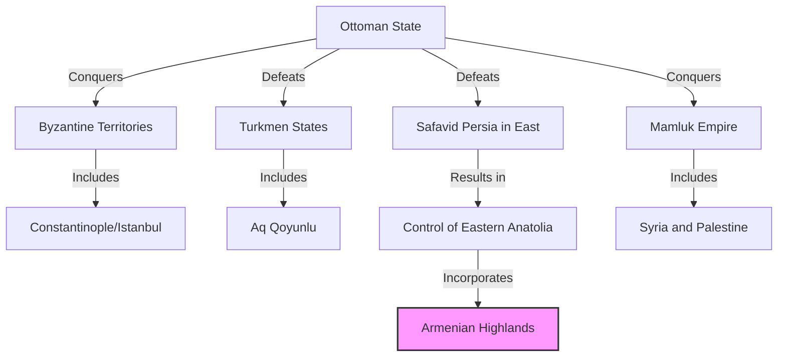
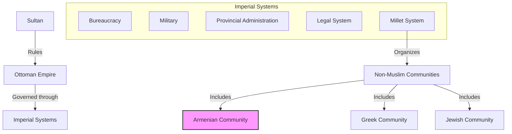
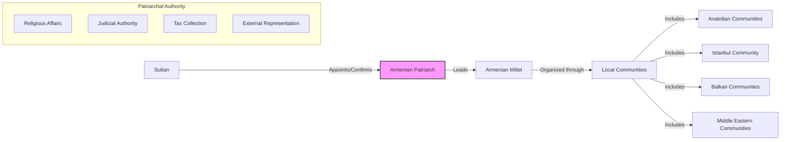
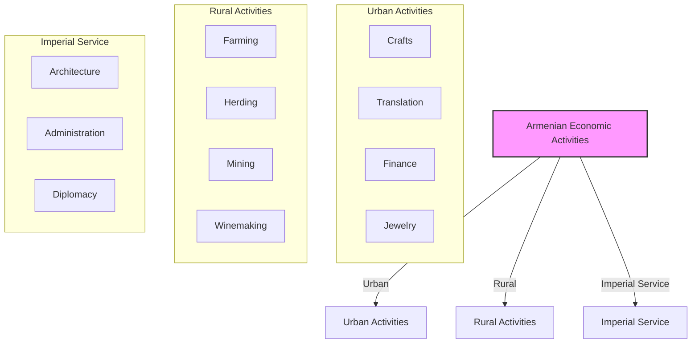
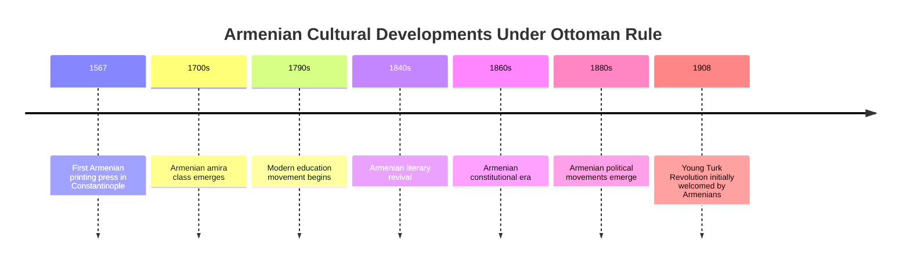
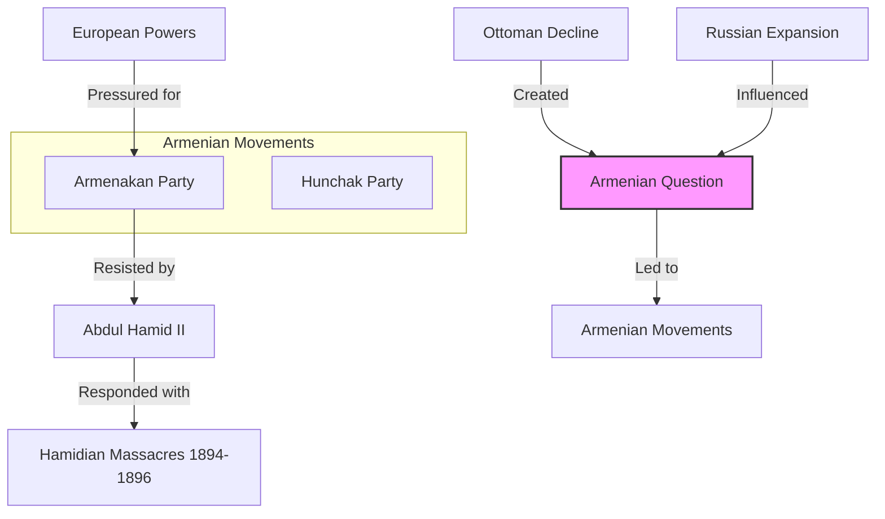
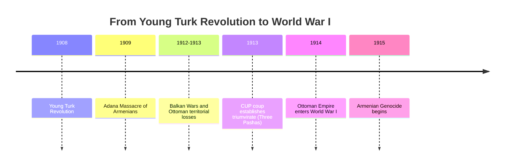
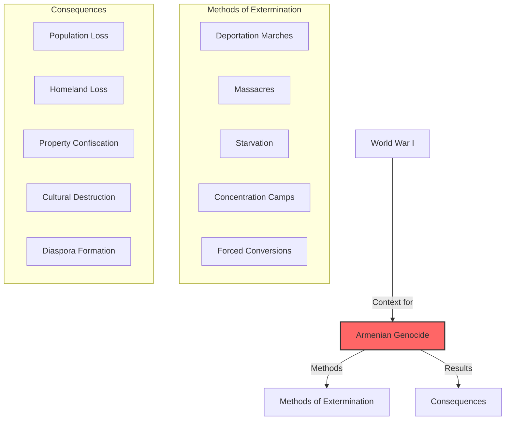
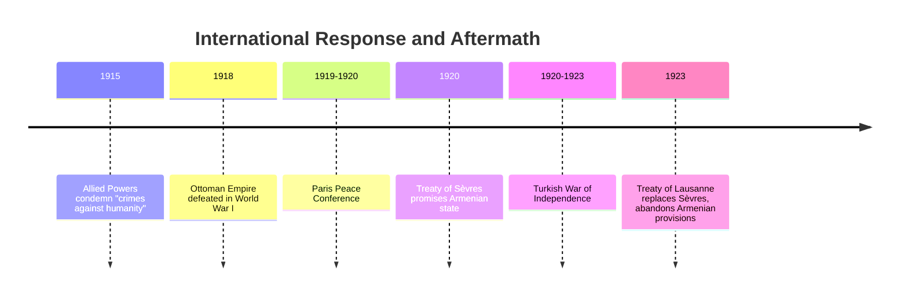
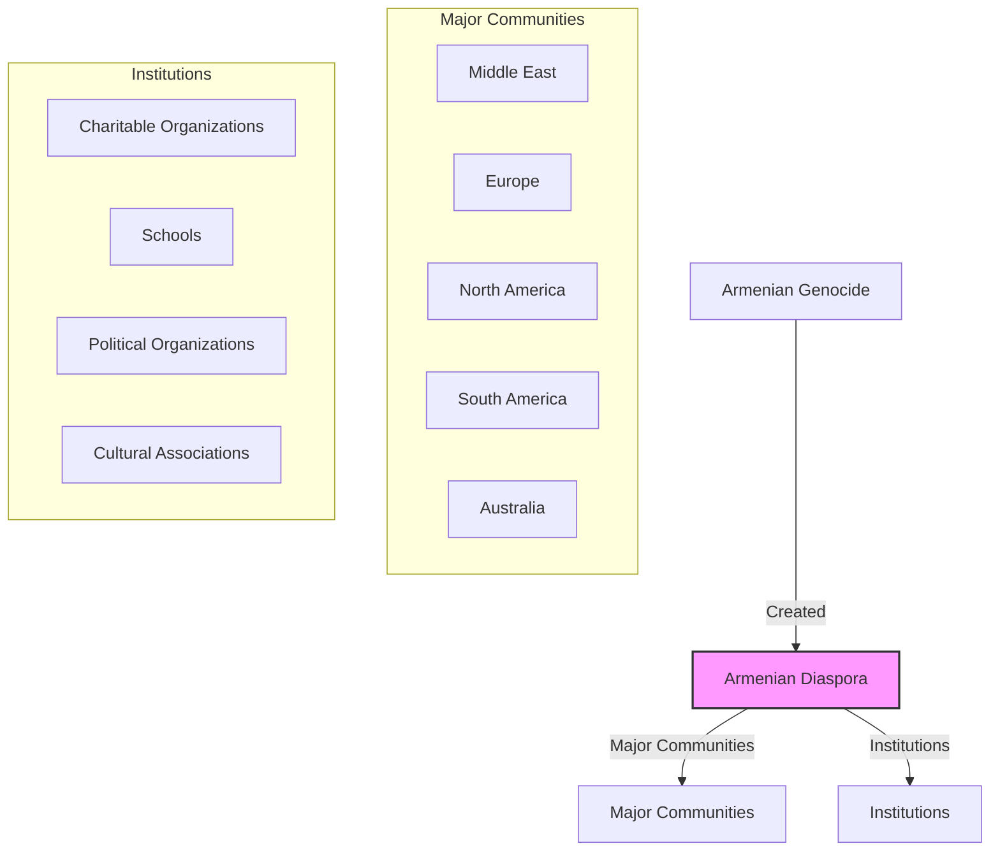

# The Ottoman Empire and the Armenian Experience: From Integration to Genocide

The rise of the **Ottoman Empire** marked the beginning of a new chapter in Armenian history—one that would last for over 500 years and end in catastrophe. From the 15th to the early 20th century, the vast majority of Armenians lived under Ottoman rule, developing distinct patterns of adaptation, achievement, and ultimately facing existential threat.

This post examines the complex relationship between Armenians and the Ottoman state from its rise to its collapse, culminating in the Armenian Genocide of 1915-1917.

------

## The Ottoman Rise to Power

The Ottoman Empire emerged from a small Turkish principality in western Anatolia:

- **1299:** Osman I establishes Ottoman beylik (principality)
- **1326:** Capture of Bursa, first Ottoman capital
- **1354:** First Ottoman foothold in Europe
- **1453:** Mehmed II conquers Constantinople
- **1461:** Ottomans annex Empire of Trebizond, last Byzantine outpost
- **1473:** Ottomans defeat Ak Koyunlu Turkmens at Battle of Otlukbeli
- **1514:** Ottomans defeat Safavids at Chaldiran, securing eastern Anatolia
- **1516-1517:** Ottoman conquest of Mamluk territories including Syria and Egypt

**Armenian incorporation into the Ottoman Empire:**

- **Western Armenian regions:** Gradually absorbed in 14th-15th centuries
- **Eastern Armenian regions:** Secured after Battle of Chaldiran (1514)
- **Cilician Armenian remnants:** Already under Mamluk control, transferred to Ottoman rule in 1516

------

## The Ottoman Imperial System

The Ottoman Empire developed sophisticated systems for governing its diverse population:

- **Sultan** as absolute monarch and caliph
- **Imperial bureaucracy** staffed by trained officials
- **Military organization** centered on Janissary corps
- **Provincial administration** through governors (beylerbeyi, vali)
- **Legal system** based on Islamic law (sharia) with secular regulations (kanun)
- **Millet system** organizing non-Muslim communities

**The Millet System:**

The millet (nation) system was crucial for Armenian life under Ottoman rule:

1. **Religious community autonomy** in internal affairs
2. **Ecclesiastical leadership** with administrative authority
3. **Separate legal jurisdiction** for personal and family matters
4. **Tax collection** through community institutions
5. **Educational autonomy** through community schools
6. **Distinct identity preservation** within imperial framework

------

## Armenian Patriarch of Constantinople

The **Armenian Patriarch of Constantinople** became the central authority for Ottoman Armenians:

- **Established in 1461** by Mehmed II after conquest of Constantinople
- **Hovakim I** appointed as first Patriarch
- **Administrative authority** over Armenian millet throughout empire
- **Represented Armenians** to Ottoman government
- **Judicial authority** in family and personal matters
- **Tax collection responsibility** for the community
- **Regulated religious institutions** including churches and monasteries

**Significance of the Patriarchate:**

- Created a centralized authority for Armenians throughout the empire
- Established Armenians as a recognized imperial community
- Shifted Armenian power center from historical homeland to Constantinople
- Provided mechanism for community governance under Ottoman sovereignty
- Created pattern of religious leadership with political functions

------

## Armenian Economic Roles in the Ottoman Empire

Armenians developed specialized economic roles in Ottoman society:

- **Artisans and craftsmen** in urban centers
- **Merchants** in domestic and international trade
- **Financiers and sarrafs** (money changers)
- **Architects and master builders** for imperial projects
- **Farmers and peasants** in rural Anatolia
- **Administrators** in certain government departments

**The amira class:**

By the 18th-19th centuries, a wealthy Armenian elite known as **amiras** emerged:

- Served as bankers and financial advisors to the Ottoman court
- Held monopolies on certain trades (mint, gunpowder)
- Built magnificent mansions in Constantinople
- Funded Armenian churches, schools, and hospitals
- Exercised significant influence within the Armenian community
- Often served as intermediaries between Ottoman state and foreign powers

------

## Armenian Cultural Life Under Ottoman Rule

Despite minority status, Armenian culture flourished in certain ways:

- **Religious institutions** preserved language and traditions
- **Manuscript production** continued in monasteries
- **Armenian printing** established in Constantinople (1567)
- **Educational institutions** developed, especially in 19th century
- **Literary revival** with development of modern Western Armenian
- **Architectural achievements** in churches and secular buildings
- **Musical traditions** preserved and developed

**Cultural adaptation:**

Armenians developed a distinct Western Armenian culture that:
- Incorporated Ottoman Turkish vocabulary and cultural elements
- Maintained core Armenian Christian identity
- Developed unique artistic styles blending Eastern and Western influences
- Created educational systems combining traditional and modern approaches
- Preserved historical memory while adapting to contemporary realities

------

## The Armenian Question and Great Power Politics

By the 19th century, the "Armenian Question" emerged as part of the broader Eastern Question:

- **Ottoman decline** created instability in Armenian regions
- **Russian expansion** into Caucasus (1828-1829) divided Armenian population
- **European powers** began advocating for Ottoman Christians
- **Treaty of Berlin (1878)** included provisions for Armenian reforms
- **Abdul Hamid II** resisted implementation of reforms
- **Armenian revolutionary movements** emerged in response to deteriorating conditions
- **Great Power competition** complicated Armenian situation

**The Hamidian Massacres (1894-1896):**

- Organized killings of Armenians under Sultan Abdul Hamid II
- Estimated 100,000-300,000 Armenians killed
- Widespread destruction of Armenian villages and property
- International condemnation but no intervention
- First major wave of Armenian emigration to America and elsewhere
- Precursor to later genocide

------

## The Young Turk Period and Rising Nationalism

The **Young Turk Revolution** of 1908 initially raised Armenian hopes:

- **Committee of Union and Progress (CUP)** overthrew Abdul Hamid II
- **Constitutional government** promised equality for all Ottoman subjects
- **Armenian political parties** initially allied with Young Turks
- **Armenian deputies** served in Ottoman parliament

**Ideological shift:**

The initial liberal promises of the Young Turks gave way to:
- **Turkish nationalism** replacing Ottoman multiculturalism
- **Pan-Turkism** seeking union with Turkic peoples in Russia
- **Scapegoating minorities** for Ottoman territorial losses
- **Militarization** of politics under CUP triumvirate
- **Enver, Talaat, and Jemal Pashas** consolidating power

------

## The Armenian Genocide (1915-1917)

World War I provided the context for the Ottoman government's decision to eliminate the Armenian population:

- **April 24, 1915:** Arrest and murder of Armenian intellectuals in Constantinople
- **Disarmament** of Armenian soldiers in Ottoman army
- **Deportation orders** for Armenian population throughout Anatolia
- **Death marches** through desert to Syria
- **Massacres** by military, Kurdish irregulars, and special units
- **Concentration camps** in Syrian Desert
- **Property confiscation** and distribution to Turkish settlers
- **Forced conversions** of women and children

**Scale of destruction:**

- Estimated **1.5 million Armenians killed**
- Near-complete elimination of Armenian population from historical homeland
- Destruction of thousands of churches, schools, and cultural monuments
- Confiscation of Armenian property valued at billions
- Creation of modern Armenian diaspora
- Permanent demographic transformation of eastern Turkey

------

## International Response and Aftermath

The international response to the Armenian Genocide was mixed:

- **Allied powers** (Britain, France, Russia) issued joint declaration in May 1915
- **American ambassador Henry Morgenthau** documented atrocities
- **Relief efforts** by American missionaries and others
- **Near East Relief** organization formed to aid survivors
- **Post-war treaties** initially promised Armenian state
- **Treaty of Sèvres (1920)** included provisions for Armenia
- **Turkish nationalist movement** under Mustafa Kemal rejected Sèvres
- **Treaty of Lausanne (1923)** abandoned Armenian provisions

**Legacy of denial:**

- Turkish state adopted policy of genocide denial
- "Turkish Historical Thesis" developed to counter Armenian claims
- International recognition delayed by geopolitical considerations
- Ongoing struggle for recognition and justice
- Profound impact on Armenian identity and diaspora consciousness

------

## The Armenian Diaspora: A New Beginning

The genocide transformed the Armenian people into a primarily diasporic nation:

- **Middle Eastern communities** in Syria, Lebanon, Egypt, Iraq
- **European communities** in France, Greece, Bulgaria
- **American community** centered in California and Massachusetts
- **Soviet Armenia** as small homeland for Eastern Armenians
- **Cultural preservation** through community institutions
- **Political advocacy** for genocide recognition
- **Eventual independence** of Armenia in 1991

**Diaspora achievements:**

Despite the catastrophe, Armenian communities rebuilt and achieved remarkable success:
- Cultural preservation and development in new settings
- Economic success in adopted countries
- Political advocacy for Armenian causes
- Educational and religious institutions
- Maintenance of Armenian identity across generations

------

## Conclusion: From Integration to Destruction

The Armenian experience in the Ottoman Empire represents a tragic arc from integration to destruction:

1. **Initial incorporation** as valued religious minority
2. **Centuries of coexistence** with specialized economic and social roles
3. **Cultural adaptation and achievement** within Ottoman framework
4. **Rising tensions** with Ottoman decline and European interference
5. **Hamidian massacres** as precursor to genocide
6. **Young Turk nationalism** transforming Ottoman identity
7. **Genocide** as final solution to the "Armenian Question"
8. **Diaspora formation** as consequence of destruction

This history continues to shape Armenian identity today, with the dual legacies of cultural achievement under Ottoman rule and the trauma of genocide defining modern Armenian consciousness.

The Ottoman-Armenian story stands as a warning about the fragility of multicultural coexistence and the dangers of nationalism taken to extremes—lessons that remain relevant in today's world of ethnic and religious tensions.
