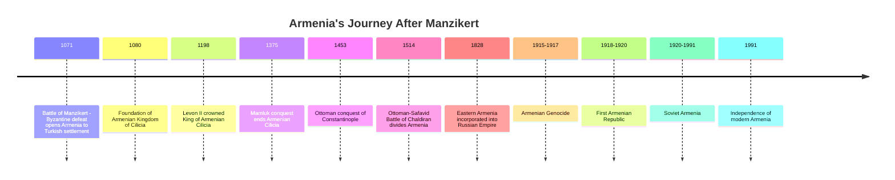
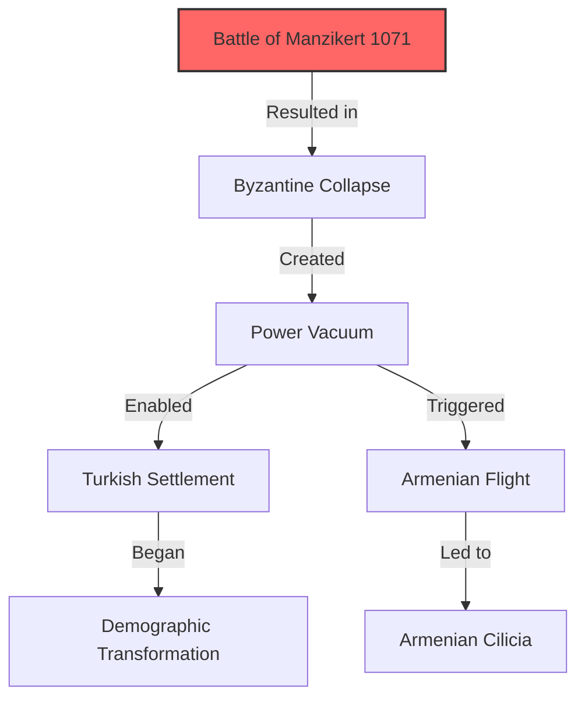
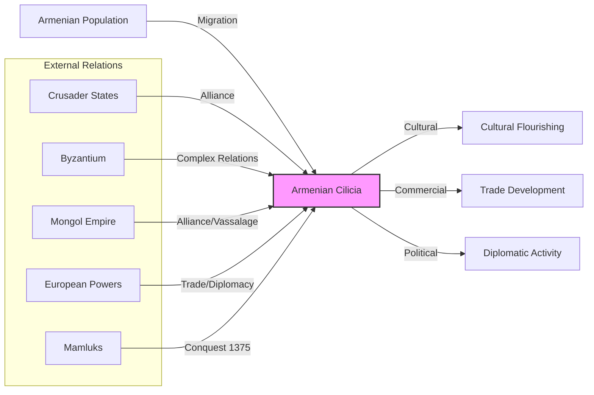
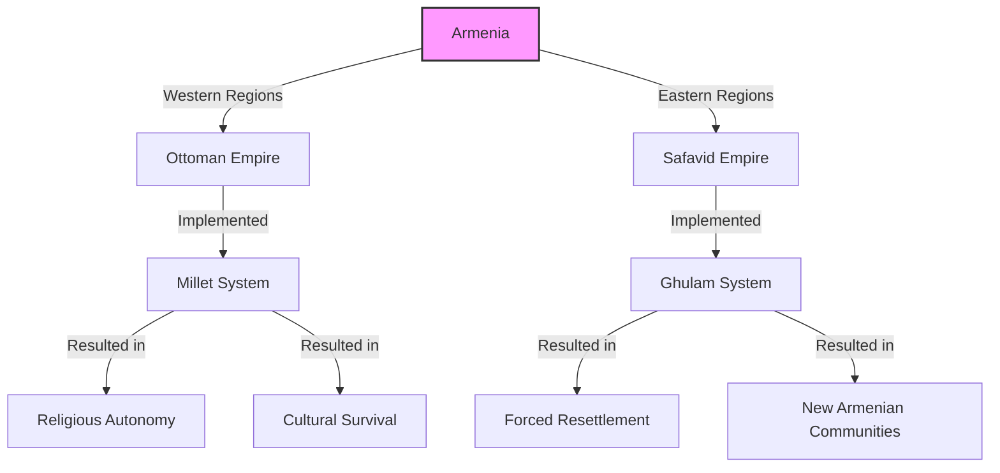
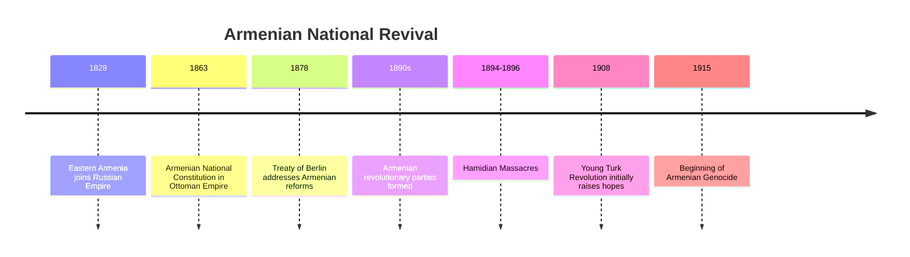
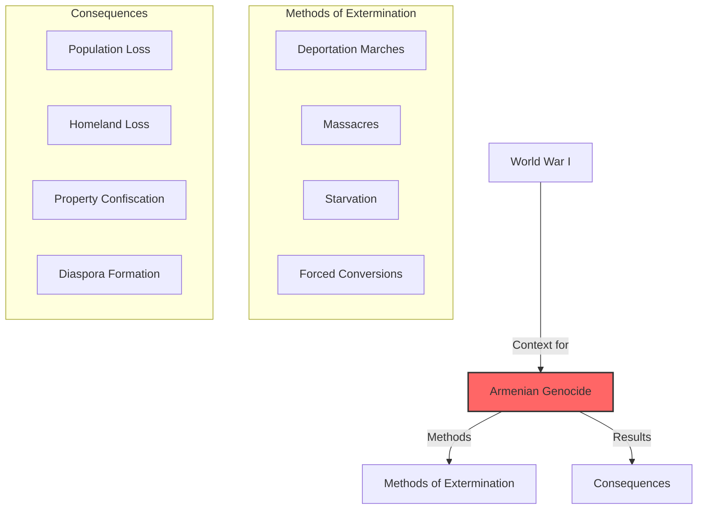
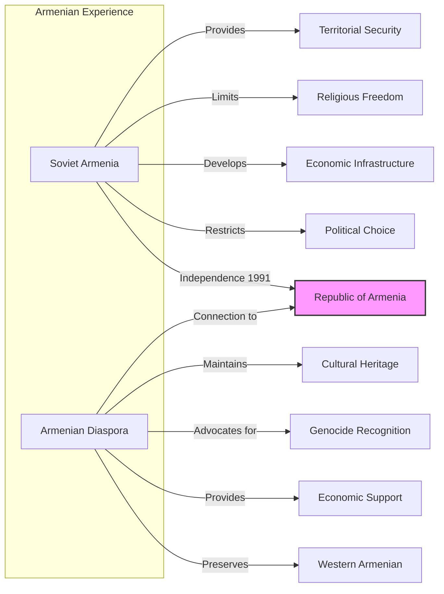
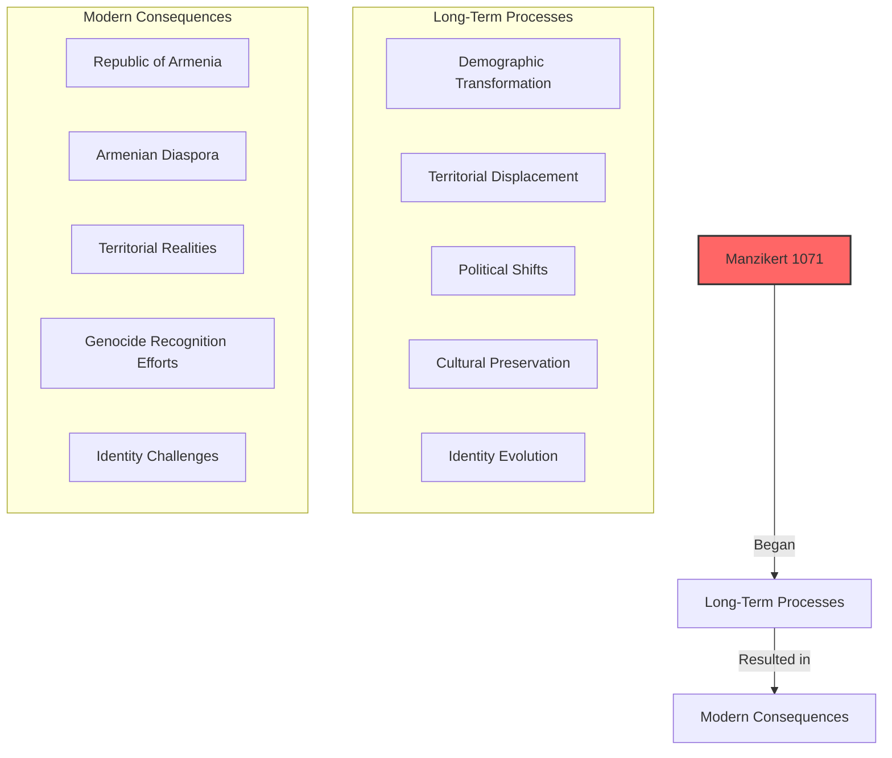

# Manzikert and Beyond: The Transformation of Armenia's Destiny

The **Battle of Manzikert** in 1071 CE stands as one of history's pivotal moments—a single day that altered the course of Armenian, Byzantine, and Middle Eastern history forever. This battle opened Anatolia to Turkic settlement, accelerated the decline of Byzantium, and began the demographic transformation of historical Armenia.

But Manzikert was not merely an end—it was also a beginning. It initiated a millennium-long process that continues to shape Armenian identity, geopolitics, and diaspora experience to this day.

------

## Timeline: From Manzikert to Modern Armenia

------

## The Fateful Battle and Its Aftermath

The **Battle of Manzikert** (August 26, 1071) saw the Seljuk Turks under Sultan Alp Arslan defeat the Byzantine army led by Emperor Romanos IV Diogenes. This military disaster had immediate consequences:

- **Byzantine defensive collapse** in eastern Anatolia
- **Turkic migration** into the Armenian highlands
- **Armenian displacement** southward toward Cilicia
- **Power vacuum** filled by competing Turkish emirates
- **Byzantine civil war** following the emperor's capture

**Long-term significance:** Manzikert fundamentally altered the ethnic and religious character of Anatolia and the Armenian highlands, beginning a process of Turkification and Islamization that would continue for centuries.

------

## The Armenian Kingdom of Cilicia: A New Beginning

As their highland homeland fell to Turkish control, Armenians established a new state in **Cilicia** (southeastern Anatolia/northern Syria):

- **1080:** Foundation of the Rubenid principality
- **1198-1375:** Kingdom of Armenian Cilicia flourishes
- **Strategic alliances** with Crusaders, Mongols, and European powers
- **Commercial center** connecting East and West
- **Cultural renaissance** in literature, art, and architecture

**Cilician achievement:** The Kingdom of Armenian Cilicia represented a remarkable adaptation to catastrophe—a "second Armenia" that preserved Armenian statehood, culture, and religion for three centuries after the loss of the highland homeland.

------

## Between Ottoman and Safavid Empires

By the 16th century, Armenia became divided between two powerful Muslim empires:

- **Ottoman Empire** controlled Western Armenia after the Battle of Chaldiran (1514)
- **Safavid Persia** controlled Eastern Armenia
- **Religious division:** Sunni Ottomans vs. Shi'a Safavids
- **"Scorched earth" policies** devastated Armenian lands during wars
- **Forced resettlement** of Armenians by Shah Abbas I (1604)

**Survival under empire:** Despite division between empires, Armenians adapted by:
- Developing specialized economic roles
- Maintaining religious institutions
- Forming diaspora communities
- Creating networks across imperial boundaries
- Preserving language and culture through church and education

------

## The Russian Factor and National Awakening

The 19th century brought a new imperial power into the Armenian equation—Russia:

- **1828-1829:** Eastern Armenia incorporated into Russian Empire
- **Armenian population divided** between Russian, Ottoman, and Persian rule
- **National awakening** through education and literature
- **Political movements** emerge in response to Ottoman repression
- **Great Power politics** complicate the "Armenian Question"

**National consciousness:** The 19th century saw the development of modern Armenian national identity, influenced by European ideas of nationalism and self-determination, but tragically culminating in the catastrophe of genocide.

------

## The Armenian Genocide: The Culmination of Manzikert's Legacy

The **Armenian Genocide** (1915-1917) represented the tragic culmination of the process begun at Manzikert:

- **1.5 million Armenians killed** through massacres, death marches, and starvation
- **Near-complete elimination** of Armenians from historical homeland
- **Property confiscation** and cultural destruction
- **Creation of modern Armenian diaspora**
- **Permanent demographic transformation** of historical Armenian lands

**Historical connection:** The genocide completed the process of Armenian displacement from their historical homeland that began with the Turkish migrations after Manzikert—a process spanning nearly 850 years.

------

## Soviet Armenia and Independence

The 20th century brought new challenges and opportunities:

- **1918-1920:** Brief independence of First Armenian Republic
- **1920-1991:** Armenia as a Soviet republic
- **Diaspora development** in Middle East, Europe, and Americas
- **1988:** Devastating earthquake in northern Armenia
- **1991:** Independence following Soviet collapse
- **1988-1994:** Nagorno-Karabakh conflict with Azerbaijan

**Dual Armenian reality:** The Soviet period created a dual Armenian existence—a homeland state with limited freedoms and a diaspora with cultural freedom but no territory—that continues to shape Armenian identity today.

------

## The Long Shadow of Manzikert

The Battle of Manzikert in 1071 cast a shadow that extends nearly a millennium:

1. **Territorial transformation:** From majority Armenian homeland to minority enclaves
2. **Political adaptation:** From highland kingdoms to Cilician state to statelessness to Soviet republic to modern independence
3. **Demographic dispersal:** From territorial majority to global diaspora
4. **Cultural preservation:** Through church, language, and community institutions
5. **Identity evolution:** From regional/religious identity to modern national consciousness

------

## Conclusion: From Medieval Battle to Modern Identity

The journey from Manzikert to modern Armenia spans nearly a millennium, yet the connections remain clear. A single battle in 1071 set in motion forces that would transform Armenia from a homeland-based people to one of the world's most significant diasporas.

Yet through this long process of displacement, adaptation, and survival, Armenian identity has demonstrated remarkable resilience. The church, language, and cultural traditions have endured despite the loss of homeland, political sovereignty, and millions of lives.

Today's Armenia—both the republic and the global diaspora—represents the latest chapter in this long story of survival against overwhelming odds. The modern Armenian experience cannot be understood without recognizing how deeply it is rooted in the consequences of Manzikert and the centuries of adaptation that followed.

As Armenians navigate the challenges of the 21st century, they do so as heirs to this complex legacy—a people who have repeatedly transformed catastrophe into survival and even revival.
