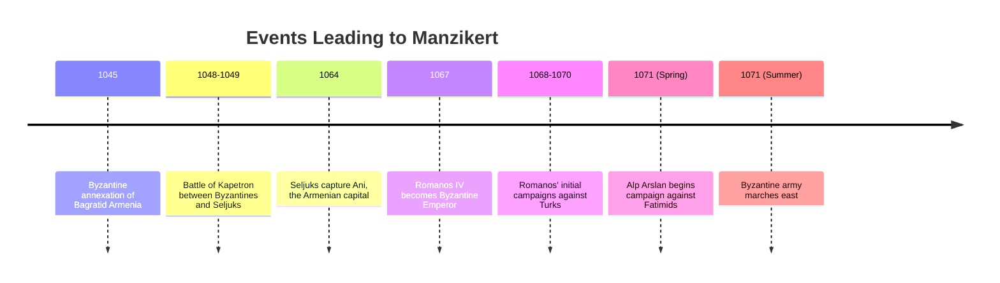
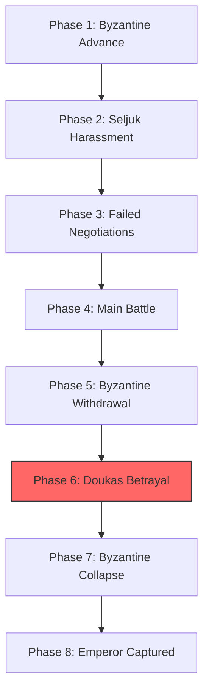
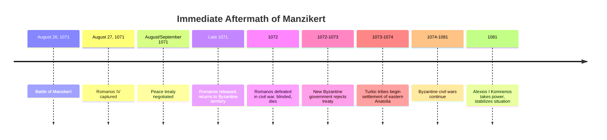
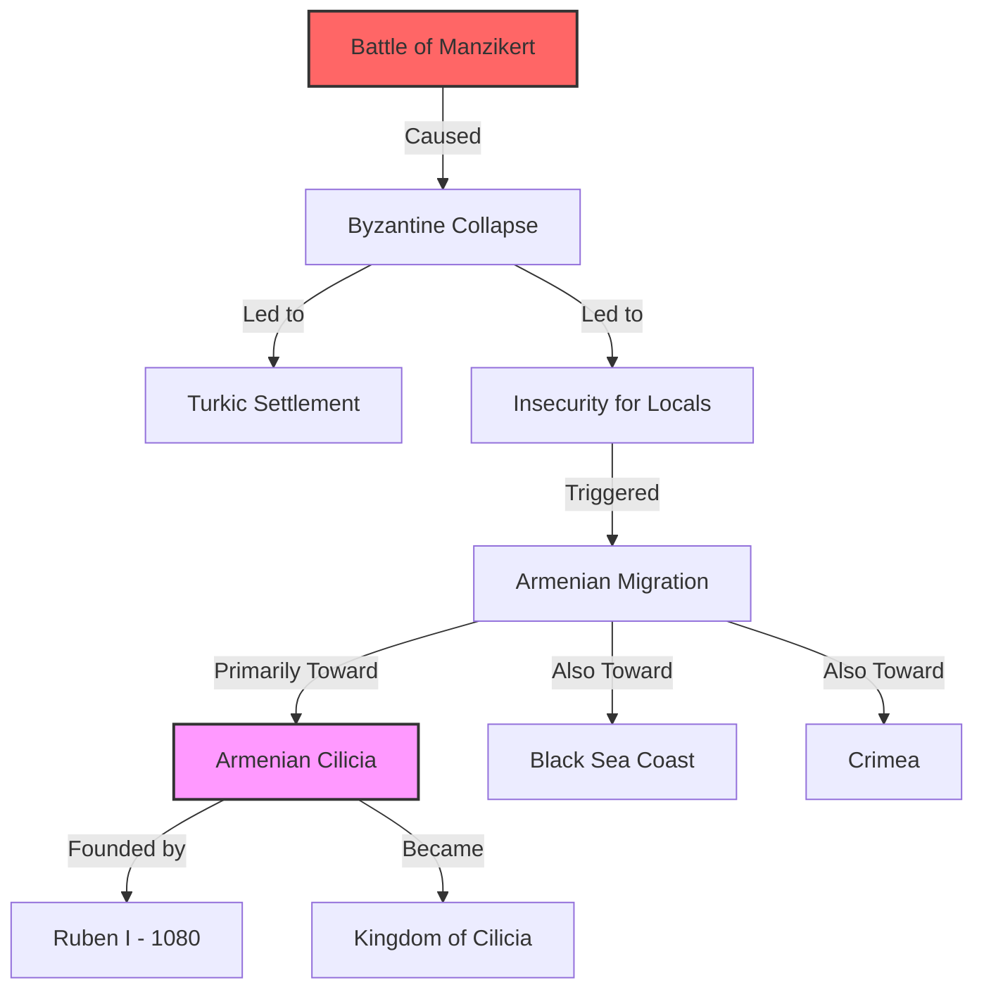
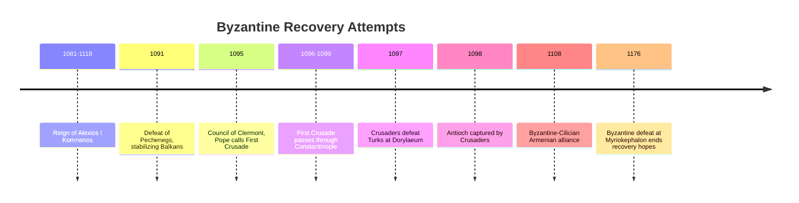
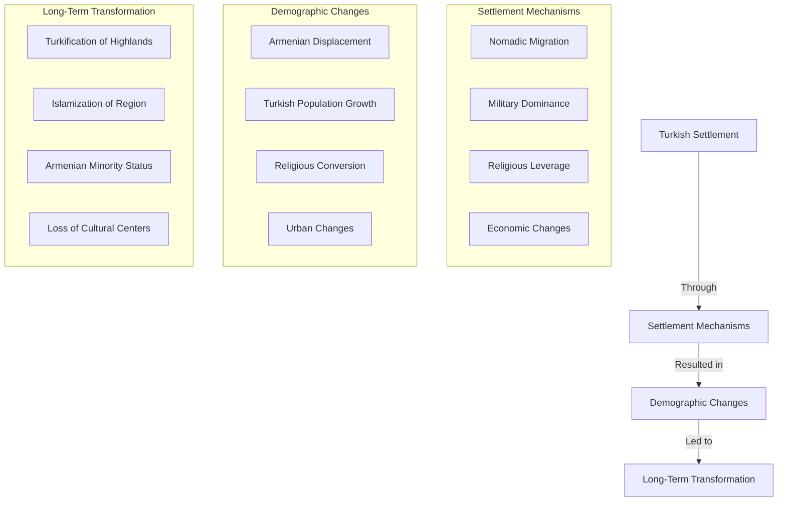
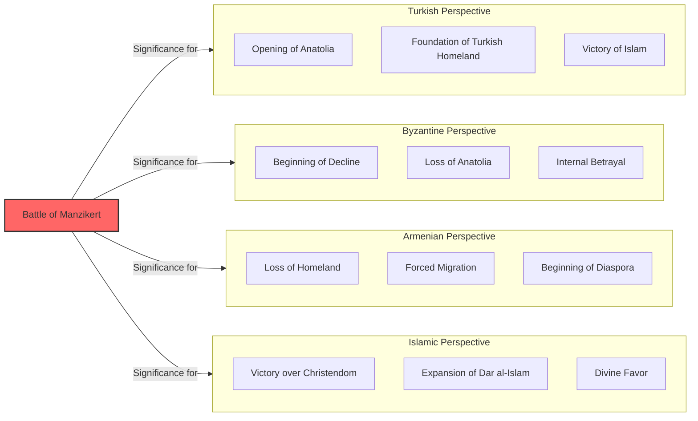

# The Battle of Manzikert: The Day That Changed Armenia's Destiny

Few battles in history have so dramatically altered the fate of an entire people as the **Battle of Manzikert** on August 26, 1071. This single military engagement between the **Byzantine Empire** and the **Seljuk Turks** set in motion a chain of events that would transform the Armenian highlands from a predominantly Christian Armenian region into the eastern provinces of what would eventually become Turkey.

This post examines the battle itself, its immediate aftermath, and how it fundamentally reshaped Armenian history.

------

## The Road to Manzikert: Historical Context

By 1071, several key factors had set the stage for this pivotal confrontation:

- **Byzantine annexation** of the Armenian Bagratid kingdom (1045) had weakened local defenses
- **Seljuk Turks** had already been raiding into Armenia and Anatolia for decades
- **Emperor Romanos IV Diogenes** sought to reverse Turkish gains and secure the eastern frontier
- **Religious tensions** between Orthodox Byzantines and Monophysite Armenians complicated loyalty
- **Alp Arslan**, the Seljuk Sultan, was initially focused on campaigns against Fatimid Egypt



**Armenian position:** By 1071, Armenians were caught in a difficult position:
- Their kingdoms had been annexed by Byzantium
- Their religious practices were considered heretical by the Orthodox Church
- Many served in the Byzantine military but with divided loyalties
- They had already suffered from Seljuk raids
- Their former capital Ani had fallen to the Seljuks in 1064

------

## The Opposing Forces

The battle pitted two very different military systems against each other:

**Byzantine Army:**
- **Size:** Approximately 40,000-70,000 troops (estimates vary widely)
- **Composition:** Mixed force of professional Tagmata, foreign mercenaries, and thematic troops
- **Leadership:** Emperor Romanos IV Diogenes personally commanding
- **Strengths:** Heavy cavalry cataphracts, disciplined infantry, siege equipment
- **Weaknesses:** Internal rivalries, questionable loyalty of mercenaries, logistical challenges

**Seljuk Army:**
- **Size:** Approximately 20,000-30,000 troops (smaller but more cohesive)
- **Composition:** Primarily Turkish horse archers with some heavy cavalry
- **Leadership:** Sultan Alp Arslan personally commanding
- **Strengths:** Mobility, horse archery, tactical flexibility, unified command
- **Weaknesses:** Less heavily armored, smaller numbers

```mermaid
flowchart LR
    subgraph BA[Byzantine Army]
        BT[Tagmata]
        BM[Mercenaries]
        BV[Varangian Guard]
        BF[Frankish Knights]
        BA[Armenian Troops]
    end
    
    subgraph SA[Seljuk Army]
        SH[Horse Archers]
        SC[Heavy Cavalry]
        SG[Ghulams]
    end
    
    BA -->|Strengths| BS[Byzantine Strengths]
    BA -->|Weaknesses| BW[Byzantine Weaknesses]
    
    subgraph BS[Byzantine Strengths]
        BS1[Heavy Armor]
        BS2[Numbers]
        BS3[Infantry Formations]
    end
    
    subgraph BW[Byzantine Weaknesses]
        BW1[Internal Rivalries]
        BW2[Complex Logistics]
        BW3[Mixed Loyalties]
    end
    
    SA -->|Strengths| SS[Seljuk Strengths]
    SA -->|Weaknesses| SW[Seljuk Weaknesses]
    
    subgraph SS[Seljuk Strengths]
        SS1[Mobility]
        SS2[Horse Archery]
        SS3[Unified Command]
    end
    
    subgraph SW[Seljuk Weaknesses]
        SW1[Lighter Armor]
        SW2[Smaller Numbers]
    end
```

**Armenian troops** were present on both sides:
- Many served in the Byzantine army, particularly in eastern themes
- Some local Armenian forces supported the Seljuks against their Byzantine overlords
- Armenian nobility was divided in its loyalties

------

## The Battle Unfolds

The battle took place near Lake Van in historical Armenia, at the town of Manzikert (modern Malazgirt, Turkey):

- **Byzantine advance:** Emperor Romanos divided his forces, sending part under Joseph Tarchaneiotes toward Khilat
- **Seljuk maneuvers:** Alp Arslan used feigned retreats and harassment tactics
- **Failed negotiations:** Last-minute peace offers were rejected
- **Initial Byzantine success:** The Byzantine advance pushed back Turkish forces
- **The fatal turn:** As evening approached, Romanos ordered a withdrawal to camp
- **Andronikos Doukas' betrayal:** The reserve commander spread rumors of the emperor's death and retreated
- **Encirclement:** The Byzantine force was surrounded as their formation collapsed
- **Emperor captured:** Romanos fought bravely but was eventually captured



**The decisive moment** came when Andronikos Doukas, a rival of the emperor, withdrew the reserve forces rather than supporting the main army. This betrayal turned what might have been an orderly retreat into a catastrophic rout.

------

## Immediate Aftermath

The consequences of the battle unfolded rapidly:

- **Alp Arslan's treatment:** The Sultan treated Emperor Romanos with respect
- **Peace treaty:** A relatively lenient agreement was negotiated
- **Emperor's return:** Romanos was released but faced civil war
- **Byzantine betrayal:** Romanos was overthrown, blinded, and died from his wounds
- **Treaty invalidated:** The new Byzantine government rejected the treaty terms
- **Byzantine civil war:** The empire turned inward rather than defending its eastern provinces
- **Turkic migration:** Seljuk and other Turkic tribes began moving into eastern Anatolia in large numbers



**Power vacuum:** The combination of Byzantine civil war and the collapse of eastern defenses created a power vacuum that Turkic tribes rapidly filled. Unlike previous invaders who had come as conquerors, these nomadic groups came as settlers, fundamentally changing the demographic character of the region.

------

## Armenian Exodus to Cilicia

For Armenians, the aftermath of Manzikert was catastrophic:

- **Security collapse:** Byzantine protection of Armenian populations vanished
- **Turkic raids:** Settlements faced increasing attacks
- **Population displacement:** Many Armenians fled southward
- **Cilician migration:** Significant Armenian movement toward Cilicia
- **New Armenian state:** Foundations laid for what would become the Armenian Kingdom of Cilicia



**Ruben's foundation:** In 1073-1080, an Armenian noble named Ruben established control in the Cilician mountains, laying the foundation for what would eventually become the Armenian Kingdom of Cilicia—a new Armenian state far from the traditional homeland.

------

## Byzantine Attempts at Recovery

The Byzantine Empire did not immediately abandon its eastern territories:

- **Alexios I Komnenos** (r. 1081-1118) stabilized the empire and halted further territorial losses
- **First Crusade** (1096-1099) was called partly in response to Byzantine appeals for help
- **Some territories recovered** in western Anatolia
- **Alliance with Armenian Cilicia** against common Turkish enemies
- **Ultimately failed** to reverse the fundamental changes set in motion by Manzikert



**Too little, too late:** Despite some successes, the Byzantine recovery efforts came too late to reverse the demographic transformation of eastern Anatolia and the Armenian highlands. The Turkification process continued despite occasional Byzantine military victories.

------

## The Turkification Process

Following Manzikert, the demographic transformation of the Armenian highlands proceeded through several mechanisms:

- **Nomadic settlement:** Turkic pastoral nomads occupied highland pastures
- **Military dominance:** Turkish military superiority prevented organized resistance
- **Gradual displacement:** Armenian farmers abandoned vulnerable areas
- **Conversion:** Some local populations converted to Islam over time
- **Urban decline:** Armenian urban centers never recovered their former importance
- **Continued migration:** Ongoing Armenian exodus to safer regions



**Gradual but irreversible:** The process was not immediate but occurred over generations. By the 13th century, much of historical Armenia was under Turkish control, and Armenians were increasingly a minority in their own homeland.

------

## Manzikert in Historical Memory

The Battle of Manzikert holds different significance in different historical traditions:

- **In Turkish history:** Celebrated as the opening of Anatolia to Turkish settlement
- **In Byzantine history:** Mourned as the beginning of the empire's terminal decline
- **In Armenian history:** Remembered as a catastrophe that began the loss of homeland
- **In Islamic history:** Seen as a triumph of Muslim forces over Christendom
- **In world history:** Recognized as one of history's most consequential battles



**Modern resonance:** The battle continues to resonate in modern politics and identity, particularly in Turkey where it is celebrated as a foundational moment in Turkish history.

------

## Conclusion: The Day That Changed Everything

The Battle of Manzikert in 1071 stands as one of history's most consequential military engagements—a single day that altered the trajectory of multiple civilizations.

For Armenians, it marked the beginning of the end of their demographic dominance in their historical homeland. The process set in motion at Manzikert would continue for centuries, culminating in the Armenian Genocide of 1915-1917, which completed the removal of Armenians from their ancestral lands.

Yet Manzikert also sparked Armenian resilience and adaptation. The migration to Cilicia and the establishment of a new Armenian kingdom there demonstrated the remarkable ability of Armenian culture and identity to survive catastrophic change—a pattern that would be repeated in the formation of the modern Armenian diaspora.

The battle reminds us how single events can set in motion centuries-long processes that fundamentally transform the fate of entire peoples. Nearly a millennium later, the consequences of that August day in 1071 continue to shape the modern world.
