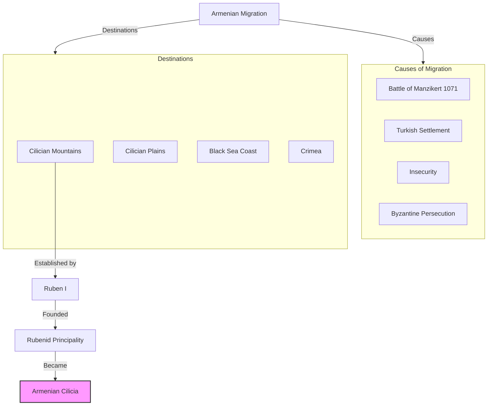
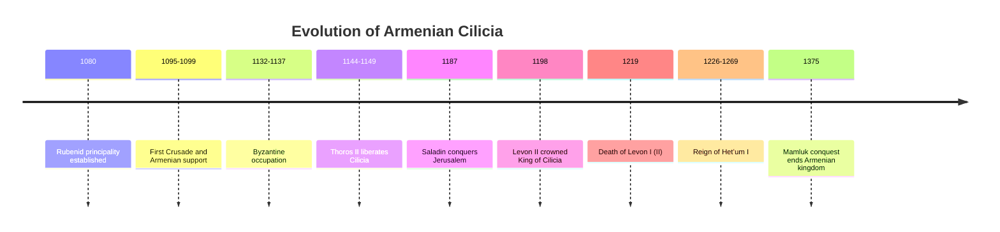
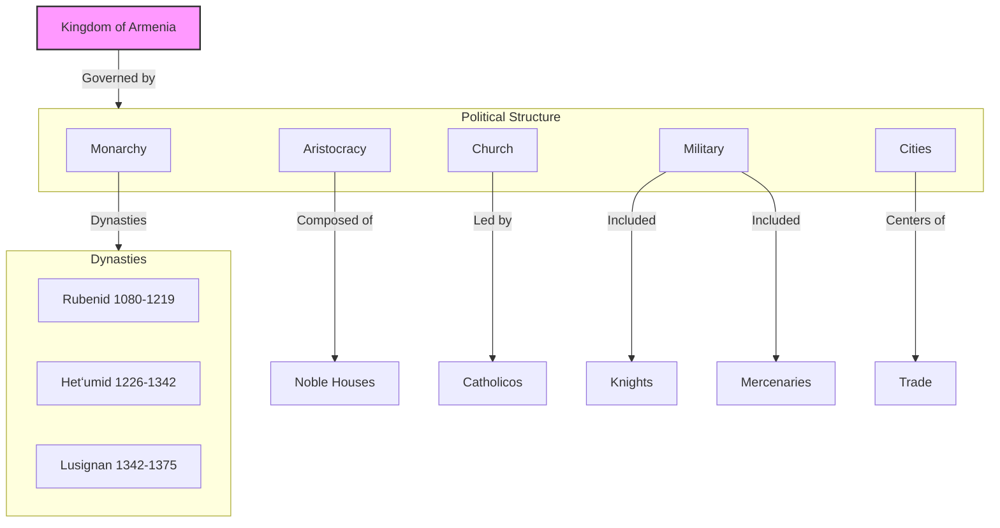
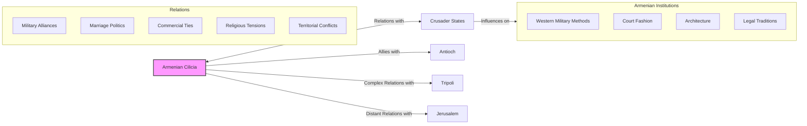
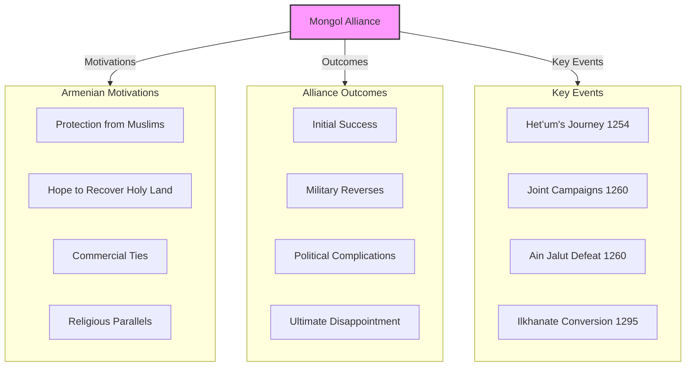
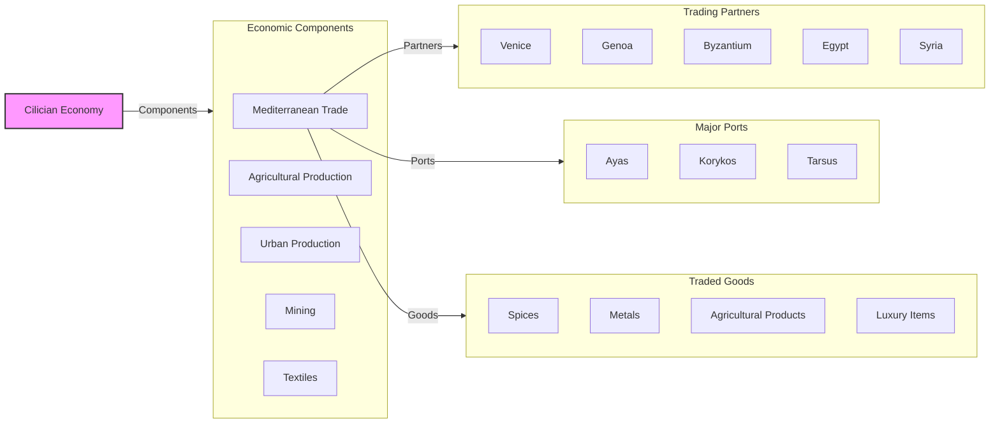
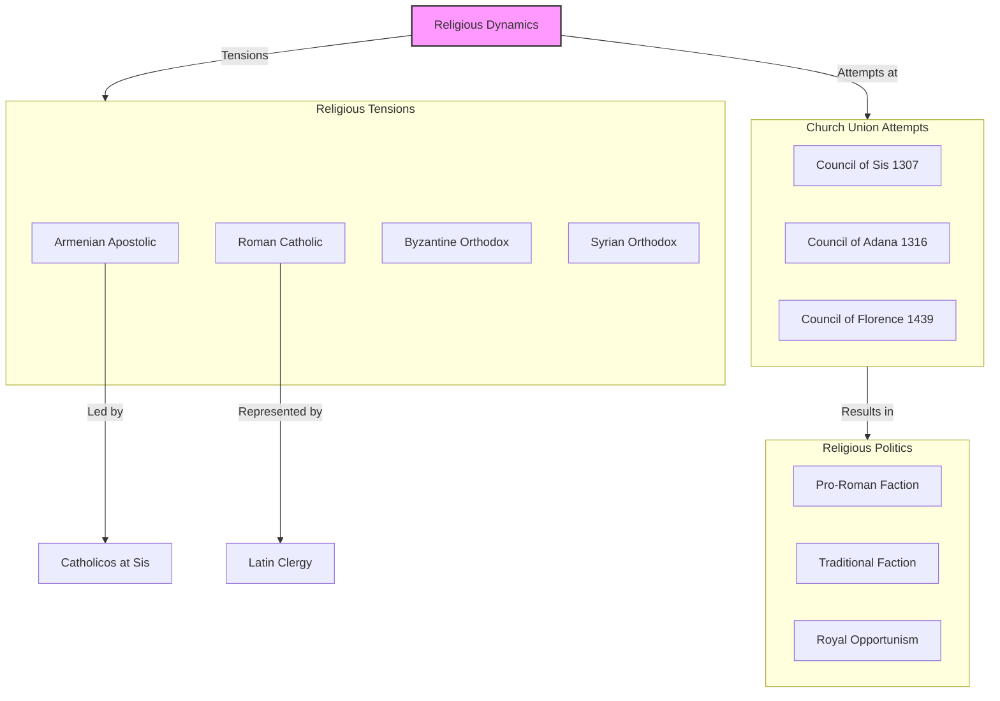
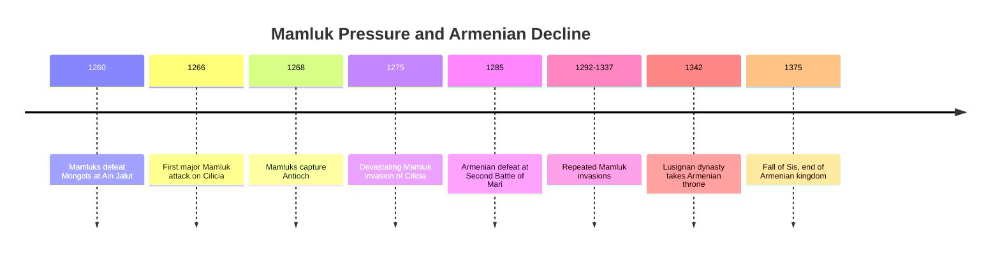
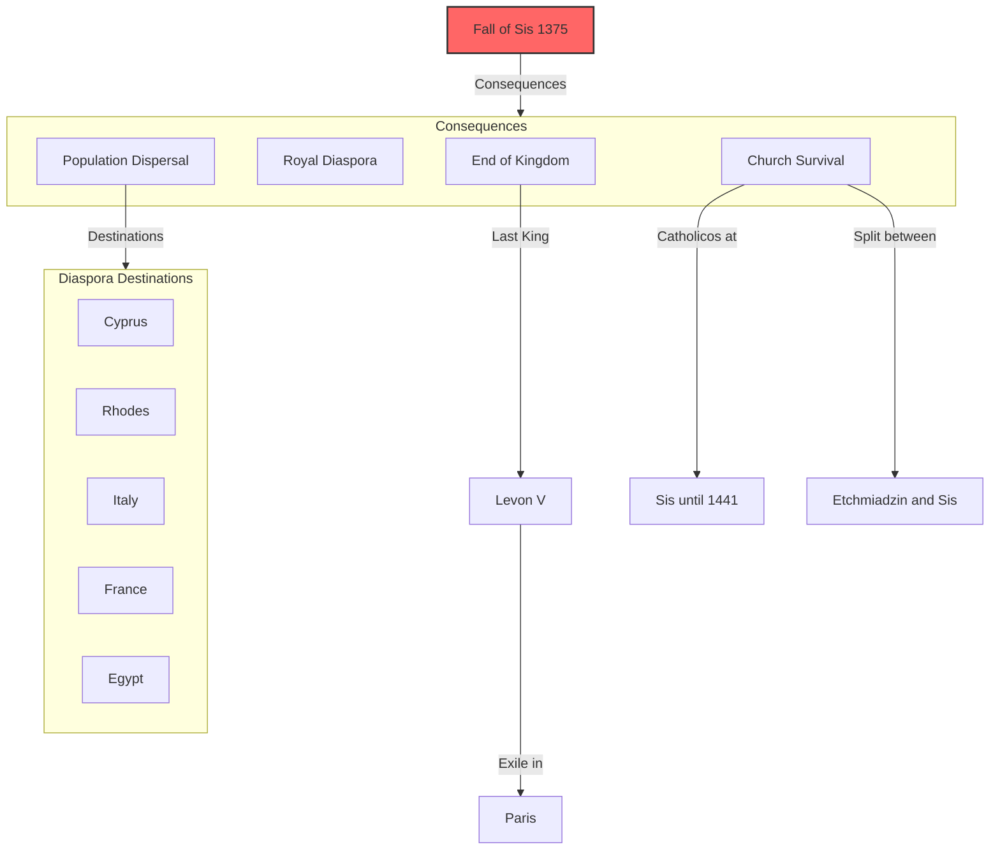
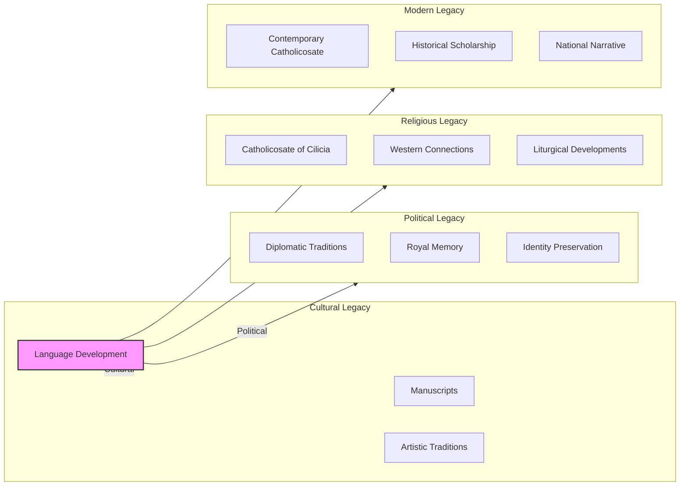

# The Crusader Period and Armenian Cilicia: A Mediterranean Armenian Kingdom

As their highland homeland fell to Turkic control following the Battle of Manzikert, Armenians established a remarkable new state in **Cilicia**—a region along the northeastern Mediterranean coast in what is now southern Turkey. This "New Armenia" would flourish for nearly three centuries, developing unique relationships with the Crusader states, European powers, Mongols, and Muslim neighbors.

The Armenian Kingdom of Cilicia represents one of history's most successful examples of cultural and political adaptation in the face of catastrophe—a diaspora state that preserved Armenian identity while engaging with the wider medieval world.

------

## The Foundation of Armenian Cilicia

Armenian migration to Cilicia began before Manzikert but accelerated dramatically afterward:

- **Pre-Manzikert settlement:** Some Armenian communities established by Byzantine resettlement
- **Post-Manzikert exodus:** Large-scale migration from the Armenian highlands
- **1073-1080:** Ruben, an Armenian noble, establishes control in Cilician mountains
- **Byzantine weakness** after Manzikert created opportunity for autonomy
- **Mountainous terrain** provided natural defenses against Turkish raids



**Strategic location:** Cilicia occupied a crucial position:
- Gateway between Anatolia and Syria/Levant
- Access to Mediterranean trade routes
- Fertile agricultural plains
- Defensible mountain ranges
- Proximity to Byzantine territories

------

## From Principality to Kingdom

Armenian Cilicia evolved from a mountain principality to a recognized kingdom:

- **1080-1095:** Consolidation of the Rubenid principality under Constantine I
- **1095-1099:** First Crusade passes through region, beginning long relationship
- **1132-1137:** Byzantine Emperor John II Komnenos temporarily conquers Cilicia
- **1187:** Armenian support for Crusaders after fall of Jerusalem
- **1198:** **Levon II** crowned King with approval of Holy Roman Emperor and Byzantine Emperor
- **1199-1219:** Golden Age under King Levon I (II)



**International recognition:** The coronation of Levon in 1198 marked Armenian Cilicia's transformation from a de facto independent principality to an internationally recognized kingdom with diplomatic relations across Europe and the Middle East.

------

## Political Structure and Society

The Armenian Kingdom of Cilicia developed a unique political structure:

- **Monarchy** with strong European influences
- **Feudal aristocracy** combining Armenian nakharar traditions with Western feudalism
- **Three major dynasties:** Rubenid, Hetʻumid, and Lusignan
- **Royal court** with elaborate European-style ceremonies
- **Legal system** blending Armenian and Frankish elements
- **Military organization** adapted to Mediterranean warfare



**Social structure:**
- Armenian nobility at the top
- Clergy with significant influence
- Merchant class growing in importance
- Urban craftsmen and artisans
- Rural peasantry
- Mixed population including Greeks, Syrians, and Franks

------

## Relations with the Crusader States

Armenian Cilicia developed complex relationships with the Crusader states:

- **Initial cooperation** during First Crusade
- **Military alliances** against common Muslim enemies
- **Marriage alliances** between Armenian and Crusader nobility
- **Commercial partnerships** in Mediterranean trade
- **Religious tensions** between Armenian Church and Latin Christianity
- **Occasional conflicts** over territorial claims



**Key relationship:** The Principality of Antioch was Armenian Cilicia's most important Crusader neighbor, with relations ranging from close alliance to open warfare depending on the period.

------

## The Mongol Alliance

One of Armenian Cilicia's most significant strategic decisions was to ally with the Mongols:

- **1243:** Mongols defeat Seljuks at Köse Dağ
- **1254-1255:** King **Hetʻum I** travels to Karakorum to meet Möngke Khan
- **1258-1260:** Joint Armenian-Mongol military operations against Muslim powers
- **1260:** Mongol defeat at Ain Jalut by Mamluks
- **1260-1307:** Continued Armenian-Mongol cooperation despite setbacks
- **1295:** Ilkhanate conversion to Islam undermines alliance's religious basis



**Strategic gamble:** The Mongol alliance represented a bold strategic choice by King Hetʻum I, who recognized that Armenian Cilicia could not survive without powerful allies against the rising Mamluk Sultanate.

------

## Mediterranean Trade and Economy

Armenian Cilicia developed a prosperous economy based on trade:

- **Strategic ports** including Ayas (modern Yumurtalık) and Korykos
- **Trade routes** connecting Europe to Asia
- **Export products** including textiles, carpets, agricultural goods, and minerals
- **Commercial partnerships** with Italian maritime republics (Venice, Genoa)
- **Currency system** with Armenian coins circulating throughout the region
- **Banking and finance** developing alongside trade



**Commercial hub:** The port of Ayas became one of the eastern Mediterranean's most important trading centers, mentioned by Marco Polo as his embarkation point for Asia.

------

## Cultural and Artistic Flourishing

Armenian Cilicia experienced a remarkable cultural renaissance:

- **Manuscript production** in scriptoria like Hromkla and Skevra
- **Architectural innovation** blending Armenian and Western styles
- **Literary achievements** including translations of Western works
- **Educational institutions** and intellectual development
- **Religious art** with distinctive Cilician Armenian style
- **Musical tradition** preserved in liturgical settings

```mermaid
flowchart TD
    CF[Cultural Flourishing] -->|Expressions| CE[Cultural Expressions]
    
    subgraph CE[Cultural Expressions]
        MA[Manuscript Art]
        AR[Architecture]
        LI[Literature]
        MU[Music]
        ED[Education]
    end
    
    MA -->|Centers| SC[Scriptoria]
    
    subgraph SC[Major Scriptoria]
        HR[Hromkla]
        SK[Skevra]
        DR[Drazark]
        TA[Tarsus]
    end
    
    MA -->|Artists| IL[Illuminators]
    
    subgraph IL[Notable Illuminators]
        TG[Toros Roslin]
        SA[Sargis Pitsak]
    end
    
    LI -->|Works| LW[Literary Works]
    
    subgraph LW[Notable Works]
        SM[Smbat Sparapet's Law Code]
        VA[Vardan's History]
        HE[Hetʻum's "Flower of Histories"]
    end
    
    style CF fill:#f9f,stroke:#333,stroke-width:2px
```

**Artistic achievement:** The illuminated manuscripts of Cilician Armenia represent some of the most beautiful medieval art, blending Armenian traditions with Byzantine and Western influences.

------

## Religious Dynamics

Armenian Cilicia faced complex religious challenges:

- **Armenian Apostolic Church** maintained its distinct traditions
- **Pressure for union** with Roman Catholic Church
- **Council of Sis (1307)** attempted compromise with Rome
- **Resistance** from conservative clergy and monasteries
- **Catholicos** (Armenian Church leader) resided in Cilicia
- **Religious minorities** including Greeks, Syrians, and Latins



**Religious identity:** Despite pressure to unite with Rome, the Armenian Church maintained its distinct identity, though with more openness to Western practices than in Greater Armenia.

------

## The Mamluk Threat and Decline

By the late 13th century, Armenian Cilicia faced an existential threat from the **Mamluk Sultanate**:

- **1266:** Mamluks begin systematic campaigns against Cilicia
- **1268:** Fall of Antioch removes key Crusader ally
- **1275:** Major Mamluk invasion devastates Cilician Plain
- **1285:** Armenian defeat at Second Battle of Mari
- **1292-1375:** Gradual loss of territory to Mamluks
- **1342:** Lusignan dynasty replaces Armenian Hetʻumids
- **1375:** Fall of Sis ends Armenian kingdom



**Factors in decline:**
1. **Overwhelming Mamluk military power**
2. **Loss of Mongol support** after Ilkhanate conversion to Islam
3. **End of Crusader states** removing buffer and allies
4. **Internal divisions** between pro-Latin and traditional factions
5. **Economic disruption** from warfare and changing trade routes
6. **Demographic losses** from repeated invasions

------

## The Fall of Sis and End of the Kingdom

In 1375, the last Armenian king, **Levon V**, surrendered Sis to the Mamluks:

- **Final siege** after decades of shrinking territory
- **King captured** and taken to Cairo
- **Armenian nobility** largely killed or exiled
- **Population dispersed** to Cyprus, Rhodes, and elsewhere
- **Levon V released** in 1382, died in exile in Paris in 1393
- **Catholicos continued** in Sis until 1441, then split between Sis and Etchmiadzin



**Royal diaspora:** The Armenian royal family scattered across Europe:
- Levon V died in Paris
- His daughter married into European nobility
- Claims to the Armenian throne passed to the Lusignan and Savoy families
- Titular "Kings of Armenia" continued to be recognized in Europe for centuries

------

## Legacy of Armenian Cilicia

Though the kingdom fell in 1375, its legacy endured:

1. **Cultural achievements** preserved Armenian identity during critical period
2. **Western connections** established lasting Armenian communities in Europe
3. **Commercial expertise** developed by Cilician Armenians spread throughout diaspora
4. **Religious continuity** maintained through Catholicosate of Cilicia
5. **Diplomatic precedent** of Armenian state engaging with international powers
6. **Architectural influence** visible in surviving churches and castles
7. **Literary heritage** preserved in manuscripts now held in collections worldwide



**Modern continuation:** The Catholicosate of Cilicia continues today, now based in Antelias, Lebanon, as one of the two major hierarchical sees of the Armenian Apostolic Church.

------

## Conclusion: A Remarkable Adaptation

The Armenian Kingdom of Cilicia represents one of history's most remarkable examples of cultural and political adaptation in the face of catastrophe. Forced from their highland homeland after Manzikert, Armenians created a new state that:

- Preserved Armenian identity, language, and religion
- Adapted to a Mediterranean environment
- Engaged diplomatically with European powers
- Developed sophisticated commercial networks
- Created distinctive cultural and artistic traditions
- Maintained independence for nearly three centuries

Though ultimately defeated by overwhelming Mamluk power, Armenian Cilicia demonstrated the extraordinary resilience of Armenian identity and institutions. It established patterns of diaspora adaptation and cultural preservation that would serve Armenians well during later periods of displacement and statelessness.

The kingdom stands as a testament to how a people can lose their homeland yet preserve their identity through cultural, religious, and political adaptation—a lesson that would prove vital during the even greater catastrophes that awaited Armenians in the 20th century.
