# Between Hammer and Anvil: Armenia in the Ottoman-Safavid Rivalry

By the 16th century, Armenia found itself caught between two powerful Muslim empires: the **Ottoman Empire** to the west and the **Safavid Persian Empire** to the east. For over two centuries, these rival powers fought for control of the Armenian highlands, turning the region into a contested borderland and battlefield.

This post examines how the Ottoman-Safavid rivalry shaped Armenian history, as the Armenian people and homeland became pawns in a geopolitical struggle between competing imperial and religious visions.

------

## The Rise of New Empires

The late 15th and early 16th centuries saw the emergence of two powerful new empires:

- **Ottoman Empire:** Turkish dynasty that had conquered Constantinople (1453)
- **Safavid Empire:** New Persian dynasty with Shi'a religious identity
- **Religious dimension:** Sunni Ottomans vs. Shi'a Safavids
- **Imperial ambitions:** Both sought control of the Middle East
- **Armenian position:** Caught directly between these powers

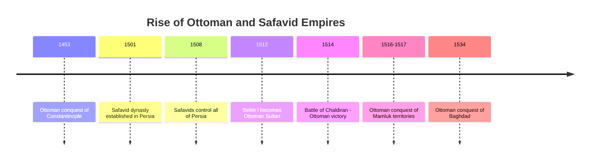

**Ideological conflict:** The Ottoman-Safavid rivalry was not merely territorial but ideological, pitting the Sunni Ottoman claim to the caliphate against the Shi'a Safavid religious revolution—with Armenia caught in the middle.

------

## The Battle of Chaldiran: A Turning Point

The decisive **Battle of Chaldiran** in 1514 established the basic pattern of control:

- **Ottoman Sultan Selim I** vs. **Safavid Shah Ismail I**
- **Ottoman victory** due to superior artillery and firearms
- **Western Armenia** fell under Ottoman control
- **Eastern Armenia** remained under Safavid influence
- **Division of Armenian population** between empires
- **Beginning of centuries-long border conflict**

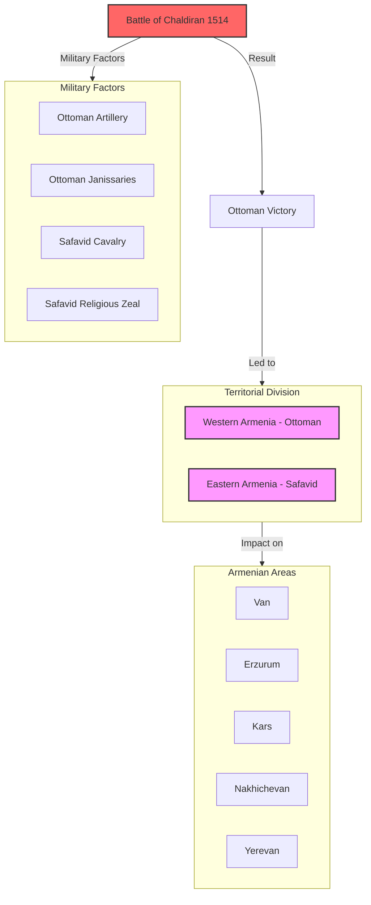

**Long-term significance:** The Ottoman-Safavid division established at Chaldiran would persist, with some fluctuations, until the Russian conquest of Eastern Armenia in the early 19th century.

------

## The Ottoman Administration of Western Armenia

The Ottoman Empire organized Western Armenia under its distinctive administrative system:

- **Eyalet (later vilayet) system** dividing region into provinces
- **Six Armenian provinces:** Van, Bitlis, Diyarbakır, Erzurum, Sivas, Kharput
- **Millet system** organizing Armenians as a religious community
- **Armenian Patriarch of Constantinople** as community leader
- **Local governance** through combination of Ottoman officials and Armenian leaders
- **Land ownership** increasingly concentrated in Muslim hands

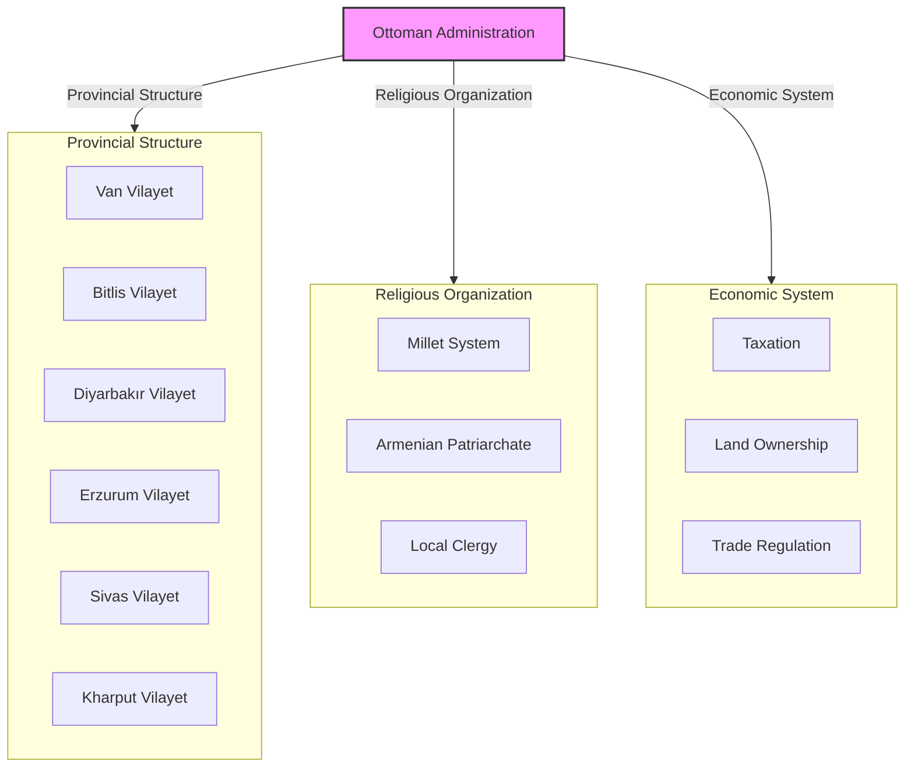

**Millet system:** The Ottoman millet (religious community) system granted Armenians religious autonomy under their Patriarch while maintaining clear Muslim superiority in political and legal matters.

------

## Safavid Rule in Eastern Armenia

The Safavid Empire developed different approaches to governing Eastern Armenia:

- **Beglarbegi of Chukhur-e Sa'd** (centered on Yerevan) as main province
- **Khanate system** with local governors
- **Meliks** (Armenian nobles) maintaining some local authority
- **Religious tolerance** with restrictions
- **Forced resettlement policies** under Shah Abbas I
- **Cultural exchange** between Armenian and Persian traditions

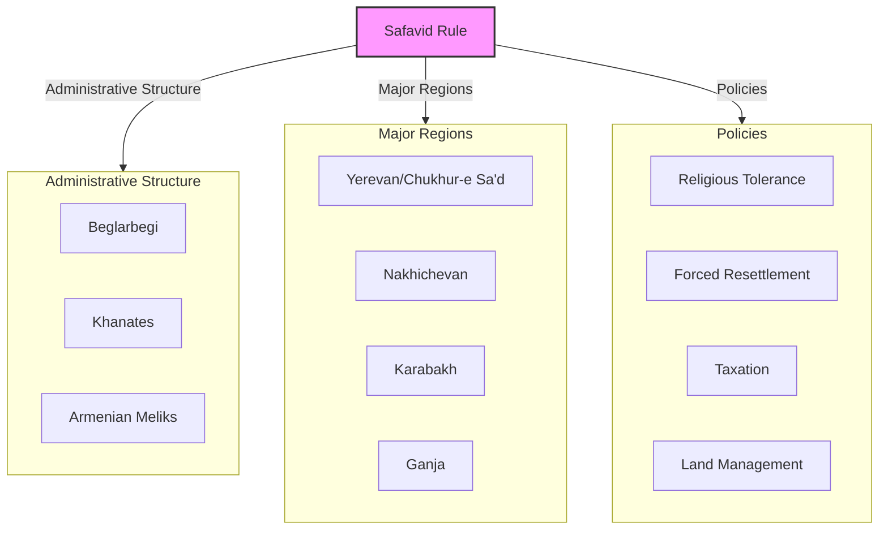

**Ghulam system:** The Safavids developed the ghulam (slave) system that incorporated Christian Armenians into the Persian administrative and military structure, sometimes in high positions.

------

## Warfare and "Scorched Earth" Policies

The Armenian highlands became a frequent battlefield between Ottoman and Safavid forces:

- **Repeated campaigns** across the region
- **Fortress cities** like Van, Kars, and Yerevan changing hands multiple times
- **"Scorched earth" tactics** devastating agricultural lands
- **Population displacement** from contested areas
- **Destruction of settlements** in border regions
- **Economic regression** due to constant warfare

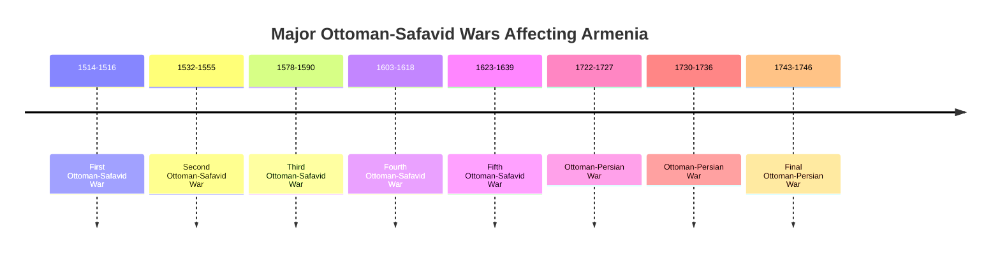

**Devastating impact:** The constant warfare between these empires caused enormous suffering for the Armenian population caught between them, with villages destroyed, agricultural systems disrupted, and populations displaced.

------

## The Great Deportation of 1604

One of the most traumatic events was Shah Abbas I's **forced deportation** of Armenians:

- **1603-1604:** Safavid reconquest of territories previously lost to Ottomans
- **Strategic retreat** facing Ottoman counterattack
- **"Scorched earth" policy** to deny resources to Ottoman army
- **Forced march** of Armenian population to Safavid interior
- **Estimated 300,000+ Armenians** deported from Ararat plain and other regions
- **Resettlement** primarily around Isfahan (New Julfa)
- **High mortality** during the forced march

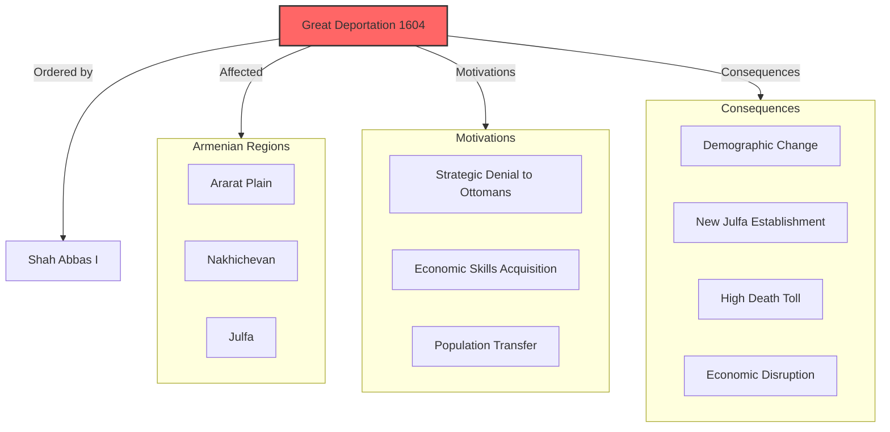

**New Julfa:** The Armenian community established at New Julfa near Isfahan became an important commercial center, with Armenian merchants receiving special privileges from the Shah in exchange for their commercial expertise.

------

## The Treaty of Zuhab/Qasr-e Shirin (1639)

The **Treaty of Zuhab** (also known as the Treaty of Qasr-e Shirin) in 1639 established a relatively stable border:

- **Western Armenia** confirmed under Ottoman control
- **Eastern Armenia** confirmed under Safavid control
- **Border delineation** that would last until the 19th century
- **Relative stabilization** after decades of warfare
- **Reduced military campaigns** across Armenian highlands
- **Beginning of distinct development** of Western and Eastern Armenian communities

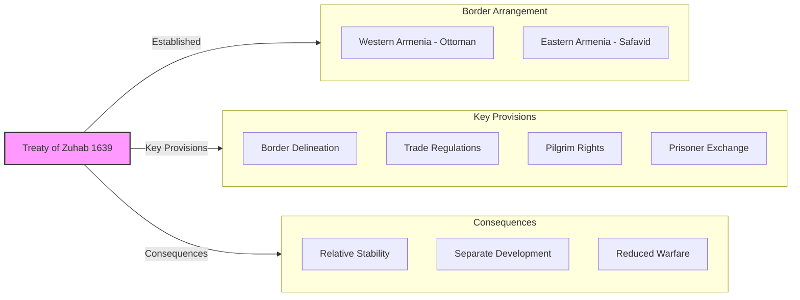

**Long-term border:** The border established in 1639 remained remarkably stable for almost two centuries and roughly corresponds to the modern border between Turkey and Iran/Armenia.

------

## Armenian Communities Under Divided Rule

The division of Armenia between empires led to divergent developments:

### Western Armenians (Ottoman):
- **Millet system** under Armenian Patriarch of Constantinople
- **Urban commercial class** development in Ottoman cities
- **Amira class** of wealthy Armenian financiers and officials
- **Rural majority** in historic Armenian provinces
- **Armenian language** with Turkish influences (Western Armenian)

### Eastern Armenians (Safavid):
- **Melik system** preserving some Armenian nobility
- **Persian cultural influence** stronger
- **New Julfa merchant network** spanning Asia
- **Religious centers** including Etchmiadzin
- **Armenian language** with Persian influences (Eastern Armenian)

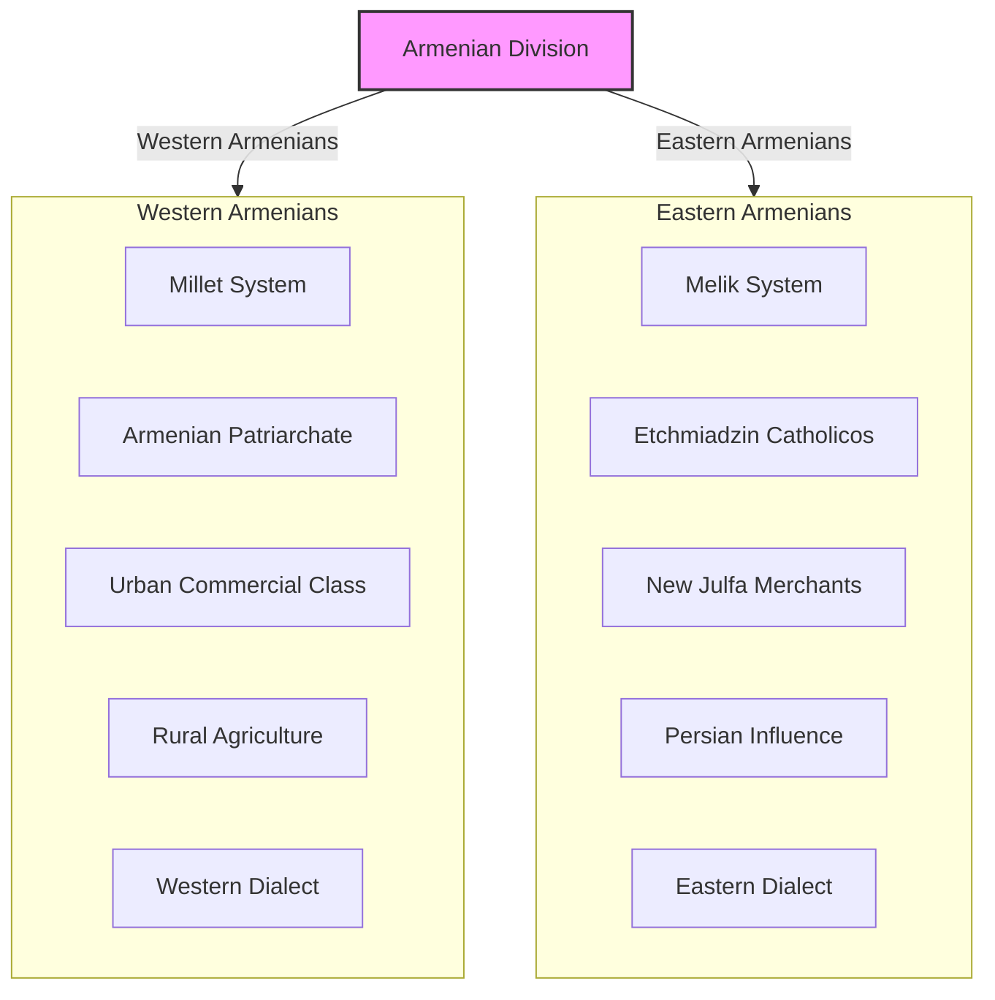

**Linguistic divergence:** The division accelerated the development of distinct Western and Eastern Armenian dialects, though a common literary language maintained cultural unity.

------

## Religious and Cultural Developments

Despite political division, Armenian religious and cultural life continued:

- **Catholicos of All Armenians** at Etchmiadzin (Safavid/Persian territory)
- **Armenian Patriarch of Constantinople** (Ottoman territory)
- **Manuscript production** continuing in both regions
- **Printing press** established in New Julfa (1638) and Constantinople
- **Armenian merchant networks** connecting divided communities
- **Pilgrimage routes** maintained across political boundaries
- **Educational institutions** developing in both regions

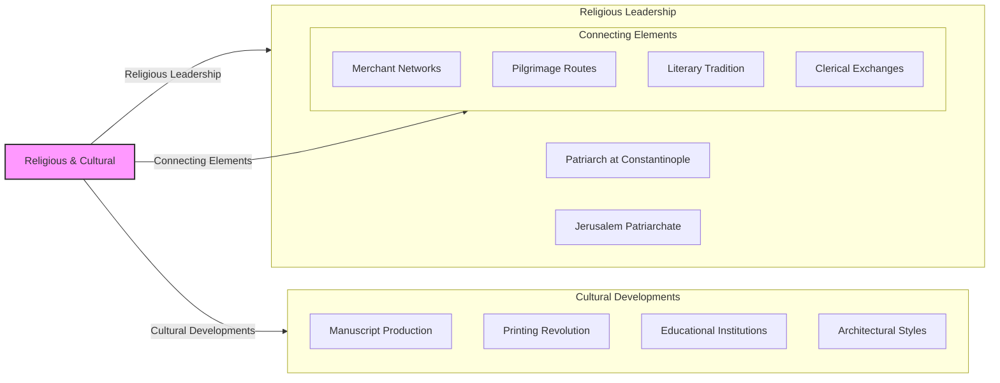

**Cultural continuity:** Despite political division, Armenians maintained cultural and religious unity through shared institutions, literature, and practices that transcended imperial boundaries.

------

## Armenian Merchant Networks

Armenian merchants developed extensive networks spanning both empires and beyond:

- **New Julfa merchants** with special privileges from Safavid shahs
- **Constantinople, Smyrna, and Aleppo** as centers in Ottoman territory
- **Overland and maritime trade routes** connecting Europe and Asia
- **Armenian trade colonies** from Venice to Manila
- **Specialized trade knowledge** including languages and currencies
- **Banking and financial services** developing alongside trade

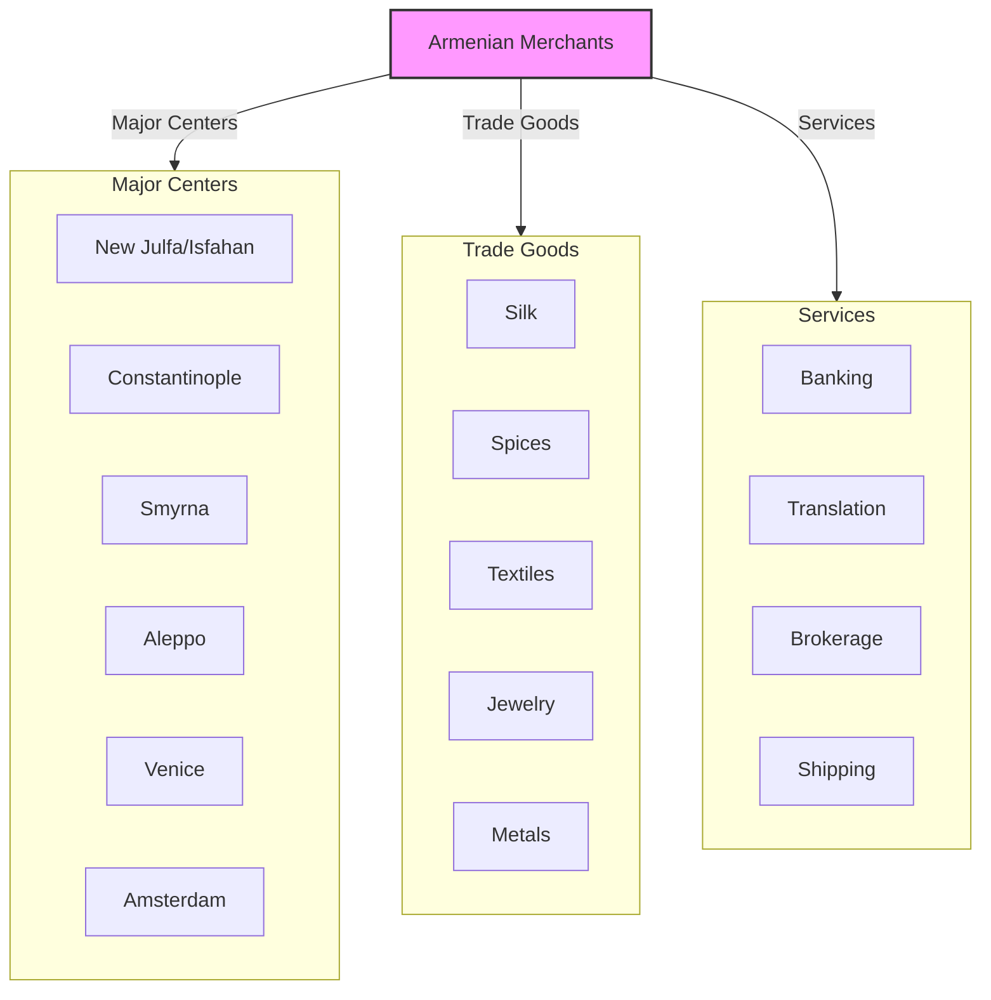

**Commercial diaspora:** Armenian merchant networks represented one of the world's most successful commercial diasporas, using family and community connections to trade across political, religious, and linguistic boundaries.

------

## The Decline of Safavid Persia

The 18th century saw the decline of Safavid power:

- **Afghan invasion** (1722) toppled Safavid dynasty
- **Ottoman opportunism** seizing territory during Persian weakness
- **Russian interest** in the Caucasus growing
- **Nader Shah's empire** briefly restoring Persian power
- **Instability in Eastern Armenia** during succession conflicts
- **Rise of local khanates** with varying degrees of autonomy

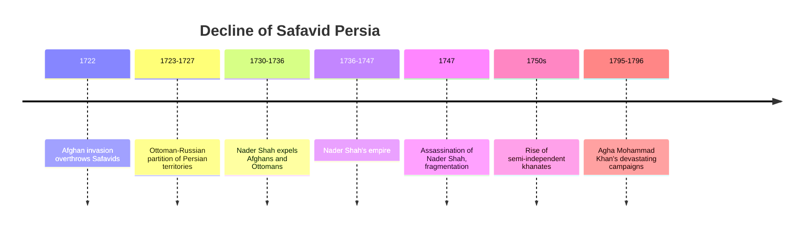

**Power vacuum:** The decline of Safavid power created a vacuum in the Caucasus that would eventually be filled by the expanding Russian Empire, fundamentally altering the geopolitics of the region.

------

## The Rise of Russian Influence

By the late 18th century, a new power entered the equation:

- **Catherine the Great's southern strategy** targeting Ottoman and Persian territories
- **Georgian alignment** with Russia against Muslim powers
- **Armenian appeals** to Russia for protection
- **Russian-Persian Wars** beginning in 1804
- **Treaty of Gulistan (1813)** bringing northern khanates under Russian control
- **Treaty of Turkmenchay (1828)** incorporating Eastern Armenia into Russian Empire

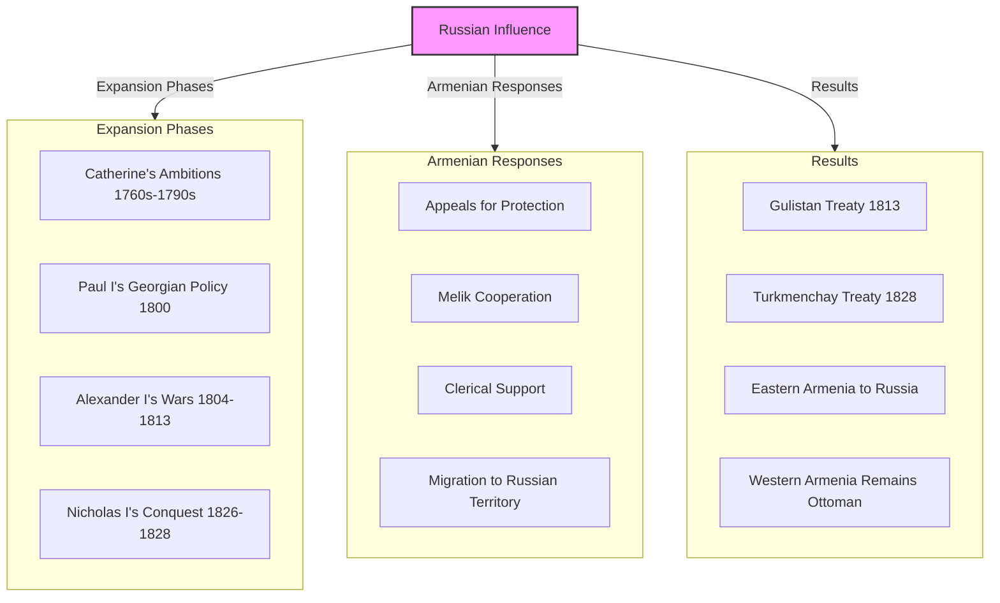

**Armenian hopes:** Many Armenians welcomed Russian expansion as liberation from Muslim rule, hoping that Christian Russia would protect them from Ottoman and Persian oppression.

------

## Legacy of the Ottoman-Safavid Rivalry

The centuries of Ottoman-Safavid competition left lasting impacts on Armenia:

1. **Demographic changes** through deportations, warfare, and migration
2. **Cultural divergence** between Western and Eastern Armenian communities
3. **Economic development** of Armenian merchant networks spanning both empires
4. **Religious adaptations** to different imperial systems
5. **Architectural influences** from both Ottoman and Persian traditions
6. **Linguistic evolution** with Turkish and Persian loan words
7. **Political fragmentation** that would persist into modern era

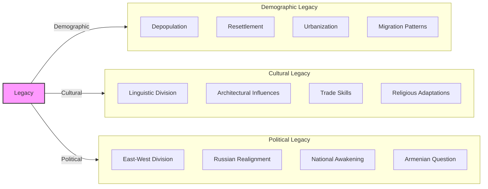

**Modern relevance:** The division of Armenia between Ottoman and Safavid empires established patterns that would shape later developments, including the Armenian Genocide (in former Ottoman territories) and Soviet Armenia (in former Russian/Persian territories).

------

## Conclusion: Between Empires

The Ottoman-Safavid rivalry represents a critical chapter in Armenian history—a period when the Armenian homeland became a contested borderland between competing empires with different religious, cultural, and political visions.

For Armenians, this rivalry brought both devastation and opportunity. The constant warfare, deportations, and "scorched earth" policies caused enormous suffering and accelerated the decline of Armenian demographic dominance in the historic homeland. Yet the same imperial competition also created spaces for Armenian autonomy, commercial success, and cultural development.

The division of Armenia between Ottoman and Safavid spheres would have lasting consequences, establishing an east-west division that persists in various forms to this day. When Russian power replaced Persian in the early 19th century, this division would take on new significance, setting Eastern and Western Armenians on dramatically different historical trajectories—one leading to Soviet Armenia and eventual independence, the other to the catastrophe of genocide and the formation of the modern diaspora.
