# From Empire to Nation: Modern Armenian History and the Genocide

The 19th and early 20th centuries represent the most transformative period in Armenian history since the Arab conquests. During this tumultuous era, Armenians experienced national awakening, political activism, unprecedented violence, and the establishment of the first modern Armenian state.

This post examines the dramatic journey from the Russian conquest of Eastern Armenia through the catastrophe of the Armenian Genocide to the establishment of Soviet Armenia and eventual independence.

------

## The Russian Conquest of Eastern Armenia

The Russian Empire's expansion into the Caucasus fundamentally altered Armenian history:

- **Russian-Persian War (1804-1813)** brought northern territories under Russian control
- **Treaty of Gulistan (1813)** formalized these gains
- **Russian-Persian War (1826-1828)** led to further Russian advances
- **Treaty of Turkmenchay (1828)** incorporated Eastern Armenia into Russian Empire
- **Armenian migration** from Persian territories to Russian-controlled areas
- **New administrative structure** under Russian governance

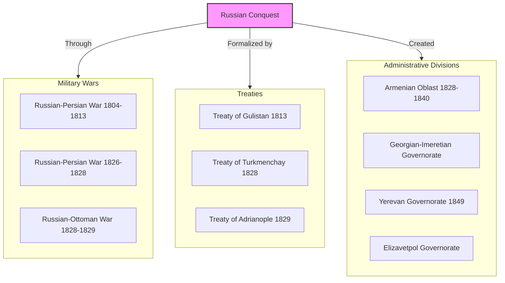

**Armenian support:** Many Armenians actively supported the Russian conquest, seeing Orthodox Christian Russia as a liberator from Muslim rule and forming volunteer units that fought alongside Russian forces.

------

## Eastern Armenians Under Russian Rule

Life for Armenians in the Russian Empire brought significant changes:

- **End of legal discrimination** based on religion
- **Economic development** with new industries and infrastructure
- **Educational advances** with Russian and European influence
- **Cultural renaissance** in literature, theater, and publishing
- **Urban growth** in cities like Tiflis (Tbilisi), Baku, and Yerevan
- **Class stratification** with emerging Armenian bourgeoisie and proletariat
- **Russification policies** increasing in late 19th century

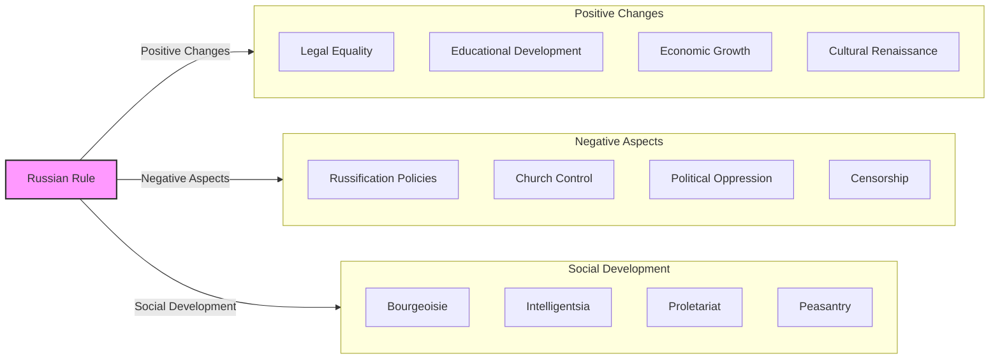

**Contradictory policies:** Russian policy toward Armenians fluctuated between supportive (under Nicholas I and Alexander II) and repressive (under Alexander III and Nicholas II), creating a complex relationship between Armenians and the Russian state.

------

## The Armenian National Awakening

The 19th century saw a remarkable cultural and political revival:

- **Literary renaissance** beginning with Khachatur Abovian's works
- **Educational reform** led by figures like Mesrop Taghiadian
- **Historical research** recovering and popularizing Armenian past
- **Linguistic developments** including modern Eastern Armenian standardization
- **Publishing boom** with newspapers, journals, and books
- **Political thought** evolving from cultural nationalism to political activism
- **Revolutionary organizations** forming in response to Ottoman oppression

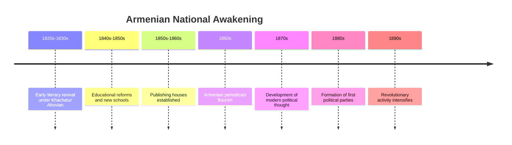

**Cultural foundations:** The Armenian national awakening began as a cultural movement focused on language, education, and history before evolving into political nationalism in response to oppression, particularly in the Ottoman Empire.

------

## The Armenian Question in International Politics

By the late 19th century, the "Armenian Question" became an international issue:

- **Treaty of Berlin (1878)** included provisions for Armenian reforms
- **European powers** expressing concern over Armenian conditions
- **Ottoman resistance** to implementing meaningful reforms
- **Russian policy shifts** sometimes supporting, sometimes opposing Armenian causes
- **Armenian revolutionary parties** seeking international support
- **Great Power competition** complicating humanitarian concerns

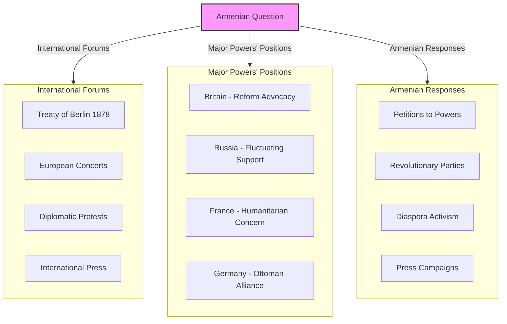

**Internationalization:** The Armenian Question represented one of the first human rights issues to become internationalized, though Great Power politics ultimately proved more decisive than humanitarian concerns.

------

## Armenian Revolutionary Movements

In response to Ottoman oppression, Armenian revolutionary movements emerged:

- **Armenakan Party** (founded 1885) - first Armenian political party
- **Hunchak Party** (founded 1887) - socialist orientation
- **Armenian Revolutionary Federation (Dashnaktsutyun)** (founded 1890) - nationalist-socialist
- **Self-defense organizations** in Armenian villages
- **Guerrilla operations** against Ottoman forces and Kurdish tribes
- **Propaganda efforts** to gain international support
- **Community organization** building parallel institutions

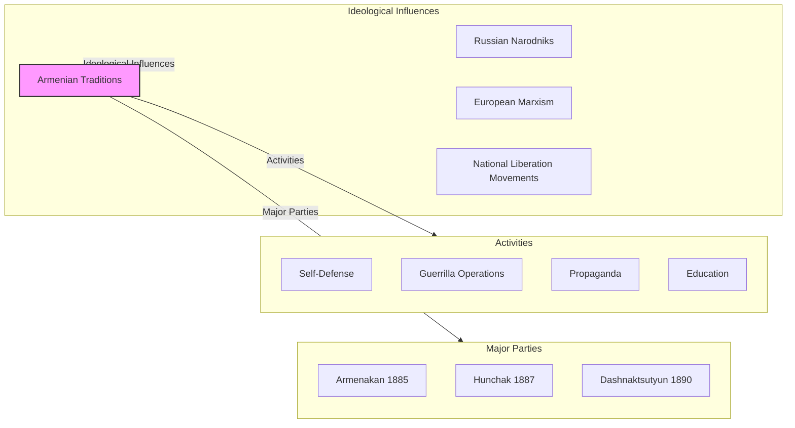

**Limited means:** Armenian revolutionary organizations faced enormous challenges, including limited resources, Ottoman repression, and the indifference of Great Powers, making their struggle against the Ottoman state extremely difficult.

------

## The Hamidian Massacres (1894-1896)

Under Sultan Abdul Hamid II, the first wave of mass violence targeted Armenians:

- **Sasun Resistance** (1894) triggering wider violence
- **Systematic attacks** on Armenian villages and urban quarters
- **Kurdish irregular forces** (Hamidiye) used against Armenians
- **Estimated 100,000-300,000 Armenians killed**
- **Widespread destruction** of property and churches
- **Forced conversions** to Islam
- **International outcry** but no intervention

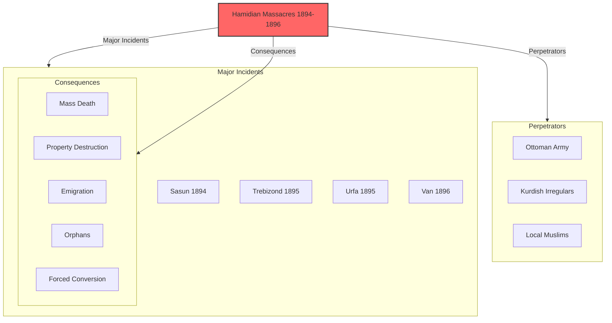

**Precursor to genocide:** The Hamidian Massacres represented a precursor to the later genocide, demonstrating both the vulnerability of the Armenian population and the unwillingness of international powers to intervene effectively.

------

## The Young Turk Revolution and Its Aftermath

The 1908 Young Turk Revolution briefly raised Armenian hopes:

- **Committee of Union and Progress (CUP)** overthrew Sultan Abdul Hamid II
- **Constitutional government** promised equality for all Ottoman subjects
- **Armenian political participation** in new parliament
- **Initial cooperation** between Armenian parties and Young Turks
- **Adana Massacre (1909)** revealing continuing dangers
- **Growing Turkish nationalism** replacing Ottoman multiculturalism
- **Balkan Wars (1912-1913)** increasing Turkish resentment of minorities

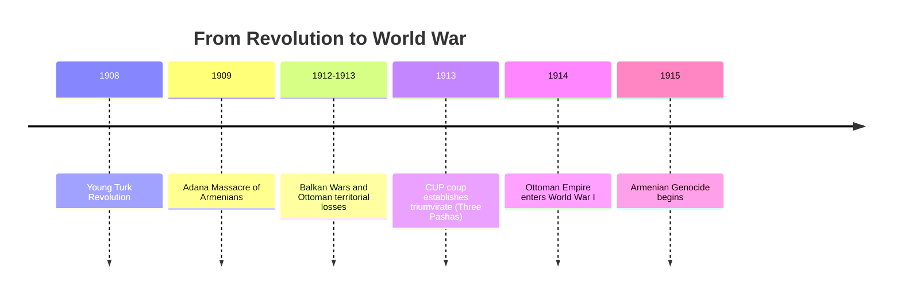

**Dashed hopes:** The initial Armenian enthusiasm for the Young Turk Revolution quickly gave way to disillusionment as Turkish nationalism hardened and the CUP leadership became increasingly authoritarian and xenophobic.

------

## The Armenian Genocide (1915-1917)

World War I provided the context for the Ottoman government's decision to eliminate the Armenian population:

- **April 24, 1915:** Arrest and murder of Armenian intellectuals in Constantinople
- **Disarmament** of Armenian soldiers in Ottoman army
- **Deportation orders** for Armenian population throughout Anatolia
- **Death marches** through desert to Syria
- **Massacres** by military, Kurdish irregulars, and special units
- **Concentration camps** in Syrian Desert
- **Property confiscation** and distribution to Turkish settlers
- **Forced conversions** of women and children

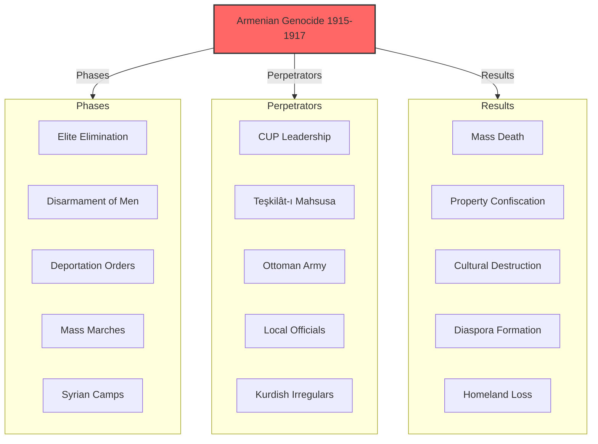

**Scale of destruction:**
- Estimated **1.5 million Armenians killed**
- Near-complete elimination of Armenian population from historical homeland
- Destruction of thousands of churches, schools, and cultural monuments
- Confiscation of Armenian property valued at billions
- Creation of modern Armenian diaspora
- Permanent demographic transformation of eastern Turkey

------

## International Response and Aftermath

The international response to the Armenian Genocide was mixed:

- **Allied powers** (Britain, France, Russia) issued joint declaration in May 1915
- **American ambassador Henry Morgenthau** documented atrocities
- **Relief efforts** by American missionaries and others
- **Near East Relief** organization formed to aid survivors
- **Post-war treaties** initially promised Armenian state
- **Treaty of Sèvres (1920)** included provisions for Armenia
- **Turkish nationalist movement** under Mustafa Kemal rejected Sèvres
- **Treaty of Lausanne (1923)** abandoned Armenian provisions

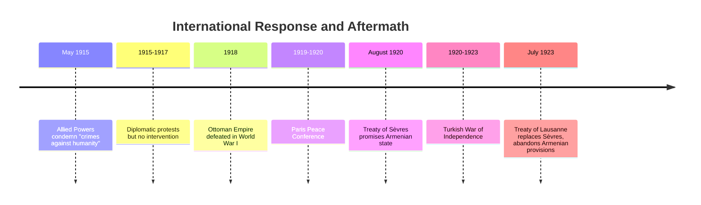

**Failure of justice:** Despite initial promises of justice and restitution, geopolitical considerations ultimately led the international community to abandon Armenian claims in favor of relations with the new Turkish Republic.

------

## The First Armenian Republic (1918-1920)

As the Russian Empire collapsed, Eastern Armenians established a brief independent state:

- **Russian Revolution** creating power vacuum in Transcaucasia
- **Transcaucasian Federation** briefly uniting Armenians, Georgians, and Azerbaijanis
- **May 28, 1918:** Declaration of Armenian independence
- **Difficult circumstances:** war, refugees, famine, disease
- **Border conflicts** with Georgia and Azerbaijan
- **Turkish invasion** threatening the republic's existence
- **Treaty of Sèvres** briefly recognizing expanded Armenian state
- **Soviet takeover** in December 1920 ending independence

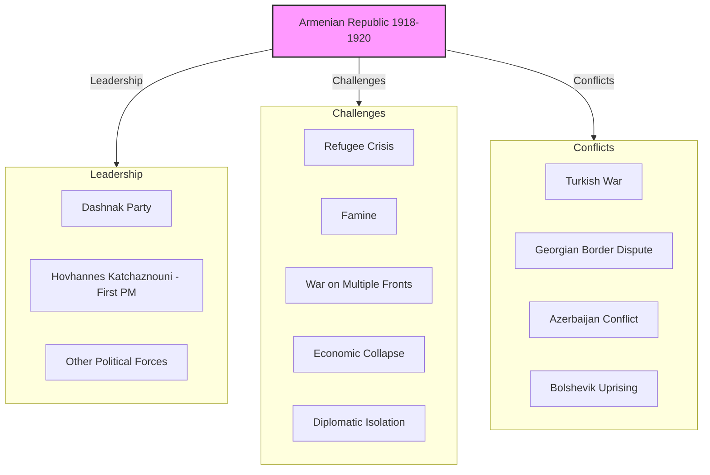

**Overwhelming challenges:** The First Armenian Republic faced nearly impossible circumstances, including hundreds of thousands of genocide refugees, economic collapse, and hostile neighbors, making its survival for even two years remarkable.

------

## Soviet Armenia (1920-1991)

For most of the 20th century, Armenia existed as a Soviet republic:

- **December 1920:** Red Army enters Yerevan
- **Sovietization** of Armenian government and society
- **New borders** established, losing territories to Turkey and Azerbaijan
- **Industrialization** transforming largely agricultural society
- **Cultural policies** alternating between promotion and repression of Armenian identity
- **Great Purge** targeting Armenian intellectuals and leaders
- **World War II** with heavy Armenian participation
- **Post-war development** making Armenia relatively prosperous Soviet republic
- **National awakening** in 1960s-1980s
- **Karabakh movement** emerging in late 1980s

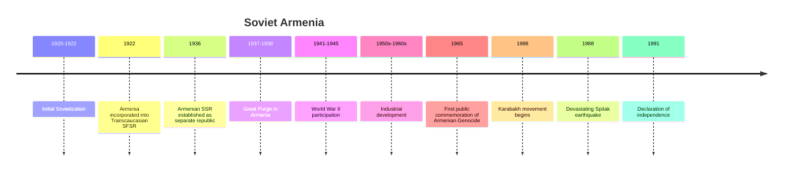

**Contradictory legacy:** Soviet rule brought modernization, industrialization, and relative security to Armenia, but at the cost of political freedom, territorial losses, and periods of cultural repression.

------

## The Armenian Diaspora

The genocide transformed Armenians into a primarily diasporic nation:

- **Middle Eastern communities** in Syria, Lebanon, Egypt, Iraq
- **European communities** in France, Greece, Bulgaria
- **American community** centered in California and Massachusetts
- **Cultural preservation** through community institutions
- **Political advocacy** for genocide recognition
- **Financial support** for Armenia and Karabakh
- **Intellectual and artistic contributions** to host countries

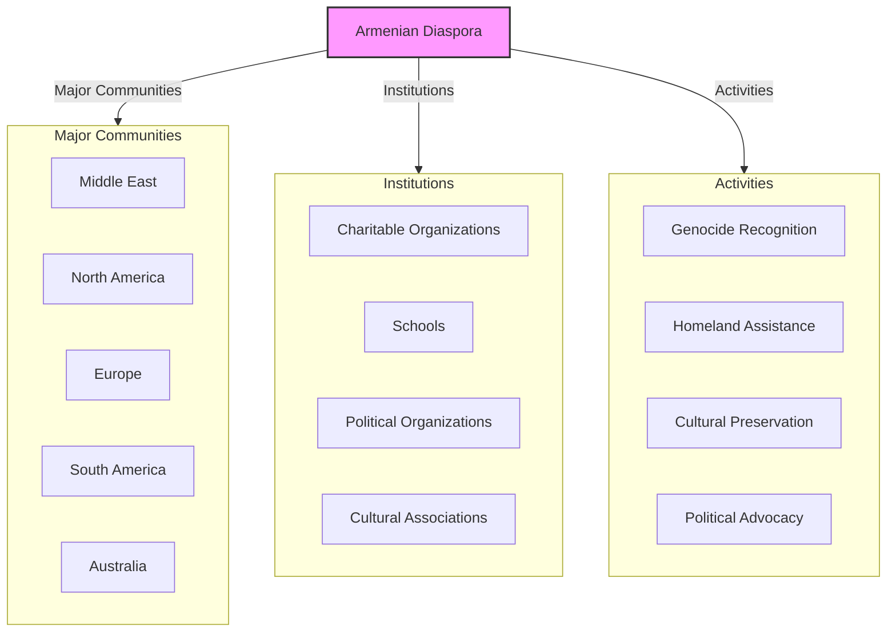

**Diaspora achievements:** Despite the catastrophe of genocide and displacement, Armenian diaspora communities achieved remarkable success in their adopted countries while maintaining Armenian identity and supporting the homeland.

------

## Independent Armenia (1991-Present)

With the collapse of the Soviet Union, Armenia regained independence:

- **September 21, 1991:** Declaration of independence
- **Nagorno-Karabakh conflict** with Azerbaijan
- **Economic challenges** following Soviet collapse
- **Blockade** by Turkey and Azerbaijan
- **Democratic development** with setbacks and advances
- **Relations with Russia** remaining close
- **Diaspora connections** providing support and investment
- **2018 Velvet Revolution** bringing democratic reforms
- **2020 Second Karabakh War** resulting in territorial losses

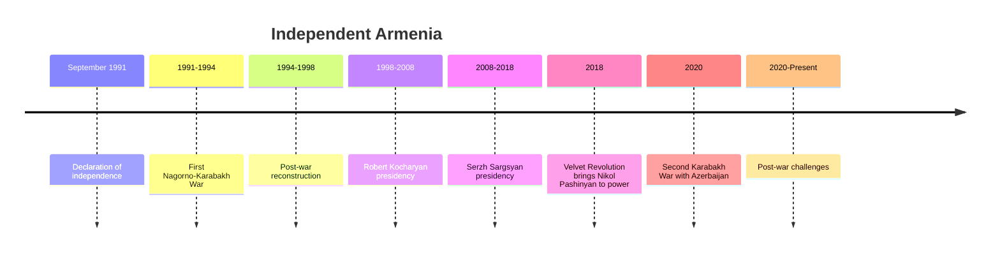

**Ongoing challenges:** Independent Armenia continues to face significant challenges, including regional conflicts, economic development issues, emigration, and the complex relationship between homeland and diaspora.

------

## Conclusion: A Nation Transformed

The journey from the 19th century to the present represents the most dramatic transformation in Armenian history since the Arab conquests. In just two centuries, Armenians experienced:

1. **Imperial rule** under Russian, Ottoman, and Soviet empires
2. **National awakening** through cultural and political revival
3. **Catastrophic genocide** that nearly destroyed the nation
4. **Brief independence** under impossible circumstances
5. **Soviet modernization** with its benefits and costs
6. **Diaspora formation** across the globe
7. **Renewed independence** with its opportunities and challenges

Through these tumultuous changes, Armenian identity has demonstrated remarkable resilience—adapting to new realities while maintaining core elements of language, religion, and culture that connect modern Armenians to their ancient heritage.

The modern Armenian experience, divided between a small homeland republic and a global diaspora, represents both the tragic legacy of genocide and the triumph of national survival against overwhelming odds. It is a story that continues to unfold, as Armenians navigate the complex challenges of the 21st century while carrying the weight of their extraordinary history.
